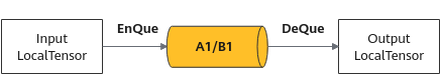

# DeQue

更新时间：2026-05-12 09:31:20

来源：https://developer.huawei.com/consumer/cn/doc/harmonyos-guides/cannkit-deque

## 功能说明

将Tensor从队列中取出，用于后续处理。

## 函数原型


```text
template
__aicore__ inline LocalTensor DeQue()
```

**图1** 将LocalTensor通过EnQue放入A1/B1的Queue中后再通过DeQue搬出


## 参数说明

无

## 支持的型号

Kirin9020系列处理器 KirinX90系列处理器

## 注意事项

无

## 返回值

从队列中取出的[LocalTensor](https://developer.huawei.com/consumer/cn/doc/harmonyos-guides/cannkit-localtensor)。

## 调用示例


```text
// 接口：DeQue Tensor
AscendC::TPipe pipe;
AscendC::TQueBind que;
int num = 4;
int len = 1024;
pipe.InitBuffer(que, num, len);
AscendC::LocalTensor tensor1 = que.AllocTensor();
que.EnQue(tensor1);
AscendC::LocalTensor tensor2 = que.DeQue(); // 将tensor从VECOUT的Queue中搬出
```
