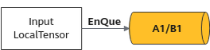

# EnQue

更新时间：2026-05-12 09:31:20

来源：https://developer.huawei.com/consumer/cn/doc/harmonyos-guides/cannkit-enque

## 功能说明

将Tensor push到队列。

## 函数原型


```text
template
__aicore__ inline bool EnQue(const LocalTensor& tensor)
```


## 参数说明

**表1** bool EnQue(LocalTensor& tensor)原型定义参数说明
| 参数名称 | 输入/输出 | 含义 |
| --- | --- | --- |
| tensor | 输入 | 指定的Tensor。 |

**图1** 将LocalTensor通过EnQue放入A1/B1的Queue中


## 支持的型号

Kirin9020系列处理器 KirinX90系列处理器

## 注意事项

无

## 返回值

true：表示Tensor加入Queue成功。  false：表示Queue已满，入队失败。

## 调用示例


```text
// 接口：EnQue Tensor
AscendC::TPipe pipe;
AscendC::TQueBind que;
int num = 4;
int len = 1024;
pipe.InitBuffer(que, num, len);
AscendC::LocalTensor tensor1 = que.AllocTensor();
que.EnQue(tensor1);// 将tensor加入VECOUT的Queue中
```
