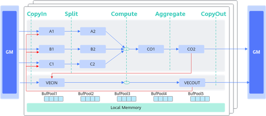

# 简介

更新时间：2026-04-20 06:34:33

来源：https://developer.huawei.com/consumer/cn/doc/harmonyos-guides/cannkit-overview

TQueBind绑定源逻辑位置和目的逻辑位置，根据源位置和目的位置，来确定内存分配的位置、插入对应的同步事件，帮助开发者解决内存分配和管理、同步等问题。TQue是TQueBind的简化模式。通常情况下开发者使用TQue进行编程，TQueBind对外提供一些特殊数据通路的内存管理和同步控制，涉及这些通路时可以直接使用TQueBind。

 如下图的数据通路示意图所示，红色线条和蓝色线条的通路可通过TQueBind定义表达，蓝色线条的通路可通过TQue进行简化表达。

l

 **表1** TQueBind和TQue对于数据通路的表达

| 数据通路 | TQueBind定义 | TQue定义 |
| --- | --- | --- |
| GM->VECIN | TQueBind<TPosition::GM, TPosition::VECIN, 1> | TQue<TPosition::VECIN, 1> |
| VECOUT->GM | TQueBind<TPosition::VECOUT, TPosition::GM, 1> | TQue<TPosition::VECOUT, 1> |
| VECIN->VECOUT | TQueBind<TPosition::VECIN, TPosition::VECOUT, 1> | - |
| GM->A1 | TQueBind<TPosition::GM, TPosition::A1, 1> | TQue<TPosition::A1, 1> |
| GM->B1 | TQueBind<TPosition::GM, TPosition::B1, 1> | TQue<TPosition::B1, 1> |
| GM->C1 | TQueBind<TPosition::GM, TPosition::C1, 1> | TQue<TPosition::C1, 1> |
| A1->A2 | TQueBind<TPosition::A1, TPosition::A2, 1> | TQue<TPosition::A2, 1> |
| B1->B2 | TQueBind<TPosition::B1, TPosition::B2, 1> | TQue<TPosition::B2, 1> |
| C1->C2 | TQueBind<TPosition::C1, TPosition::C2, 1> | TQue<TPosition::C2, 1> |
| CO1->CO2 | TQueBind<TPosition::CO1, TPosition::CO2, 1> | TQue<TPosition::CO1, 1> |
| CO2->GM | TQueBind<TPosition::CO2, TPosition::GM, 1> | TQue<TPosition::CO2, 1> |
| VECOUT->A1/B1/C1 | TQueBind<TPosition::VECOUT, TPosition::A1, 1>; TQueBind<TPosition::VECOUT, TPosition::B1, 1>; TQueBind<TPosition::VECOUT, TPosition::C1, 1> | - |
| CO2->VECIN | TQueBind<TPosition::CO2, TPosition::VECIN, 1> | - |

> [!NOTE]
> 上述表格中的Cube相关数据通路建议使用Cube高阶API（如Matmul）实现，直接使用TQueBind控制会相对复杂。

 下面通过两个具体的示例展示了矢量编程场景下TQueBind的使用方法：
