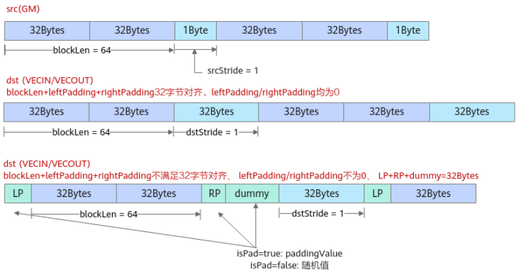
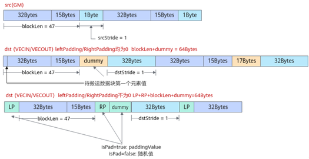
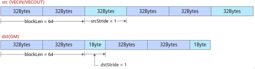
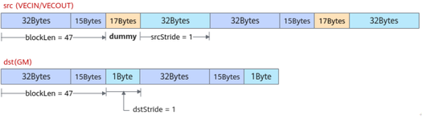
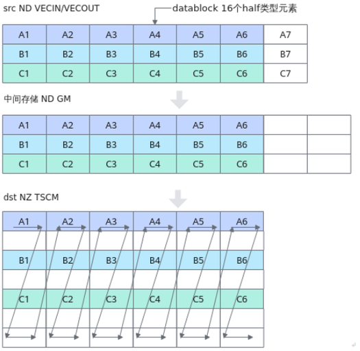

# DataCopyPad

更新时间：2026-04-20 06:34:33

来源：https://developer.huawei.com/consumer/cn/doc/harmonyos-guides/cannkit-datacopypad

## 功能说明

该接口提供数据非对齐搬运的功能，支持的数据传输通路如下。 GM->VECIN/VECOUT  VECIN/VECOUT->GM  VECIN/VECOUT->TSCM   其中从GM->VECIN/VECOUT进行数据搬运时，可以根据开发者的需要自行填充数据。

## 函数原型

dataCopyParams为DataCopyExtParams类型，相比于DataCopyParams类型，支持的操作数步长等参数取值范围更大  通路：GM->VECIN/VECOUT
```text
template
__aicore__ inline  void DataCopyPad(const LocalTensor &dstLocal, const GlobalTensor &srcGlobal, const DataCopyExtParams &dataCopyParams, const DataCopyPadExtParams &padParams)
```

通路：VECIN/VECOUT->GM
```text
template
__aicore__ inline  void DataCopyPad(const GlobalTensor &dstGlobal, const LocalTensor &srcLocal, const DataCopyExtParams &dataCopyParams)
```

dataCopyParams为DataCopyParams类型  通路：GM->VECIN/VECOUT
```text
template
__aicore__ inline void DataCopyPad(const LocalTensor& dstLocal, const GlobalTensor& srcGlobal, const DataCopyParams& dataCopyParams, const DataCopyPadParams& padParams)
```

通路：VECIN/VECOUT->GM
```text
template
__aicore__ inline void DataCopyPad(const GlobalTensor& dstGlobal, const LocalTensor& srcLocal,const DataCopyParams& dataCopyParams)
```


## 参数说明

**表1** 模板参数说明
| 参数名 | 描述 |
| --- | --- |
| T | 操作数以及paddingValue（待填充数据值）的数据类型。 Kirin9020系列处理器，支持的数据类型为：int8_t/uint8_t/int16_t/uint16_t/int32_t/uint32_t/half/float KirinX90系列处理器，支持的数据类型为：int8_t/uint8_t/int16_t/uint16_t/int32_t/uint32_t/half/float |

**表2** 接口参数说明
| 参数名 | 输入/输出 | 描述 |
| --- | --- | --- |
| dstLocal, dstGlobal | 输出 | 目的操作数，类型为LocalTensor或GlobalTensor。 |
| srcLocal, srcGlobal | 输入 | 源操作数，类型为LocalTensor或GlobalTensor。 |
| dataCopyParams | 输入 | 搬运参数。 - DataCopyExtParams类型，具体参数说明请参考表3。 - DataCopyParams类型，具体参数说明请参考表4。 |
| padParams | 输入 | 从GM->VECIN/VECOUT进行数据搬运时，可以根据开发者需要，在搬运数据左边或右边填充数据。padParams是用于控制数据填充过程的参数，DataCopyPadExtParams类型，具体参数请参考表5。 |
| nd2nzParams | 输入 | 从VECIN/VECOUT->TSCM进行数据搬运时，可以进行ND到NZ的数据格式转换。nd2nzParams是用于控制数据格式转换的参数，Nd2NzParams类型，具体参数为：ndNum、nValue、dValue、srcNdMatrixStride、srcDValue、dstNzC0Stride、dstNzNStride、dstNzMatrixStride。 说明： Nd2NzParams的ndNum仅支持设置为1。 |

**表3** DataCopyExtParams结构体参数定义
| 参数名称 | 含义 |
| --- | --- |
| blockCount | 指定该指令包含的连续传输数据块个数，数据类型为uint16_t，取值范围：blockCount∈[1, 4095]。 |
| blockLen | 指定该指令每个连续传输数据块长度，该指令支持非对齐搬运，每个连续传输数据块长度单位为Byte。数据类型为uint32_t，blockLen不要超出该数据类型的取值范围。 |
| srcStride | 源操作数，相邻连续数据块的间隔（前面一个数据块的尾与后面数据块的头的间隔），如果源操作数的逻辑位置为VECIN/VECOUT，则单位为dataBlock(32Bytes), 如果源操作数的逻辑位置为GM,则单位为Byte。数据类型为uint32_t，srcStride不要超出该数据类型的取值范围。 |
| dstStride | 目的操作数，相邻连续数据块间的间隔（前面一个数据块的尾与后面数据块的头的间隔），如果目的操作数的逻辑位置为VECIN/VECOUT，则单位为dataBlock(32Bytes)，如果目的操作数的逻辑位置为GM，则单位为Byte。数据类型为uint32_t，dstStride不要超出该数据类型的取值范围。 |
| rsv | 保留字段。 |

**表4** DataCopyParams结构体参数定义
| 参数名称 | 含义 |
| --- | --- |
| blockCount | 指定该指令包含的连续传输数据块个数，数据类型为uint16_t，取值范围：blockCount∈[1, 4095]。 |
| blockLen | 指定该指令每个连续传输数据块长度，该指令支持非对齐搬运，每个连续传输数据块长度单位为Byte。数据类型为uint16_t，blockLen不要超出该数据类型的取值范围。 |
| srcStride | 源操作数，相邻连续数据块的间隔（前面一个数据块的尾与后面数据块的头的间隔），如果源操作数的逻辑位置为VECIN/VECOUT，则单位为dataBlock(32Bytes), 如果源操作数的逻辑位置为GM,则单位为Byte。数据类型为uint16_t，srcStride不要超出该数据类型的取值范围。 |
| dstStride | 目的操作数，相邻连续数据块间的间隔（前面一个数据块的尾与后面数据块的头的间隔），如果目的操作数的逻辑位置为VECIN/VECOUT，则单位为dataBlock(32Bytes)，如果目的操作数的逻辑位置为GM，则单位为Byte。数据类型为uint16_t，dstStride不要超出该数据类型的取值范围。 |

**表5** DataCopyPadExtParams结构体参数定义
| 参数名称 | 含义 |
| --- | --- |
| isPad | 是否需要填充开发者自定义的数据，取值范围：true，false。 true：填充padding value。 false：表示开发者不需要指定填充值，会默认填充随机值。 |
| leftPadding | 连续搬运数据块左侧需要补充的数据范围，单位为元素个数。 leftPadding、rightPadding的字节数均不能超过32Bytes。 |
| rightPadding | 连续搬运数据块右侧需要补充的数据范围，单位为元素个数。 leftPadding、rightPadding的字节数均不能超过32Bytes。 |
| paddingValue | 左右两侧需要填充的数据值，需要保证在数据占用字节范围内。 数据类型和源操作数保持一致，T数据类型。 当数据类型长度为64位时，该参数只能设置为0。 |

**GM**->**VECIN/VECOUT** **参数解释**：  当blockLen+leftPadding+rightPadding满足32字节对齐时，isPad为false，左右两侧填充的数据值会默认为随机值，否则为paddingValue。  当blockLen+leftPadding+rightPadding不满足32字节对齐时，框架会填充一些假数据dummy，保证左右填充的数据和blockLen、假数据为32字节对齐。若leftPadding、rightPadding都为0：dummy会默认填充待搬运数据块的第一个元素值。若leftPadding/rightPadding不为0：isPad为false，左右两侧填充的数据值和dummy值均为随机值，否则为paddingValue。 **配置示例1：**  blockLen为64，每个连续传输数据块包含64Bytes。srcStride为1，因为源操作数的逻辑位置为GM，srcStride的单位为Byte，也就是说源操作数相邻数据块之间间隔1Byte；dstStride为1，因为目的操作数的逻辑位置为VECIN/VECOUT，dstStride的单位为dataBlock(32Bytes)，也就是说目的操作数相邻数据块之间间隔1个dataBlock。  blockLen+leftPadding+rightPadding满足32字节对齐，isPad为false，左右两侧填充的数据值会默认为随机值，否则为paddingValue。此处示例中，leftPadding、rightPadding均为0，则不填充。  blockLen+leftPadding+rightPadding不满足32字节对齐时，框架会填充一些假数据dummy，保证左右填充的数据和blockLen、假数据为32字节对齐。leftPadding/rightPadding不为0：若isPad为false，左右两侧填充的数据值和dummy值均为随机值，否则为paddingValue。

**配置示例2：**  blockLen为47，每个连续传输数据块包含47Bytes；srcStride为1，表示源操作数相邻数据块之间间隔1Byte；dstStride为1，表示目的操作数相邻数据块之间间隔1个dataBlock。  blockLen+leftPadding+rightPadding不满足32字节对齐，leftPadding、rightPadding均为0：dummy会默认填充待搬运数据块的第一个元素值。  blockLen+leftPadding+rightPadding不满足32字节对齐，leftPadding/rightPadding不为0：若isPad为false，左右两侧填充的数据值和dummy值均为随机值，否则为paddingValue。

**VECIN/VECOUT**->**GM**  当每个连续传输数据块长度blockLen为32字节对齐时，下图呈现了需要传入的DataCopyParams示例，blockLen为64，每个连续传输数据块包含64Bytes；srcStride为1，因为源操作数的逻辑位置为VECIN/VECOUT，srcStride的单位为dataBlock(32Bytes)，也就是说源操作数相邻数据块之间间隔1个dataBlock；dstStride为1，因为目的操作数的逻辑位置为GM，dstStride的单位为Byte，也就是说目的操作数相邻数据块之间间隔1Byte。

当每个连续传输数据块长度blockLen不满足32字节对齐，由于Unified Buffer要求32字节对齐，框架在搬出时会自动补充一些假数据来保证对齐，但在当搬到GM时会自动将填充的假数据丢弃掉。下图呈现了该场景下需要传入的DataCopyParams示例和假数据补齐的原理。blockLen为47，每个连续传输数据块包含47Bytes，不满足32字节对齐；srcStride为1，表示源操作数相邻数据块之间间隔1个dataBlock；dstStride为1，表示目的操作数相邻数据块之间间隔1Byte。框架在搬出时会自动补充17Bytes的假数据来保证对齐，搬到GM时再自动将填充的假数据丢弃掉。

**VECIN/VECOUT->TSCM** 内部实现涉及AIC和AIV之间的通信，实际搬运路径为VECIN/VECOUT->GM->TSCM，**发送通信消息会有开销，性能会受到影响**。 如下图所示，展示了从VECIN/VECOUT搬运到GM，再搬运到TSCM的过程：示例中数据类型为half，单个datablock（32B）含有16个half元素，源操作数中的 A1~A6、B1~B6、C1~C6为需要进行搬运的数据。

从VECIN/VECOUT->GM的搬运，数据存储格式没有发生转变，依然是ND。  **blockCount**为需要搬运的连续传输数据块个数，设置为3。  **blockLen**为一个连续传输数据块的大小(单位为Byte)，设置为6 * 32 = 192。  **srcStride**为源操作数相邻连续数据块的间隔（前面一个数据块的尾与后面数据块的头的间隔），源操作数逻辑位置为VECIN/VECOUT，其单位为datablock, 两个连续传输数据块（A1~A6、B1~B6）中间相隔1个A7，因此srcStride设置为1。  **dstStride**为目的操作数，相邻连续数据块间的间隔（前面一个数据块的尾与后面数据块的头的间隔），目的操作数逻辑位置为GM，其单位为Byte，两个连续传输数据块（A1~A6、B1~B6）中间相隔2个空白的datablock，因此dstStride设置为64Byte。 从GM->TSCM的搬运，数据存储格式由ND转换为NZ。  **ndNum**固定为1，即A1~A6、B1~B6、C1~C6视作一整个ndMatrix。  **nValue**为ndMatrix的行数，即为3行。  **dValue**为ndMatrix中一行包含的元素个数，即为6 * 16 = 96个元素。  **srcNdMatrixStride**为相邻ndMatrix之间的距离，因为仅涉及1个ndMatrix，所以可填为0。  **srcDValue**表明ndMatrix的第x行和第x+1行所相隔的元素个数，如A1~B1的距离，即为8个datablock，8 * 16 = 128个元素。  **dstNzC0Stride**为src同一行的相邻datablock在NZ矩阵中相隔datablock数，如A1~A2的距离，即为7个datablock (A1 + 空白 + B1 + 空白 + C1 + 空白 * 2)。  **dstNzNStride**为src中ndMatrix的相邻行在NZ矩阵中相隔多少个datablock，如A1~B1的距离，即为2个datablock (A1 + 空白) 。  **dstNzMatrixStride**为相邻NZ矩阵之间的元素个数，因为仅涉及1个NZ矩阵，所以可以填为1。

## 返回值

无

## 支持的型号

Kirin9020系列处理器。 KirinX90系列处理器

## 约束说明

leftPadding、rightPadding的字节数均不能超过32Bytes。

## 调用示例

本示例实现了GM->VECIN->GM的非对齐搬运过程。
```text
#include "kernel_operator.h"

class TestDataCopyPad {
public:
    __aicore__ inline TestDataCopyPad() {}
    __aicore__ inline void Init(__gm__ uint8_t* srcGm, __gm__ uint8_t* dstGm)
    {
        srcGlobal.SetGlobalBuffer((__gm__ half *)srcGm);
        dstGlobal.SetGlobalBuffer((__gm__ half *)dstGm);
        pipe.InitBuffer(inQueueSrc, 1, 32 * sizeof(half));
        pipe.InitBuffer(outQueueDst, 1, 32 * sizeof(half));
    }
    __aicore__ inline void Process()
    {
        CopyIn();
        Compute();
        CopyOut();
    }
private:
    __aicore__ inline void CopyIn()
    {
        AscendC::LocalTensor srcLocal = inQueueSrc.AllocTensor();
        AscendC::DataCopyExtParams copyParams{1, 20 * sizeof(half), 0, 0, 0}; // 结构体DataCopyExtParams最后一个参数是rsv保留位
        AscendC::DataCopyPadExtParams padParams{true, 0, 2, 0};
        AscendC::DataCopyPad(srcLocal, srcGlobal, copyParams, padParams); // 从GM->VECIN搬运40Bytes
        inQueueSrc.EnQue(srcLocal);
    }
    __aicore__ inline void Compute()
    {
        AscendC::LocalTensor srcLocal = inQueueSrc.DeQue();
        AscendC::LocalTensor dstLocal = outQueueDst.AllocTensor();
        AscendC::Adds(dstLocal, srcLocal, scalar, 20);
        outQueueDst.EnQue(dstLocal);
        inQueueSrc.FreeTensor(srcLocal);
    }
    __aicore__ inline void CopyOut()
    {
        AscendC::LocalTensor dstLocal = outQueueDst.DeQue();
        AscendC::DataCopyExtParams copyParams{1, 20 * sizeof(half), 0, 0, 0};
        AscendC::DataCopyPad(dstGlobal, dstLocal, copyParams); // 从VECIN->GM搬运40Bytes
        outQueueDst.FreeTensor(dstLocal);
    }
private:
    AscendC::TPipe pipe;
    AscendC::TQue inQueueSrc;
    AscendC::TQue outQueueDst;
    AscendC::GlobalTensor srcGlobal;
    AscendC::GlobalTensor dstGlobal;
    AscendC::DataCopyPadExtParams padParams;
    AscendC::DataCopyExtParams copyParams;
    half scalar = 0;
};

extern "C" __global__ __aicore__ void kernel_data_copy_pad_kernel(__gm__ uint8_t* src_gm, __gm__ uint8_t* dst_gm)
{
    TestDataCopyPad op;
    op.Init(src_gm, dst_gm);
    op.Process();
}
```

 结果示例：
```text
输入数据(src0Global): [1 2 3 ... 32]
输出数据(dstGlobal):[1 2 3 ... 20]
```
