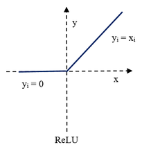
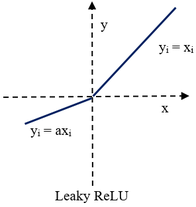

# LeakyRelu

更新时间：2026-04-20 06:34:33

来源：https://developer.huawei.com/consumer/cn/doc/harmonyos-guides/cannkit-scalar-binocular-leakyrelu

##### 功能说明

按元素做带泄露线性整流Leaky ReLU：


 
带泄露线性整流函数（Leaky Rectified Linear Unit, Leaky ReLU激活函数），是一种人工神经网络中常用的激活函数，其数学表达式为：
 


 
和ReLU的区别是：ReLU是将所有的负值都设为零，而Leaky Relu 是给所有负值赋予一个斜率。下图表示了Relu和Leaky Relu的区别：
 


 


 
对于Leaky ReLU函数，如果src的值小于零，dst的值等于src的值乘以scalar的值。如果src大于等于零，则dst的值等于src的值。
 
  

##### 函数原型

tensor前n个数据计算：
 
```text
template <typename T, bool isSetMask = true> 
__aicore__ inline void LeakyRelu(const LocalTensor<T>& dstLocal, const LocalTensor<T>& srcLocal, const T& scalarValue, const int32_t& calCount)
```
 
  

##### 参数说明

**表1** 模板参数说明
  
| 参数名 | 描述 |
| --- | --- |
| T | 操作数数据类型。 |
| U | scalarValue数据类型。 |
| isSetMask | 是否在接口内部设置mask模式和mask值。 - true，表示在接口内部设置。 - false，表示在接口外部设置。 |
 
 
**表2** 参数说明
  
| 参数名称 | 类型 | 说明 |
| --- | --- | --- |
| dstLocal | 输出 | 目的操作数。 类型为LocalTensor，支持的TPosition为VECIN/VECCALC/VECOUT。 LocalTensor的起始地址需要32字节对齐。 Kirin9020训练系列产品，支持的数据类型为：Tensor（half/float） KirinX90系列处理器，支持的数据类型为：Tensor（half/float） |
| srcLocal | 输入 | 源操作数。 类型为LocalTensor，支持的TPosition为VECIN/VECCALC/VECOUT。 LocalTensor的起始地址需要32字节对齐。 数据类型需要与目的操作数保持一致。 Kirin9020训练系列产品，支持的数据类型为：Tensor（half/float） KirinX90系列处理器，支持的数据类型为：Tensor（half/float） |
| scalarValue | 输入 | 源操作数，数据类型需要与目的操作数Tensor中的元素保持一致。 Kirin9020训练系列产品，支持的数据类型为：half/float KirinX90系列处理器，支持的数据类型为：Tensor（half/float） |
| calCount | 输入 | 输入数据元素个数。 |
 
 
  

##### 返回值

无
 
  

##### 支持的型号

Kirin9020系列处理器
 
KirinX90系列处理器
 
  

##### 注意事项

操作数地址偏移对齐要求请参见[通用约束](https://developer.huawei.com/consumer/cn/doc/harmonyos-guides/cannkit-general-constraints)。
 
  

##### 调用示例

tensor前n个数据计算样例（本样例中只展示Compute流程中的部分代码，如果开发者需要运行样例代码，请将该代码段拷贝并替换上方样例的Compute函数中粗体部分即可）。
 
```text
half scalar = 2;
AscendC::LeakyRelu(dstLocal, srcLocal, scalar, 512);
```
 
结果示例如下。
 
```text
输入数据(srcLocal): [-1. -2. 3. ... 512.]
输入数据 scalar = 2.
输出数据(dstLocal): [-2. -4. 3. ... 512.]
```
