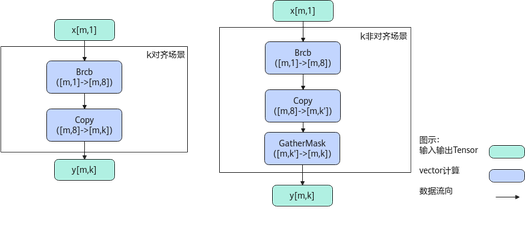

# 数据填充

更新时间：2026-05-12 09:31:20

来源：https://developer.huawei.com/consumer/cn/doc/harmonyos-guides/cannkit-high-data-filling

## Broadcast


## 功能说明

将输入按照输出shape进行广播。 比如A的shape为(2,1)，广播的目标shape为(2,16)，则会将原来的一列扩展为相同的16列。
```text
输入数据：  [[ 1] [ 2]]
输出数据：  [[ 1  1  1  1  1  1  1  1  1  1  1  1  1  1  1  1] [ 2  2  2  2  2  2  2  2  2  2  2  2  2  2  2  2]]
```


## 实现原理

以float类型，ND格式，[m, 1]广播到[m, k]为例，描述Broadcast高阶API内部算法框图，如下图所示。 **图1** Broadcast算法框图

计算过程分为如下几步，均在Vector上进行： Brcb步骤：将每个元素广播为一个datablock；  Copy步骤：将每个datablock均复制为多个datablock，k对齐场景下即为结果y；  对于k非对齐的场景，再使用GatherMask截取[m, k]个元素， 其中k'表示k向上对齐32B的大小。

## 函数原型

通过sharedTmpBuffer入参传入临时空间
```text
template
__aicore__ inline void Broadcast(const LocalTensor &dstLocal, const LocalTensor &srcLocal, const uint32_t dstShape[dim], const uint32_t srcShape[dim], LocalTensor &sharedTmpBuffer)
```

接口框架申请临时空间
```text
template
__aicore__ inline void Broadcast(const LocalTensor &dstLocal, const LocalTensor &srcLocal, const uint32_t dstShape[dim], const uint32_t srcShape[dim])
```

该接口需要额外的临时空间来存储计算过程中的中间变量。临时空间支持开发者通过sharedTmpBuffer入参传入和接口框架申请两种方式。 通过sharedTmpBuffer入参传入，使用该tensor作为临时空间进行处理，接口框架不再申请。该方式开发者可以自行管理sharedTmpBuffer内存空间，并在接口调用完成后，复用该部分内存，内存不会反复申请释放，灵活性较高，内存利用率也较高。  接口框架申请临时空间，开发者无需申请，但是需要预留临时空间的大小。   通过sharedTmpBuffer传入的情况，开发者需要为tensor申请空间；接口框架申请的方式，开发者需要预留临时空间。

## 参数说明

**表1** 模板参数说明
| 参数名称 | 功能 |
| --- | --- |
| T | 操作数的数据类型。支持的数据类型为：uint8_t/int8_t/half/float。 |
| dim | 输入/输出tensor的维度，目前仅支持1维和2维。 |
| axis | 要广播的维度，目前仅支持0和1。 |
| isReuseSource | 是否允许修改源操作数。该参数预留，传入默认值false即可。 |

**表2** 接口参数说明
| 参数名称 | 输入/输出 | 描述 |
| --- | --- | --- |
| dstLocal | 输出 | 目的操作数。 类型为[LocalTensor](https://developer.huawei.com/consumer/cn/doc/harmonyos-guides/cannkit-localtensor)，支持的TPosition为VECIN/VECCALC/VECOUT。 |
| srcLocal | 输入 | 源操作数。 源操作数的数据类型需要与目的操作数保持一致。 类型为[LocalTensor](https://developer.huawei.com/consumer/cn/doc/harmonyos-guides/cannkit-localtensor)，支持的TPosition为VECIN/VECCALC/VECOUT。 |
| dstShape | 输入 | 输出tensor的shape：uint32_t类型的数组，长度为1或者2， 输入/输出的shape维度数目必须一致。 |
| srcShape | 输入 | 输入tensor的shape：uint32_t类型的数组，长度为1或者2， 输入/输出的shape维度数目必须一致。 |
| sharedTmpBuffer | 输入 | 临时缓存。 类型为[LocalTensor](https://developer.huawei.com/consumer/cn/doc/harmonyos-guides/cannkit-localtensor)，支持的TPosition为VECIN/VECCALC/VECOUT。 用于Broadcast内部复杂计算时存储中间变量，由开发者提供。 |


## 返回值

无

## 支持的型号

KirinX90系列处理器

## 约束说明

操作数地址偏移对齐要求请参见[通用约束](https://developer.huawei.com/consumer/cn/doc/harmonyos-guides/cannkit-general-constraints)。  不支持源操作数与目的操作数地址重叠。  当前仅支持ND格式的输入，不支持其他格式。  dim目前仅支持1或者2， axis目前仅支持0或者1。  对于Atlas推理系列产品AI Core，在dim=2，axis=1时，srcShape[0]必须为32B对齐。  在dim=2，axis=0时，要求srcShape[1]必须32B对齐。

## 调用示例


```text
#include "kernel_operator.h"

template
class KernelBroadcast {
public:
    __aicore__ inline KernelBroadcast()
    {}
    __aicore__ inline void Init(
        GM_ADDR srcGm, GM_ADDR dstGm, const uint32_t dstShape[dim], const uint32_t srcShape[dim])
    {
        for (uint32_t i = 0; i (srcGm), srcSize);
        dstGlobal.SetGlobalBuffer(reinterpret_cast(dstGm), dstSize);

        pipe.InitBuffer(inQueueX, 1, srcSize * sizeof(T));
        pipe.InitBuffer(outQueue, 1, dstSize * sizeof(T));
        dstShape_ = dstShape;
        srcShape_ = srcShape;
    }
    __aicore__ inline void Process()
    {
        CopyIn();
        Compute();
        CopyOut();
    }

private:
    __aicore__ inline void CopyIn()
    {
        AscendC::LocalTensor srcLocal = inQueueX.AllocTensor();
        AscendC::DataCopy(srcLocal, srcGlobal, srcSize);
        inQueueX.EnQue(srcLocal);
    }
    __aicore__ inline void Compute()
    {
        AscendC::LocalTensor dstLocal = outQueue.AllocTensor();
        AscendC::LocalTensor srcLocal = inQueueX.DeQue();
        AscendC::Broadcast(dstLocal, srcLocal, dstShape_, srcShape_);

        outQueue.EnQue(dstLocal);
        inQueueX.FreeTensor(srcLocal);
    }
    __aicore__ inline void CopyOut()
    {
        AscendC::LocalTensor dstLocal = outQueue.DeQue();
        AscendC::DataCopy(dstGlobal, dstLocal, dstSize);
        outQueue.FreeTensor(dstLocal);
    }

private:
    AscendC::GlobalTensor srcGlobal;
    AscendC::GlobalTensor dstGlobal;

    AscendC::TPipe pipe;
    AscendC::TQue inQueueX;
    AscendC::TQue outQueue;
    const uint32_t *dstShape_{nullptr};
    const uint32_t *srcShape_{nullptr};
    int32_t srcSize{1};
    int32_t dstSize{1};
};

template
__aicore__ void kernel_broadcast_operator(
    GM_ADDR srcGm, GM_ADDR dstGm, const uint32_t dstShape[dim], const uint32_t srcShape[dim])
{
    KernelBroadcast op;
    op.Init(srcGm, dstGm, dstShape, srcShape);
    op.Process();
}
```

 结果示例如下：
```text
输入数据（srcLocal）:
[[ 1] [ 2] [ 3] [ 4] [ 5] [ 6] [ 7] [ 8] [ 9] [10] [11] [12] [13] [14] [15] [16]]
dim: 2
axis: 1
输出数据（dstLocal）:
[[ 1  1  1  1  1  1  1  1  1  1  1  1  1  1  1  1]
[ 2  2  2  2  2  2  2  2  2  2  2  2  2  2  2  2]
[ 3  3  3  3  3  3  3  3  3  3  3  3  3  3  3  3]
[ 4  4  4  4  4  4  4  4  4  4  4  4  4  4  4  4]
[ 5  5  5  5  5  5  5  5  5  5  5  5  5  5  5  5]
[ 6  6  6  6  6  6  6  6  6  6  6  6  6  6  6  6]
[ 7  7  7  7  7  7  7  7  7  7  7  7  7  7  7  7]
[ 8  8  8  8  8  8  8  8  8  8  8  8  8  8  8  8]
[ 9  9  9  9  9  9  9  9  9  9  9  9  9  9  9  9]
[10 10 10 10 10 10 10 10 10 10 10 10 10 10 10 10]
[11 11 11 11 11 11 11 11 11 11 11 11 11 11 11 11]
[12 12 12 12 12 12 12 12 12 12 12 12 12 12 12 12]
[13 13 13 13 13 13 13 13 13 13 13 13 13 13 13 13]
[14 14 14 14 14 14 14 14 14 14 14 14 14 14 14 14]
[15 15 15 15 15 15 15 15 15 15 15 15 15 15 15 15]
[16 16 16 16 16 16 16 16 16 16 16 16 16 16 16 16]]
```
