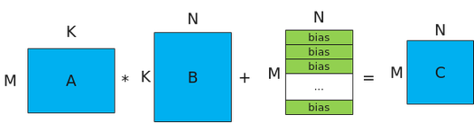

# 使用说明

更新时间：2026-05-12 09:31:20

来源：https://developer.huawei.com/consumer/cn/doc/harmonyos-guides/cannkit-matmul-usage-description

AscendC提供一组Matmul高阶API，方便开发者快速实现Matmul矩阵乘法的运算操作。

 Matmul的计算公式为：C = A * B，其示意图如下。

 **图1** Matmul矩阵乘示意图（当前不支持bias计算）

 

> [!NOTE]
> 下文中提及的M轴方向，即为A矩阵纵向；K轴方向，即为A矩阵横向或B矩阵纵向；N轴方向，即为B矩阵横向。

 实现Matmul矩阵乘运算的具体步骤如下。
