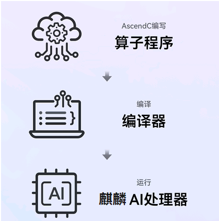

# AscendC简介

更新时间：2026-04-20 06:34:33

来源：https://developer.huawei.com/consumer/cn/doc/harmonyos-guides/cannkit-introduction-to-ascend-c

##### 概述

AscendC是CANN Kit针对算子开发场景推出的编程语言，遵循C和C++标准规范，匹配开发者开发习惯；通过多层接口抽象、自动并行计算、孪生调试等关键技术，提高算子开发效率，助力AI开发者低成本完成算子开发和模型调优部署。
 

 
使用AscendC进行自定义算子开发的突出优势有：
 
- 遵循C/C++编程规范，匹配开发者开发习惯
- 自动并行调度，获得最优执行性能
- 结构化核函数编程，简化算子开发逻辑
- CPU/NPU孪生调试，提升算子调试效率

 
开发者可以通过[AscendC主页](https://www.hiascend.com/zh/ascend-c)了解更详细的内容。
 
  

##### 使用须知

当前AscendC支持的产品型号为：Kirin9030/Kirin9020/KirinX90系列处理器产品。
