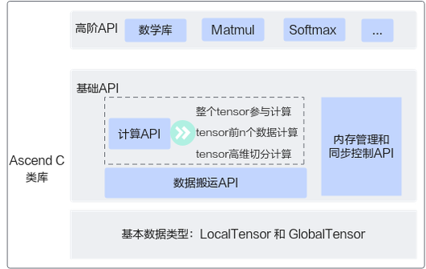
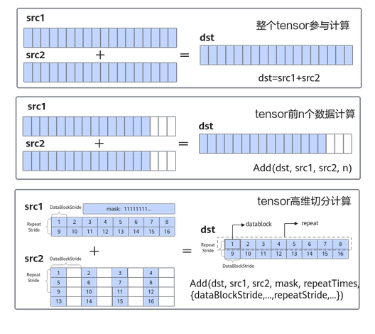

# 接口概述

更新时间：2026-04-20 06:34:33

来源：https://developer.huawei.com/consumer/cn/doc/harmonyos-guides/cannkit-api-overview

AscendC算子采用标准C++语法和一组类库API进行编程，开发者可以根据自己的需求选择合适的API。AscendC编程类库API示意图如下所示，AscendC API的操作数都是Tensor类型：GlobalTensor和LocalTensor；类库API分为基础API和高阶API。

 **图1** AscendC编程类库API示意图

 

 对于基础API，主要分为以下几类：

 对于基础API中的**计算API，** 根据对数据操作方法的不同，分为以下**几种计算方式：**

 下图以矢量加法为例，展示了几种计算方式的特点。

 **图2** 计算API几种计算方式的特点

 

> [!NOTE]
> AscendC API所在头文件目录为：  基础API：\${DDK_INSTALL_PATH}/tools/tools_ascendc/include/tikcpp/tikcfw/kernel_operator.h。  高阶API：\${DDK_INSTALL_PATH}/tools/tools_ascendc/include/tikcpp/tikcfw/lib，其中\${DDK_INSTALL_PATH}表示DDK软件安装目录。（目录头文件中包含的接口如果未在资料中声明，属于间接调用接口，开发者无需关注）
