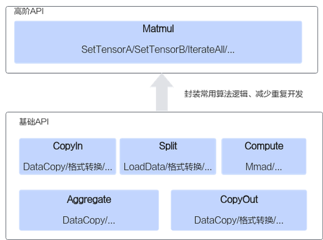

# 高阶API

更新时间：2026-04-20 06:34:33

来源：https://developer.huawei.com/consumer/cn/doc/harmonyos-guides/cannkit-high-level-apis

高阶API一般是基于单核对常见算法的抽象和封装，用于提高编程开发效率，通常会调用多种基础API实现。高阶API当前仅支持Matmul。
 
如下图所示，实现一个矩阵乘操作，使用基础API需要的步骤较多，需要关注格式转换、数据切分等逻辑；使用高阶API则无需关注这些逻辑，直接传入输入矩阵，调用接口获取输出即可。
 



 
注意，在程序中调用高阶API的Tiling接口或者使用高阶API的Tiling结构体参数时，需要引入依赖的头文件，示例如下。
 
```text
#include "register/tilingdata_base.h"
#include "lib/tiling_api.h"
 
namespace optiling {
BEGIN_TILING_DATA_DEF(MatmulCustomTilingData)
TILING_DATA_FIELD_DEF_STRUCT(TCubeTiling, cubeTilingData);
END_TILING_DATA_DEF;
REGISTER_TILING_DATA_CLASS(MatmulCustom, MatmulCustomTilingData);
} // namespace optiling
```
