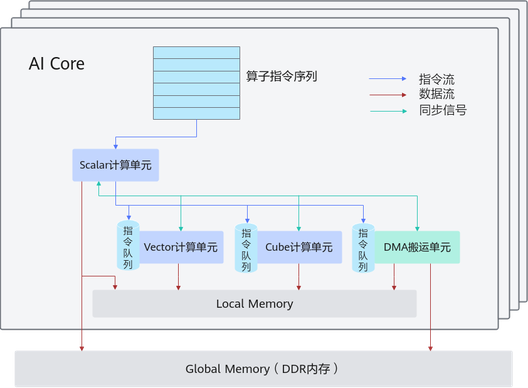

# 硬件架构抽象

更新时间：2026-04-20 06:34:33

来源：https://developer.huawei.com/consumer/cn/doc/harmonyos-guides/cannkit-hardware-architecture-abstraction

AscendC基于硬件抽象架构进行编程， 屏蔽不同硬件之间的差异。

 **图1** 硬件架构抽象

 

 AI Core中包含**计算单元、存储单元、搬运单元**等核心组件。

- AI Core的内部存储，统称为Local Memory，对应的数据类型为LocalTensor。由于不同芯片间硬件资源不固定，可以为UB、L1、L0A、L0B等。
- AI Core能够访问的外部存储称之为Global Memory，对应的数据类型为GlobalTensor。

DMA(Direct Memory Access)搬运单元：负责在Global Memory和Local Memory之间搬运数据。

AI Core内部核心组件及组件功能详细说明如下表。

 **表1** AI Core内部核心组件

| 组件分类 | 组件名称 | 组件功能 |
| --- | --- | --- |
| 计算单元 | Scalar | 执行地址计算、循环控制等标量计算工作，并把向量计算、矩阵计算、数据搬运、同步指令发射给对应单元执行。 |
| 计算单元 | Vector | 负责执行向量运算。 |
| 计算单元 | Cube | 负责执行矩阵运算。 |
| 存储单元 | Local Memory | AI Core的内部存储。 |
| 搬运单元 | DMA(Direct Memory Access) | 负责在Global Memory和Local Memory之间搬运数据，包含搬运单元MTE2（Memory Transfer Engine，数据搬入单元），MTE3（数据搬出单元）等。 |

开发者在理解硬件架构的抽象时，需要重点关注如下**异步指令流、同步信号流**、**计算数据流**三个过程：
