# 编程范式

更新时间：2026-05-12 09:31:20

来源：https://developer.huawei.com/consumer/cn/doc/harmonyos-guides/cannkit-programming-paradigm

编程范式描述了算子实现的固定流程，基于编程范式进行编程，可以快速搭建算子实现的代码框架。

 根据[硬件架构抽象](https://developer.huawei.com/consumer/cn/doc/harmonyos-guides/cannkit-hardware-architecture-abstraction)可以了解到，AI Core内部的执行单元异步并行地执行接收到的指令。如下图所示，从输入数据到输出数据需要经过3个阶段任务的处理（T1、T2、T3），多个执行单元并行处理，每个执行单元只会专注于一个任务的处理，会处理所有的数据分片。可以看出，流水线并行和工业生产中的流水线是类似的，每一个执行单元都可以看成是流水线上的节点，通过流水线并行的方式来提高计算效率：执行单元1完成对某个数据分片的处理后，将其加入到通信队列，执行单元2空闲时就会从队列中取出数据继续处理；可以类比为生产流水线中的工人只完成某一项固定工序，完成后就交由下一项工序负责人继续处理。

 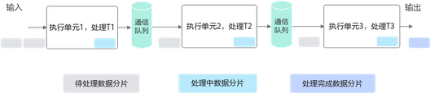

 AscendC编程范式就是这样一种流水线式的编程范式，把算子核内的处理程序，分成多个**流水任务**，通过队列(Queue)完成**任务间通信和同步**，并通过统一的**资源管理**模块(Pipe)来统一管理内存、事件等资源。


## Vector编程范式

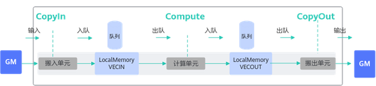
如上图所示，Vector编程范式把算子的实现流程分为3个基本任务：CopyIn，Compute，CopyOut。 **CopyIn**负责搬入操作：将输入数据从Global Memory搬运到Local Memory（VECIN用于表达矢量计算搬入数据的存放位置），完成搬运后执行入队列操作。  **Compute**负责矢量指令计算操作：完成队列出队后，从Local Memory获取数据并计算，计算完成后执行入队操作。  **CopyOut**负责搬出操作：完成队列出队后，将计算结果从Local Memory（VECOUT用于表达矢量计算搬出数据的存放位置）搬运到GM。   上文中提到的VECIN/VECOUT是TPosition的概念。AscendC管理不同层级的物理内存时，用一种抽象的逻辑位置(TPosition)来表达各级别的存储，代替了片上物理存储的概念，达到隐藏硬件架构的目的。除了VECIN/VECOUT，矢量编程中还会使用到VECCALC，一般在定义临时变量时使用此位置。这些TPosition与物理内存的映射关系如下表。 **表1** TPosition与物理内存映射关系
| TPosition | 物理内存 |
| --- | --- |
| GM | Global Memory |
| VECIN | Unified Buffer |
| VECOUT | Unified Buffer |
| VECCALC | Unified Buffer |

从编程的角度来讲，具体流程（如下文的伪代码）和流程图如下。
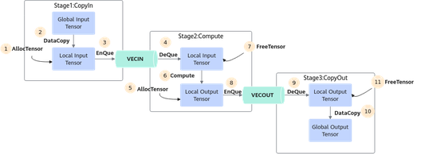
```text
AscendC::TPipe pipe; // 创建全局的资源管理
AscendC::TQue queIn; // 创建CopyIn阶段的队列
AscendC::TQue queOut; // 创建CopyOut阶段的队列
// Init阶段：
pipe.InitBuffer(queIn, 2, 1024); // 开启double buffer，将待处理的数据一分为二，实现流水并行
for-loop {
    // CopyIn阶段{
    auto tensor = queIn.AllocTensor(); // 从Que上申请资源，长度1024字节
    AscendC::DataCopy(tensor, gm, len); // 搬运数据从GM到VECIN
    queIn.EnQue(tensor);
    // }
    // Compute阶段{
    auto tensor = queIn.DeQue();
    auto tensorOut = queOut.AllocTensor();
    AscendC::Abs(tensorOut, tensor, 1024);
    queIn.FreeTensor(tensor);
    queOut.EnQue(tensorOut);
    // }
    // CopyOut阶段{
    auto tensor = queOut.DeQue();
    AscendC::DataCopy(gmOut, tensor, 1024);
    queOut.FreeTensor(tensor);
    // }
}
```

任务间数据传递使用到的内存、事件等资源统一由管理模块Pipe进行管理。如下所示的内存管理示意图，TPipe通过[InitBuffer](https://developer.huawei.com/consumer/cn/doc/harmonyos-guides/cannkit-tpipe-initbuffer)接口对外提供Queue内存初始化功能，开发者可以通过该接口为指定的Queue分配内存。 Queue队列内存初始化完成后，需要使用内存时，通过调用[AllocTensor](https://developer.huawei.com/consumer/cn/doc/harmonyos-guides/cannkit-tque-alloctensor)来为LocalTensor分配内存，当创建的LocalTensor完成相关计算无需再使用时，再调用[FreeTensor](https://developer.huawei.com/consumer/cn/doc/harmonyos-guides/cannkit-tque-freetensor)来回收LocalTensor的内存。
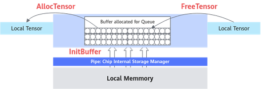
编程过程中使用到的临时变量内存同样通过Pipe进行管理。临时变量可以使用TBuf数据结构来申请指定TPosition上的存储空间。使用TBuf申请的内存空间只能参与计算，无法执行Queue队列的入队出队操作。具体的接口使用说明请参考[TBuf](https://developer.huawei.com/consumer/cn/doc/harmonyos-guides/cannkit-tbuf-overview)。 按照上述编程范式进行编程即可实现单核上数据的并行处理。需要处理的数据被切分成n片，每个并行任务（Stage1、2、3）需要依次完成n个数据切片的处理。Stage间的箭头表达数据间的依赖关系，比如Stage1(CopyIn)处理完第一个数据分片之后，Stage2(Compute)才能对该分片进行处理。
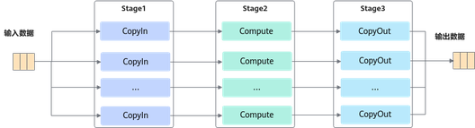
上图中的流水任务运行起来的示意图如下，Progress1、2、3代表处理的数据分片，从运行图中可以看出，对于同一片数据，Stage1、Stage2、Stage3之间的处理具有依赖关系，需要串行处理。不同的数据切片，同一时间点，可以有多个任务在并行处理，由此达到任务并行、提升性能的目的。
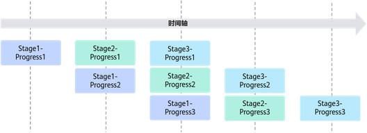

## Cube编程范式

Cube计算的典型数据流图如下所示：
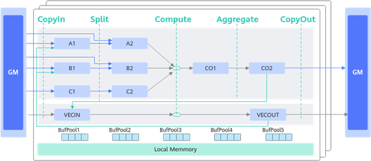
和矢量编程范式一样，同样也使用逻辑位置(TPosition)来表达数据流，Cube编程范式中主要使用的逻辑位置定义如下。 搬入数据的存放位置：A1，用于存放整块A矩阵，可类比CPU多级缓存中的二级缓存。  搬入数据的存放位置：B1，用于存放整块B矩阵，可类比CPU多级缓存中的二级缓存。  搬入数据的存放位置：A2，用于存放切分后的小块A矩阵，可类比CPU多级缓存中的一级缓存。  搬入数据的存放位置：B2，用于存放切分后的小块B矩阵，可类比CPU多级缓存中的一级缓存。  结果数据的存放位置：CO1，用于存放小块结果C矩阵，可理解为Cube Out。  结果数据的存放位置：CO2，用于存放整块结果C矩阵，可理解为Cube Out。  搬入数据的存放位置：VECIN，用于矢量计算，实际业务在数据搬入Vector计算单元时使用此位置。  搬入数据的存放位置：VECCALC，用于矢量计算，实际业务一般在计算需要临时变量时使用此位置。  搬出数据的存放位置：VECOUT，用于矢量计算，实际业务在将Vector计算单元结果搬出时使用此位置。   上述TPosition与物理内存的映射关系如下。 **表2** TPosition与物理内存映射关系
| TPosition | 物理内存 |
| --- | --- |
| GM | Global Memory |
| VECIN | Unified Buffer |
| VECCALC | Unified Buffer |
| VECOUT | Unified Buffer |
| A1 | L1 Buffer |
| A2 | L0A Buffer |
| B1 | L1 Buffer |
| B2 | L0B Buffer |
| C1 | Kirin9020系列产品，L1 Buffer。 |
| C2 | Kirin9020系列产品，BT Buffer。 |
| CO1 | L0C Buffer |
| CO2 | Kirin9020系列产品，Global Memory。 |

Cube计算流程同样也可以理解为CopyIn、Compute、CopyOut这几个阶段，因为流程相对复杂，Matmul高阶API提供对此的高阶封装，编程范式如下。
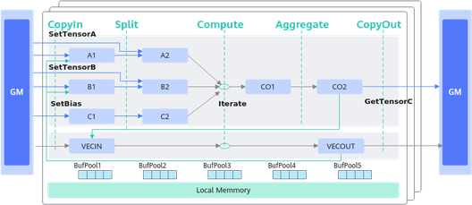
图中线条表示数据流向 具体流程可参考如下示例：
```text
// 创建Matmul对象 创建对象时需要传入A、B、C、Bias的参数类型信息， 类型信息通过MatmulType来定义，包括：内存逻辑位置、数据格式、数据类型。
typedef MatmulType aType;
typedef MatmulType bType;
typedef MatmulType cType;
typedef MatmulType biasType;
Matmul mm;

REGIST_MATMUL_OBJ(&pipe, GetSysWorkSpacePtr(), mm, &tiling); // 初始化
// CopyIn阶段：完成从GM到LocalMemory的搬运
mm.SetTensorA(gm_a); // 设置左矩阵A
mm.SetTensorB(gm_b); // 设置右矩阵B
mm.SetBias(gm_bias); // 设置Bias
// Compute阶段：完成矩阵乘计算
while (mm.Iterate()) {
    // CopyOut阶段：完成从LocalMemory到GM的搬运
    mm.GetTensorC(gm_c);
}
// 结束矩阵乘操作
mm.End();
```


## 融合算子编程范式

支持Vector与Cube混合计算的算子称之为融合算子。AscendC提供**融合算子的编程范式**，方便开发者基于该范式表达融合算子的数据流，快速实现自己的融合算子。 **融合算子数据流**指融合算子的输入输出在各存储位置间的流向。以一个典型的Cube和Vector融合算子为例，逻辑位置间的数据流向如下图所示（为了简化描述，没有列出bias）： Cube的输出可以作为Vector的输入：CO2->VECIN  Vector的输出可以作为Cube的输入：VECOUT->A1->A2、VECOUT->B1->B2
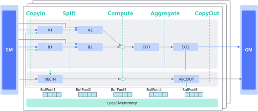
基于Matmul高阶API的融合算子编程范式，对上述数据流简化表达如下。
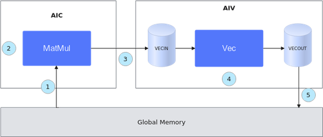
初始化一个MatMul对象，将输入数据从Global Memory搬运到Cube核上。  进行MatMul内部的计算。  将MatMul的计算结果搬运到Vector核上。  进行Vector矢量计算。  将输出结果搬运到Global Memory上。   整个过程的示例代码如下（伪代码）：
```text
template
__aicore__ inline void MatmulLeakyKernel::Process()
{
    // 步骤1：初始化一个MatMul对象，将输入数据从Global Memory搬运到Cube核上。
    uint32_t computeRound = 0;
    REGIST_MATMUL_OBJ(&pipe, GetSysWorkSpacePtr(), matmulObj);
    matmulObj.Init(&tiling);
    matmulObj.SetTensorA(aGlobal);
    matmulObj.SetTensorB(bGlobal);
    matmulObj.SetBias(biasGlobal);

    while (matmulObj.template Iterate()) { // 步骤2：进行MatMul内部的计算。
        // 步骤3：将MatMul的计算结果搬运到Vector核上。
        reluOutLocal = reluOutQueue_.AllocTensor();
        matmulObj.template GetTensorC(reluOutLocal, false, true);
       // 步骤4：进行Vector矢量计算。
        AscendC::LeakyRelu(reluOutLocal, reluOutLocal, (cType)alpha, tiling.baseM * tiling.baseN);
        reluOutQueue_.EnQue(reluOutLocal);
        // 步骤5：将输出结果搬运到Global Memory上
        reluOutQueue_.DeQue();
        // ...
        AscendC::DataCopy(cGlobal[startOffset], reluOutLocal, copyParam);
        reluOutQueue_.FreeTensor(reluOutLocal);

        computeRound++;
    }
    matmulObj.End();
}
```


## 编程模型背后的奥秘

由上文可知，AscendC的并行编程范式核心要素是：任务并行计算、队列管理通信和同步、自定义任务资源调度。本节介绍编程模型的实现原理，作为扩展阅读，便于开发者更好的理解编程模型的设计思路和优势，对于后续的深度开发也会有所帮助。 每个并行任务Stage的编程范式如下。 获取Local Memory的内存，调用[AllocTensor](https://developer.huawei.com/consumer/cn/doc/harmonyos-guides/cannkit-tque-alloctensor)申请内存，或者从上游队列[DeQue](https://developer.huawei.com/consumer/cn/doc/harmonyos-guides/cannkit-tque-deque)一块内存数据。  完成计算或者数据搬运。  把上一步处理好的数据调用[EnQue](https://developer.huawei.com/consumer/cn/doc/harmonyos-guides/cannkit-tque-enque)入队。  调用[FreeTensor](https://developer.huawei.com/consumer/cn/doc/harmonyos-guides/cannkit-tque-freetensor)释放不再需要的内存。   以最简单的矢量编程范式为例，在调用上述接口时，实际上会给各执行单元下发一些指令，如下图所示：
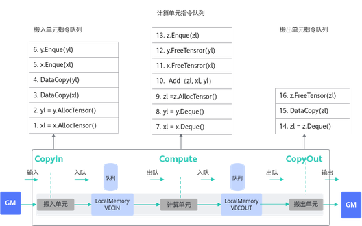

## EnQue/DeQue处理流程

标量执行单元读取算子指令序列。  把这些指令发射到对应的执行单元的指令队列。  各个执行单元并行执行这些指令序列。  EnQue/DeQue解决对内存的写后读问题。  EnQue调用会发射同步指令set，发送信号激活wait。DeQue调用会发射同步指令wait，等待数据写入完成。wait需要等到set信号才能执行否则阻塞。
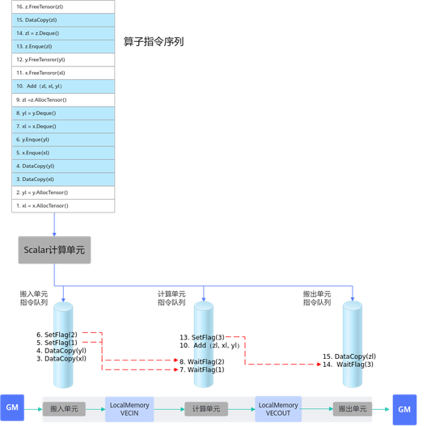
由此可以看出，EnQue/DeQue主要解决了存在数据依赖时，并行执行单元的写后读同步控制问题。
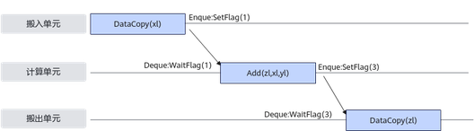

## AllocTensor/FreeTensor处理流程

标量执行单元读取算子指令序列。  把这些指令发射到对应的执行单元的指令队列。  各个执行单元并行执行这些指令序列。  AllocTensor/FreeTensor，解决对内存的读后写问题。  AllocTensor调用会发射同步指令wait等待内存被读完成。FreeTensor调用会发射同步指令set，通知内存释放，可以重复写。wait需要等到set信号才能执行否则阻塞。
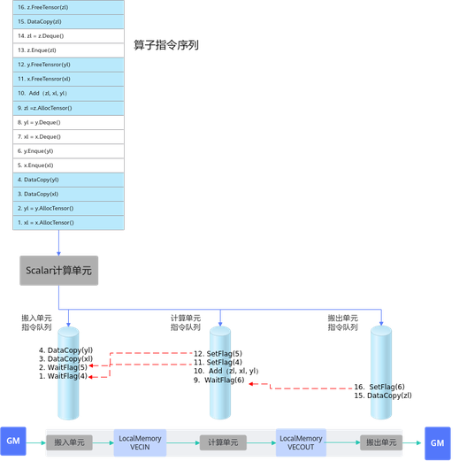
由此可以看出，AllocTensor/FreeTensor主要解决了存在数据依赖时，并行执行单元的读后写同步控制问题。
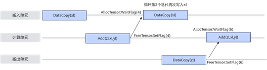
通过上文的详细说明，可以看出异步并行程序需要考虑复杂的同步控制，而AscendC编程模型将这些流程进行了封装，同时对外接口通过EnQue/DeQue/AllocTensor/FreeTensor这种开发者熟悉的资源控制方式来体现，同时达到了简化编程和易于理解的目的。
