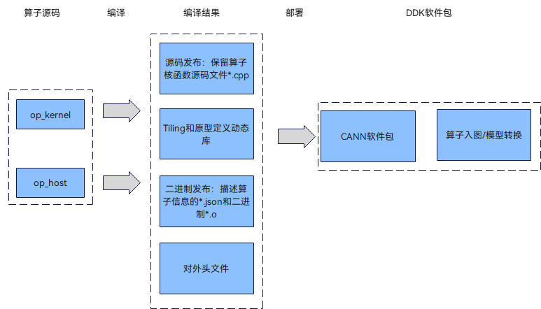

# 算子工程编译

更新时间：2026-06-05 02:03:20

来源：https://developer.huawei.com/consumer/cn/doc/harmonyos-guides/cannkit-operator-project-compilation

算子kernel侧和host侧实现开发完成后，需要对算子工程进行编译，将自定义算子部署到omg工具中，详细的编译操作包括：
 
- 编译AscendC算子kernel侧代码实现文件*.cpp，分为源码发布和二进制发布两种方式。

  
**源码发布：** 不对算子kernel侧实现进行编译，保留算子kernel源码文件*.cpp。该方式可以支持模型的离线编译场景。
- **二进制发布：** 对算子kernel侧实现进行编译，生成描述算子相关信息的json文件*.json和算子二进制文件*.o。算子调用时，如果需要直接调用算子二进制，则使用该编译方式，当前暂不支持该方式进行部署。

  - 编译AscendC算子host侧代码实现文件*.cpp、*.h。

  
将原型定义和shape推导实现编译成算子原型定义动态库libcustom_op.so，并生成算子原型对外接口op_proto.h。
- 将算子信息库定义编译成信息库定义文件*.json。

  
 
上述编译过程示意图如下。
 
**图1** 算子工程编译示意图
 



  

#### 编译步骤
1. 完成工程编译相关配置。

  修改工程目录下的**CMakePresets.json** cacheVariables的配置项。**CMakePresets.json**文件内容如下。

  
```json
{
    "version": 1,
    "cmakeMinimumRequired": {
        "major": 3,
        "minor": 19,
        "patch": 0
    },
    "configurePresets": [
        {
            "name": "default",
            "displayName": "Default Config",
            "description": "Default build using Unix Makefiles generator",
            "generator": "Unix Makefiles",
            "binaryDir": "${sourceDir}/build_out",
            "cacheVariables": {
                "CMAKE_BUILD_TYPE": {
                    "type": "STRING",
                    "value": "Release"
                },
                "ASCEND_COMPUTE_UNIT": {
                    "type": "STRING",
                    "value": "kirin9020"
                },
                "vendor_name": {
                    "type": "STRING",
                    "value": "customize"
                },
                "ASCEND_PYTHON_EXECUTABLE": {
                    "type": "STRING",
                    "value": "python3"
                },
                "CMAKE_INSTALL_PREFIX": {
                    "type": "PATH",
                    "value": "${sourceDir}/build_out"
                }
            }
        }
    ]
}
```
  **表1** 需要开发者配置的常用参数列表

| 参数名称 | 参数描述 | 默认值 |

| --- | --- | --- |

| CMAKE_BUILD_TYPE | 编译模式选项，可配置为： - “Release”，Release版本，不包含调试信息，编译最终发布的版本。 - “Debug”，“Debug”版本，包含调试信息，便于开发者开发和调试。 | Release |
2. 在算子工程目录下执行如下命令，进行算子工程编译。

  
```bash
./build.sh
```
  编译成功后，会在当前目录下创建build_out目录，并将build_out目录下生成的自定义算子交付件安装到tools_omg中。

  如果想单独编译算子kernel，可以在算子工程下执行如下命令：

  
```bash
./build_devices.sh
```
  开发者如果需要该编译过程日志存盘，可以使用环境变量ASCENDC_BUILD_LOG_DIR来控制存储路径。

  
```bash
# 如希望编译日志存储在/home/build_log/，则可以按照如下设置，默认不打开日志存储
export ASCENDC_BUILD_LOG_DIR=/home/build_log/
```
