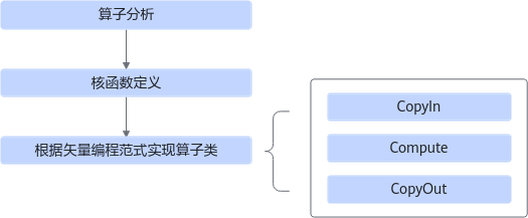
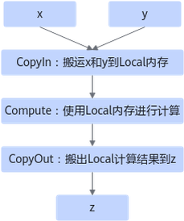
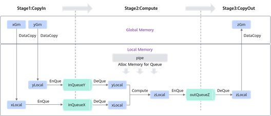
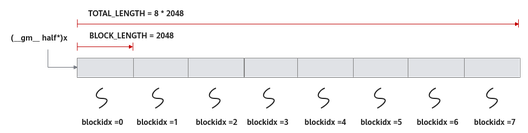
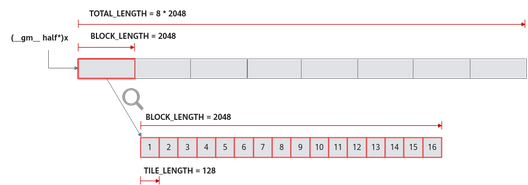

# 矢量编程

更新时间：2026-05-12 09:31:20

来源：https://developer.huawei.com/consumer/cn/doc/harmonyos-guides/cannkit-vector-programming

## 算子实现流程概述

基于AscendC方式实现矢量算子的流程如图1所示。 **图1** 矢量算子实现流程

算子分析：分析算子的数学表达式、输入、输出以及计算逻辑的实现，明确需要调用的AscendC接口。  核函数定义：定义AscendC算子入口函数。  根据矢量编程范式实现算子类：完成核函数的内部实现。   下文以ElemWise(Add)算子为例，对上述步骤进行详细介绍。本样例中介绍的算子完整代码参见[add_custom.cpp](https://gitcode.com/HarmonyOS_Samples/cannkit_samplecode_add_custom_cpp/blob/master/FrameworkLaunch/AddCustom/op_kernel/add_custom.cpp)。

## 算子分析

在开发算子代码之前需要分析算子的数学表达式、输入、输出以及计算逻辑的实现，明确需要调用的AscendC接口。 明确算子的数学表达式及计算逻辑。  Add算子的数学表达式为：
```text
z = x + y
```

计算逻辑是：AscendC提供的[矢量计算](https://developer.huawei.com/consumer/cn/doc/harmonyos-guides/cannkit-vector-calculation-exp)接口的操作元素都为LocalTensor，输入数据需要先搬运进片上存储，然后使用计算接口完成两个输入参数相加，得到最终结果，再搬出到外部存储上。AscendC Add算子的计算逻辑如下图所示。  **图2** 算子计算逻辑

明确输入和输出。  Add算子有两个输入：x与y，输出为z。本样例中算子的输入支持的数据类型为half(float16)，算子输出的数据类型与输入数据类型相同。算子输入支持shape(8，2048)，输出shape与输入shape相同。算子输入支持的format为：ND。  确定核函数名称和参数。  开发者可以自定义核函数名称，本样例中核函数命名为add_custom。根据对算子输入输出的分析，确定核函数有3个参数x，y，z；x，y为输入在Global Memory上的内存地址，z为输出在Global Memory上的内存地址。  确定算子实现所需接口。  实现涉及外部存储和内部存储间的数据搬运，查看AscendC API参考中的数据搬移接口，需要使用[DataCopy](https://developer.huawei.com/consumer/cn/doc/harmonyos-guides/cannkit-common-data-movement)来实现数据搬移。本样例只涉及矢量计算的加法操作，通过查看AscendC API参考中的[矢量计算](https://developer.huawei.com/consumer/cn/doc/harmonyos-guides/cannkit-vector-calculation-exp)接口定义，初步分析可使用双目指令[Add](https://developer.huawei.com/consumer/cn/doc/harmonyos-guides/cannkit-add)接口实现x+y。计算中使用到的Tensor数据结构，使用Queue队列进行管理，会使用到[EnQue](https://developer.huawei.com/consumer/cn/doc/harmonyos-guides/cannkit-tque-enque)、[DeQue](https://developer.huawei.com/consumer/cn/doc/harmonyos-guides/cannkit-tque-deque)等接口。  通过以上分析，得到AscendC Add算子的设计规格如下。  **算子类型(OpType)：** Add**算子输入输出：****name:** x（输入）、y（输入）、z（输出）**shape:** (8, 2048)**data type:** half**format:** ND  **核函数名称：** add_custom**使用的主要接口：** DataCopy：数据搬移接口；Add：矢量双目指令接口；EnQue、DeQue等接口：Queue队列管理接口。**算子实现文件名称：** add_custom.cpp

## 核函数定义

根据[核函数定义](https://developer.huawei.com/consumer/cn/doc/harmonyos-guides/cannkit-kernel-function#核函数定义)中介绍的规则进行核函数的定义。 函数原型定义  本样例中，函数名为add_custom（核函数名称可自定义），根据[算子分析](#算子分析)中对算子输入输出的分析，确定有3个参数x，y，z，其中x，y为输入内存，z为输出内存。根据[核函数定义](https://developer.huawei.com/consumer/cn/doc/harmonyos-guides/cannkit-kernel-function#核函数定义)核函数的规则介绍，函数原型定义如下所示：使用__global__函数类型限定符来标识它是一个核函数；使用__aicore__函数类型限定符来标识该核函数在设备端aicore上执行；为方便起见，统一使用GM_ADDR宏修饰入参，GM_ADDR宏定义请参考[核函数](https://developer.huawei.com/consumer/cn/doc/harmonyos-guides/cannkit-kernel-function)。
```text
extern "C" __global__ __aicore__ void add_custom(GM_ADDR x, GM_ADDR y, GM_ADDR z)
{
}
```

调用算子类的Init和Process函数。  算子类的Init函数，完成内存初始化相关工作，Process函数完成算子实现的核心逻辑，具体介绍参见[算子类实现](#算子类实现)。
```text
extern "C" __global__ __aicore__ void add_custom(GM_ADDR x, GM_ADDR y, GM_ADDR z)
{
    KernelAdd op;
    op.Init(x, y, z);
    op.Process();
}
```


## 算子类实现

根据上一节介绍，核函数中会调用算子类的Init和Process函数，本节具体讲解如何基于编程范式实现算子类。 根据矢量编程范式对Add算子的实现流程进行设计的思路如下，矢量编程范式请参考[Vector编程范式](https://developer.huawei.com/consumer/cn/doc/harmonyos-guides/cannkit-programming-paradigm#vector编程范式)，设计完成后得到的Add算子实现流程图参见图3： Add算子的实现流程分为3个基本任务：CopyIn，Compute，CopyOut。CopyIn任务负责将Global Memory上的输入Tensor xGm和yGm搬运至Local Memory，分别存储在xLocal，yLocal，Compute任务负责对xLocal，yLocal执行加法操作，计算结果存储在zLocal中，CopyOut任务负责将输出数据从zLocal搬运至Global Memory上的输出Tensor zGm中。  CopyIn，Compute任务间通过VECIN队列inQueueX，inQueueY进行通信和同步，Compute，CopyOut任务间通过VECOUT队列outQueueZ进行通信和同步。  任务间交互使用到的内存、临时变量使用到的内存统一使用pipe内存管理对象进行管理。   **图3** Add算子实现流程

算子类中主要实现上述流程，包含对外开放的初始化Init函数和核心处理函数Process，Process函数中会对上图中的三个基本任务进行调用；同时包括一些算子实现中会用到的私有成员，比如上图中的Global Tensor和VECIN、VECOUT队列等。KernelAdd算子类具体成员如下。
```text
class KernelAdd {
public:
    __aicore__ inline KernelAdd() {}
    // Initialization function, which initializes the memory
    __aicore__ inline void Init(GM_ADDR x, GM_ADDR y, GM_ADDR z){}
    // Core processing function, which implements the operator logic and calls the private member functions
    // CopyIn, Compute, and CopyOut to complete the three-stage pipelined execution of the vector operator
    __aicore__ inline void Process(){}

private:
    // CopyIn function, which completes the processing in the CopyIn phase and is called by the Process function
    __aicore__ inline void CopyIn(int32_t progress){}
    // Compute function, which completes the processing in the Compute phase and is called by Process function
    __aicore__ inline void Compute(int32_t progress){}
    // CopyOut function, which completes the processing in the CopyOut phase and is called by the Process function
    __aicore__ inline void CopyOut(int32_t progress){}

private:
    AscendC::TPipe pipe; // Pipe memory management object.
    AscendC::TQue inQueueX, inQueueY; // Input data queue management object. QuePosition is VECIN.
    AscendC::TQue outQueueZ; // Output data queue management object. QuePosition is VECOUT.
    AscendC::GlobalTensor xGm; // Object for managing the input and output global memory addresses. xGm and yGm are inputs, and zGm is the output.
    AscendC::GlobalTensor yGm;
    AscendC::GlobalTensor zGm;
};
```

 初始化函数主要完成以下内容： 设置输入输出Global Tensor的Global Memory内存地址。  本样例中使用多核并行计算，即把数据进行分片，分配到多个核上进行处理。AscendC核函数是在一个核上的处理函数，所以只处理部分数据，需要在初始化函数中获取该核函数需要处理的输入输出在Global Memory上的内存偏移地址，并将该偏移地址设置在Global Tensor中。  以获取输入x在Global Memory上的内存偏移地址为例：
```text
xGm.SetGlobalBuffer((__gm__ half*)x + BLOCK_LENGTH * GetBlockIdx(), BLOCK_LENGTH);
```

本样例中的分配方案是：数据整体长度TOTAL_LENGTH为8 * 2048，平均分配到8个核上运行，每个核上处理的数据大小BLOCK_LENGTH为2048字节。x + BLOCK_LENGTH * GetBlockIdx()即为单核处理程序中x在Global Memory上的内存偏移地址，获取偏移地址后，使用[GlobalTensor](https://developer.huawei.com/consumer/cn/doc/harmonyos-guides/cannkit-globaltensor)类的接口设定该核上Global Memory的起始地址以及长度。具体示意图请参考图4。  **图4** 多核并行处理示意图

通过Pipe内存管理对象为输入输出Queue分配内存。  比如，为输入x的Queue分配内存，可以通过如下代码段实现：
```text
pipe.InitBuffer(inQueueX, BUFFER_NUM, TILE_LENGTH * sizeof(half))
```

对于单核上的处理数据，可以进行数据切块(Tiling)，在本示例中，将数据切分成8块（并不意味着8块就是性能最优）仅作为参考。切分后的每个数据块再次切分成2块，即可开启double buffer，实现流水线之间的并行。  这样单核上的数据（2048个数）被切分成16块，每块TILE_LENGTH(128)个数据。上文代码表示Pipe为inQueueX分配了两块大小为TILE_LENGTH * sizeof(half)个字节的内存块，每个内存块能容纳TILE_LENGTH(128)个half类型数据。数据切分示意图如图5所示。  **图5** 单核数据切分示意图

Kirin9020/KirinX90系列处理器支持的核数为1，具体的初始化函数代码如下。
```text
constexpr int32_t TOTAL_LENGTH = 8 * 2048; // 数据总长度
constexpr int32_t USE_CORE_NUM = 1; // 使用的核心数量
constexpr int32_t BLOCK_LENGTH = TOTAL_LENGTH / USE_CORE_NUM; // 每个核心计算的数据长度
constexpr int32_t TILE_NUM = 8; // 将数据拆分为8个图块（tile）供每个核心处理
constexpr int32_t BUFFER_NUM = 2; // 每个队列中的张量数量（用于双缓冲）
constexpr int32_t TILE_LENGTH = BLOCK_LENGTH / TILE_NUM / BUFFER_NUM; // 每个图块长度（由于双缓冲机制，需拆分为2部分）
__aicore__ inline void Init(GM_ADDR x, GM_ADDR y, GM_ADDR z)
{
    // 获取当前核心的起始索引，实现核心并行
    xGm.SetGlobalBuffer((__gm__ half*)x + BLOCK_LENGTH * AscendC::GetBlockIdx(), BLOCK_LENGTH);
    yGm.SetGlobalBuffer((__gm__ half*)y + BLOCK_LENGTH * AscendC::GetBlockIdx(), BLOCK_LENGTH);
    zGm.SetGlobalBuffer((__gm__ half*)z + BLOCK_LENGTH * AscendC::GetBlockIdx(), BLOCK_LENGTH);
    // 初始化管道（Pipe）缓冲区到队列，单位是字节
    pipe.InitBuffer(inQueueX, BUFFER_NUM, TILE_LENGTH * sizeof(half));
    pipe.InitBuffer(inQueueY, BUFFER_NUM, TILE_LENGTH * sizeof(half));
    pipe.InitBuffer(outQueueZ, BUFFER_NUM, TILE_LENGTH * sizeof(half));
}
```

 基于矢量编程范式，将核函数的实现分为3个基本任务：CopyIn，Compute，CopyOut。Process函数中通过如下方式调用这三个函数。
```text
__aicore__ inline void Process()
    {
        // 由于使用了双缓冲区，循环次数需要加倍。
        constexpr int32_t loopCount = TILE_NUM * BUFFER_NUM;
        // 平铺策略，流水线并行
        for (int32_t i = 0; i 根据编程范式上面的算法分析，将整个计算拆分成三个Stage，开发者单独编写每个Stage的代码，三阶段流程示意图参见图3，具体流程如下。 CopyIn函数实现。  使用[DataCopy](https://developer.huawei.com/consumer/cn/doc/harmonyos-guides/cannkit-common-data-movement)接口将GlobalTensor数据拷贝到LocalTensor。使用[EnQue](https://developer.huawei.com/consumer/cn/doc/harmonyos-guides/cannkit-tque-enque)将LocalTensor放入VecIn的Queue中。
```text
__aicore__ inline void CopyIn(int32_t progress)
{
// 从队列内存中分配张量
AscendC::LocalTensor xLocal = inQueueX.AllocTensor();
AscendC::LocalTensor yLocal = inQueueY.AllocTensor();
// 将progress_th tile从全局张量复制到局部张量
AscendC::DataCopy(xLocal, xGm[progress * TILE_LENGTH], TILE_LENGTH);
AscendC::DataCopy(yLocal, yGm[progress * TILE_LENGTH], TILE_LENGTH);
// 将输入张量入队到VECIN队列
inQueueX.EnQue(xLocal);
inQueueY.EnQue(yLocal);
}
```

  Compute函数实现。  使用[DeQue](https://developer.huawei.com/consumer/cn/doc/harmonyos-guides/cannkit-tque-deque)从VecIn中取出LocalTensor。使用[Add](https://developer.huawei.com/consumer/cn/doc/harmonyos-guides/cannkit-add)接口完成矢量计算。使用[EnQue](https://developer.huawei.com/consumer/cn/doc/harmonyos-guides/cannkit-tque-enque)将计算结果LocalTensor放入到VecOut的Queue中。使用[FreeTensor](https://developer.huawei.com/consumer/cn/doc/harmonyos-guides/cannkit-tque-freetensor)释放不再使用的LocalTensor。
```text
__aicore__ inline void Compute(int32_t progress)
{
// 从VECIN队列中取出输入张量。
AscendC::LocalTensor xLocal = inQueueX.DeQue();
AscendC::LocalTensor yLocal = inQueueY.DeQue();
AscendC::LocalTensor zLocal = outQueueZ.AllocTensor();
// 调用Add指令进行计算
AscendC::Add(zLocal, xLocal, yLocal, TILE_LENGTH);
// 将输出张量加入VECOUT队列
outQueueZ.EnQue(zLocal);
// 免费输入张量，可重复使用
inQueueX.FreeTensor(xLocal);
inQueueY.FreeTensor(yLocal);
}
```

  CopyOut函数实现。  使用[DeQue](https://developer.huawei.com/consumer/cn/doc/harmonyos-guides/cannkit-tque-deque)接口从VecOut的Queue中取出LocalTensor。使用[DataCopy](https://developer.huawei.com/consumer/cn/doc/harmonyos-guides/cannkit-common-data-movement)接口将LocalTensor拷贝到GlobalTensor上。使用[FreeTensor](https://developer.huawei.com/consumer/cn/doc/harmonyos-guides/cannkit-tque-freetensor)将不再使用的LocalTensor进行回收。
```text
__aicore__ inline void CopyOut(int32_t progress)
{
// 从VECOUT队列中取出输出张量。
AscendC::LocalTensor zLocal = outQueueZ.DeQue();
// 将局部张量中的progress_th块复制到全局张量
AscendC::DataCopy(zGm[progress * TILE_LENGTH], zLocal, TILE_LENGTH);
// 可自由输出张量以供重用
outQueueZ.FreeTensor(zLocal);
}
```


## 运行验证

核函数即算子kernel程序开发完成后，即可编写host侧的核函数调用程序，实现从host侧的APP程序调用算子，进行运行验证。
