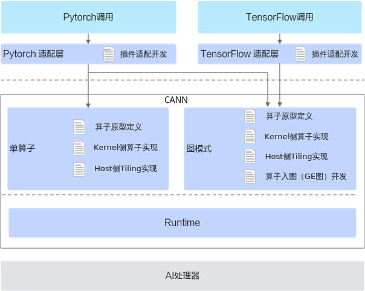

# AI框架算子适配概述

更新时间：2026-04-20 06:34:33

来源：https://developer.huawei.com/consumer/cn/doc/harmonyos-guides/cannkit-overview-of-ai-framework-operator

本章节内容介绍AI框架调用自定义算子的方法。如下图所示，PyTorch和TensorFlow仅支持图模式。
 
AI框架调用时，除了需要提供DDK框架调用时需要的代码实现文件，还需要对插件进行适配开发。下文仅展示通过ONNX框架进行算子适配，TensorFlow框架开发流程与ONNX框架开发流程一致。
 

