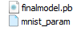
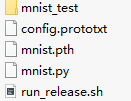
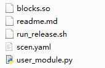
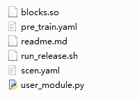
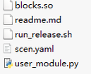

# 模型轻量化示例

更新时间：2026-04-20 06:34:33

来源：https://developer.huawei.com/consumer/cn/doc/harmonyos-guides/cannkit-examples

#### TensorFlow Quant_INT8-8无训练量化Demo

  

#### 环境准备

请参见[环境准备](https://developer.huawei.com/consumer/cn/doc/harmonyos-guides/cannkit-no-training-and-quantization#环境准备)，安装TensorFlow及依赖。
 
  

#### 模型配置

- 准备量化模型

  将基线模型的pb文件放入"dopt_tf_py3/demo/quant8-8/notrain/tensorflow_mnist/basemodel/"中。该路径下已经放入了mnist基线模型mnist.pb。
- 准备量化输入数据

  参见[模型量化](https://developer.huawei.com/consumer/cn/doc/harmonyos-guides/cannkit-no-training-and-quantization#模型量化)，将图片或二进制形式的校准集放入"dopt_tf_py3/demo/quant8-8/notrain/tensorflow_mnist/mnist_test/"中。该路径下已经放入了图片校准集。

 
  

#### 模型量化

执行"dopt_tf_py3/demo/quant8-8/notrain/tensorflow_mnist/"下run_release.sh即可。
 
"dopt_tf_py3/demo/quant8-8/notrain/tensorflow_mnist"中存有量化后的pb模型和量化配置文件，运行demo后生成的文件如下图所示：
 



 
  

#### PyTorch Quant_INT8-8无训练量化Demo

  

#### 环境准备

请参见[环境准备](https://developer.huawei.com/consumer/cn/doc/harmonyos-guides/cannkit-no-training-and-quantization#环境准备-1)，安装PyTorch及依赖。
 
  

#### 模型配置

- 准备量化模型

  将基线模型的模型定义文件(.py)以及模型参数文件放入"dopt_pytorch_py3/demo/quant8-8/notrain/pytorch_mnist/"。

  该路径下已经放入了mnist基线模型定义文件mnist.py以及模型参数文件mnist.pth。
- 准备量化输入数据

  参见[模型量化](https://developer.huawei.com/consumer/cn/doc/harmonyos-guides/cannkit-no-training-and-quantization#模型量化-1)，将图片或二进制形式的校准集放入"dopt_pytorch_py3/demo/quant8-8/notrain/pytorch_mnist/"中。

 
  

#### 模型量化

执行"dopt_pytorch_py3/demo/quant8-8/notrain/pytorch_mnist/"下run_release.sh即可。
 
"dopt_pytorch_py3/demo/quant8-8/notrain/pytorch_mnist/"中存有PyTorch无训练量化示例文件，如下图所示：
 



 
  

#### ONNX Quant_INT8-8无训练量化Demo

  

#### 环境准备

环境准备请参见[环境准备](https://developer.huawei.com/consumer/cn/doc/harmonyos-guides/cannkit-no-training-and-quantization#环境准备-2)，安装ONNX及依赖。
 
  

#### 示例代码

将dopt_onnx_py3 目录添加到系统环境中，在终端环境执行
 
```text
python3 ./dopt_so.py \
    --framework 5 \
    --mode   0 \
    --model "./resnet18_matmul.onnx" \          ## 待量化的ONNX模型
    --cal_conf "./config.prototxt" \            ## 校准集配置文件
    --output  "./resnet18_matmul_quant.onnx" \  ## 量化后的ONNX文件
    --input_shape   input:1,3,128,128 \         ## 浮点模型输入shape
    --compress_conf  ./mnist_param              ## dopt 工具生成的量化文件
```
 
其中，./config.prototxt配置内容为（[配置文件使用方法](https://developer.huawei.com/consumer/cn/doc/harmonyos-guides/cannkit-no-training-and-quantization#onnx模型无训练量化)）：
 
```text
strategy: 'Quant_INT8-8'
device: USE_CPU
preprocess_parameter:
{
    input_type: BINARY
    input_file_path: './input1.bin'
}
```
 
  

#### TensorFlow Quant_INT8-8插件式量化Demo

  

#### 环境准备

请参见[准备TensorFlow环境](https://developer.huawei.com/consumer/cn/doc/harmonyos-guides/cannkit-plugin-based-quantization#准备tensorflow环境)。安装TensorFlow-gpu 2.8.0版本以及其必要的依赖。
 
  

#### 示例代码

```json
import sys
sys.path.append(".../dopt_tf_py3") ## 其中路径为绝对路径

def generate_config():
    with tf.Session(config=config) as sess:
        build_tf_model() ## 自定义tf模型graph，仅构建拓扑图，不可加载权重
        from dopt.dopt_tf.opt_main import generate_config_file
        generate_config_file(sess, dst_path="./config_gen.json")

def train_model():
    with tf.Session(config=config) as sess:
        build_tf_model() ## 自定义tf模型graph，仅构建拓扑图，不可加载权重
        from dopt.dopt_tf.opt_main import optimize_model
        quant_flag = tf.placeholder(tf.int32)
        is_train_flag = tf.placeholder(tf.bool, name='is_train')
        ## 模型量化，自动在 tf.get_default_graph()上进行改图操作
        optimize_model(
            sess,
            "./config_gen.json",
            is_train_flag,
            quant_flag
        )
        ## 调用完optimize_model之后，加载模型权重
        saver = tf.Saver()
        saver.restore(ckpt)
        tf.global_variables_initializer().run()
        ## train model
        for i in range(...):
            optimizer = ...
            feed_dict[is_train_flag] = True
            feed_dict[quant_flag] = 1
            sess.run(train_op, feed_dict)
        ## eval model
        feed_dict[is_train_flag] = False
        feed_dict[quant_flag] = 1
        sess.run(output, feed_dict)
        evaluate_output(output)

def calibrate_model():
    with tf.Session(config=config) as sess:
        build_tf_model() ## 自定义tf模型graph，仅构建拓扑图，不可加载权重
        from dopt.dopt_tf.opt_main import optimize_model, set_calibrate_state
        quant_flag = tf.placeholder(tf.int32)
        is_train_flag = tf.placeholder(tf.bool, name='is_train')
        ## 模型量化，自动在 tf.get_default_graph()上进行改图操作
        optimize_model(
            sess,
            "./config_gen.json",
            is_train_flag,
            quant_flag
        )
        ## 调用完optimize_model之后，加载模型权重
        saver = tf.Saver()
        saver.restore(ckpt)

        calibration_mode = True
        set_calibrate_state(sess, calibration_mode )
        ## eval model
        feed_dict[is_train_flag] = False
        feed_dict[quant_flag] = 1
        sess.run(output, feed_dict)
        evaluate_output(output)

def generate_params():
    with tf.Session(config=config) as sess:
        build_tf_model()
        from dopt.dopt_tf.opt_main import generate_final_model
        generate_final_model(
            sess,
            config_file         = "./config_gen.json",
            output_name_list    = ["output"],
            ckpt_file           = "train_ckpt_path",
            output_dir          = "./output_dir"
        )
if __name__ == "__main__":
    ## step 1
    ## 开发者接入，配置修改
    generate_config()
    
    ## step 2
    ## 训练模型，直至达标
    train_model() ## 重训练量化模型
    ## calibrate_model()  ## 校准量化模型
    
    ## step 3
    ## 提取参数，用于后续模型部署
    generate_params()
```
 
  

#### PyTorch Quant_INT8-8插件式量化Demo

  

#### 环境准备

请参见[准备PyTorch环境](https://developer.huawei.com/consumer/cn/doc/harmonyos-guides/cannkit-plugin-based-quantization#准备pytorch环境)。安装PyTorch-gpu 1.11版本以及其必要的依赖。
 
  

#### 示例代码

```json
import sys
sys.path.append(".../dopt_tf_py3") ## 其中路径为绝对路径

def generate_config():
    model = build_torch_model()  ## 开发者待量化的浮点模型
    generate_config_file(model, input_shape, dst_path="./config_gen.json") # model：torch.nn.Module， input_shape : "input1:input1.shape;input2:input2.shape"
    return model

def train_model():
    model = build_torch_model() ## 开发者待量化的浮点模型
    from dopt.dopt_torch.opt_main import optimize_model
    model.load_state_dict(state)  ## load 浮点模型参数
    
    ## 调用optimize model 量化模型
    quanted_model = optimize_model(model, config_path)
    
    ## train model
    quant_loss = get_quant_loss(quant_model)
    optimizer = torch.optim.SGD(quanted_model.parameters(), lr=0.001, momentum=0.9) ## 假设使用SGD优化器
    
    for input_data, label in range(...):
        optimizer.zero_grad()
        outputs = model(input_data)
        loss = loss_fn(outputs, label) ## loss_fn 为原始浮点网络训练loss
        
        total_loss = loss + quant_weight * quant_loss ## quant_weight是指量化损失所占比例
        loss.backward()
        
        optimizer.step()

def calibrate_model():
    model = build_torch_model() ## 开发者待量化的浮点模型
    from dopt.dopt_torch.opt_main import optimize_model, set_calibrate_state
    model.load_state_dict(state)  ## load 浮点模型参数
    
    ## 调用optimize model 量化模型
    quanted_model = optimize_model(model, config_path)
    
    calibrate_mode = True
    set_calibrate_state(model, calibrate_mode)
    
    for input_data, label in range(...):
        outputs = model(input_data)

def generate_params():
    model = build_torch_model()
    from dopt.dopt_torch.opt_main import generate_final_model
    generate_final_model(model,
                        config_file,
                        pth_file="quant.pth",
                        output_dir="./results_dir")

if __name__ == "__main__":
    ## step 1
    ## 开发者接入，配置修改
    generate_config()
    
    ## step 2
    ## 训练模型，直至达标
    train_model()
    ## 无训练模式
    ## calibrate_model()
 
    ## step 3
    ## 提取参数，用于后续模型部署
    generate_params()
```
 
  

#### TensorFlow NASEA网络结构搜索Demo

  

#### NASEA分类网络

分类网络Demo位于tools_dopt/dopt_tf_py3/demo/nas_ea/ea_cls_imagenet，包含5个文件，如下图所示：
 



 
- blocks.so：搜索空间文件
- readme.md：搜索训练指导文件
- run_release.sh：开始搜索的执行脚本
- scen.yaml：配置项
- user_module.py：工具的自定义接口

 
执行步骤：
 1. 准备ImageNet数据集（tfrecord格式），并修改scen.yaml文件中的数据集路径。
2. 环境准备请参见[环境准备](https://developer.huawei.com/consumer/cn/doc/harmonyos-guides/cannkit-network-structure-search-training#环境准备)。
3. 加载依赖的开源代码：

  
- 进入分类网络demo目录：

  
```text
cd tools_dopt/dopt_tf_py3/demo/nas_ea/ea_cls_imagenet
```


4. 下载开源代码：

  
```text
git clone https://github.com/Tensorflow/models.git
```


5. 进入开源代码目录：

  
```text
cd models
```


6. 切换到指定版本：

  
如果TensorFlow版本为1.12.0，执行如下命令：

  
```text
git checkout v1.12.0
```


7. 如果TensorFlow版本为2.1.0，执行如下命令：

  
```text
git checkout v2.1.0
```


8. 返回分类网络demo目录：

  
```text
cd ..
```


9. 设置PYTHONPATH默认路径：

  
```text
export PYTHONPATH=$PYTHONPATH:`pwd`/models/
```


  
> [!NOTE]
> 每次打开终端需要重新执行一次上述命令，或添加到“~/.bashrc”文件，并执行“source ~/.bashrc”。

- 配置demo下的scen.yaml文件，请参见[搜索参数配置](https://developer.huawei.com/consumer/cn/doc/harmonyos-guides/cannkit-network-structure-search-training#搜索参数配置)。scen.yaml中提供了建议参数，开发者可根据实际需求修改。
- 修改demo下的user_module.py文件，模型接口定义请参见[TensorFlow用户自定义接口](https://developer.huawei.com/consumer/cn/doc/harmonyos-guides/cannkit-network-structure-search-training#tensorflow开发者自定义接口)。user_module.py中提供了建议配置，开发者可根据实际需求进行修改。
- 执行脚本run_release.sh，在results下，生成多个model_arch_result_*.py文件。开发者可根据log_classification中提供的信息选择合适的网络结构进行训练。后续训练可参考readme.md中的指导。

 
  

#### NASEA检测网络

检测网络Demo位于"tools_dopt/dopt_tf_py3/demo/nas_ea/ea_det_coco"，包含6个文件，如下图所示：
 



 
- blocks.so：搜索空间文件。
- pre_train.yaml：预训练的配置项。
- readme.md：搜索训练指导文件。
- run_release.sh：开始搜索的执行脚本。
- scen.yaml：配置项。
- user_module.py：工具的自定义接口。

 
执行步骤：
 1. 准备数据集，包括用于预训的ImageNet数据集（tfrecord格式）和用于训练的COCO数据集（原始格式）。若有完成预训练的ckpt文件，则不需再准备ImageNet数据集。请参见[搜索参数配置](https://developer.huawei.com/consumer/cn/doc/harmonyos-guides/cannkit-network-structure-search-training#搜索参数配置)，修改scen.yaml文件中的数据集路径。
2. 环境准备请参见[环境准备](https://developer.huawei.com/consumer/cn/doc/harmonyos-guides/cannkit-network-structure-search-training#环境准备)。
3. 加载依赖的开源代码。

  
- 进入检测网络demo目录。

  
```text
cd tools_dopt/dopt_tf_py3/demo/nas_ea/ea_det_coco
```


4. 下载开源代码。

  
```text
git clone https://github.com/pierluigiferrari/ssd_keras.git
git clone https://github.com/Tensorflow/models.git
```


5. 进入开源代码目录。

  
```text
cd ssd_keras
```


6. 切换到指定版本。

  
```text
git checkout -b v0.9.0
```


7. 返回检测网络demo目录。

  
```text
cd ..
```


8. 进入models开源代码目录。

  
```text
cd models
```


9. 切换models到指定版本。

  如果TensorFlow版本为1.12.0，执行如下命令：

  
```text
git checkout v1.12.0
```
   如果TensorFlow版本为2.1.0，则执行如下命令：

  
```text
git checkout v2.1.0
```


10. 进入models开源代码目录

  
```text
cd models
```


11. 设置PYTHONPATH默认路径

  
```text
export PYTHONPATH=$PYTHONPATH:`pwd`/models/
```


12. 按照readme.md中的step1~step4步骤，修改相关开源文件。
- 配置demo的scen.yaml文件和pre_train.yaml，请参见[搜索参数配置](https://developer.huawei.com/consumer/cn/doc/harmonyos-guides/cannkit-network-structure-search-training#搜索参数配置)。scen.yaml中提供了建议参数，开发者可根据实际需求修改。
- 修改demo的user_module.py文件，模型接口定义请参见[TensorFlow用户自定义接口](https://developer.huawei.com/consumer/cn/doc/harmonyos-guides/cannkit-network-structure-search-training#tensorflow开发者自定义接口)。user_module.py中提供了建议配置，开发者可根据实际需求进行修改。
- 执行脚本run_release.sh，在results下，生成多个model_arch_result_*.py文件。开发者可根据log_detection中提供的信息选择合适的网络结构进行训练。后续训练可参考readme.md中的指导。

 
  

#### NASEA分割网络

分割网络Demo位于tools_dopt/dopt_tf_py3/demo/nas_ea/ea_seg_voc，包含 6个文件，如下图所示：
 



 
- blocks.so：搜索空间文件。
- pre_train.yaml：预训练的配置项
- readme.md：搜索训练指导文件。
- run_release.sh：开始搜索的执行脚本。
- scen.yaml：配置项。
- user_module.py：工具的自定义接口。

 
执行步骤：
 1. 准备数据集，包括用于预训练的ImageNet数据集（tfrecord格式）和用于训练的VOC数据集（tfrecord格式）。若有完成预训练的ckpt文件，则不需再准备ImageNet数据集。请参见[搜索参数配置](https://developer.huawei.com/consumer/cn/doc/harmonyos-guides/cannkit-network-structure-search-training#搜索参数配置)，修改scen.yaml文件中的数据集路径。
2. 环境准备请参见[环境准备](https://developer.huawei.com/consumer/cn/doc/harmonyos-guides/cannkit-network-structure-search-training#环境准备)。
3. 加载依赖的开源代码。

  
- 进入分割网络demo目录。
```text
cd tools_dopt/dopt_tf_py3/demo/nas_ea/ea_seg_voc
```


4. 下载开源代码：
```text
git clone https://github.com/Tensorflow/models.git
```


5. 进入开源代码目录。
```text
cd models
```


6. 切换到指定版本。
```text
git checkout v1.13.0
```


7. 返回分割网络demo目录。
```text
cd ..
```


8. 设置PYTHONPATH默认路径：
```text
export PYTHONPATH=$PYTHONPATH:`pwd`/models/research:`pwd`/models/research/slim
```


9. 如果TensorFlow版本为2.1.0，需要执行如下命令：
创建models_tf2.1，并进入文件夹

  
```text
mkdir models_tf2.1
cd models_tf2.1
```


10. 下载开源实现

  
```text
git clone https://github.com/Tensorflow/models.git
```


11. 进入开源代码路径

  
```text
cd models
```


12. 切换到指定版本

  
```text
git checkout v2.1.0
```


13. 返回models_tf2.1目录

  
```text
cd ..
```


14. 设置PYTHONPATH默认路径

  
```text
export PYTHONPATH=$PYTHONPATH:`pwd`/models/
```
  
> [!NOTE]
> 每次打开终端需要重新执行一次上述命令，或添加到"~/.bashrc"文件，并执行"source ~/.bashrc"。

- 修改开源实现，按照readme.md中修改开源实现的步骤，修改相关开源文件。

  - 配置demo的scen.yaml文件和pre_train.yaml，请参见[搜索参数配置](https://developer.huawei.com/consumer/cn/doc/harmonyos-guides/cannkit-network-structure-search-training#搜索参数配置)。scen.yaml中提供了建议参数，开发者可根据实际需求修改。
- 修改demo的user_module.py文件，模型接口定义请参见[TensorFlow用户自定义接口](https://developer.huawei.com/consumer/cn/doc/harmonyos-guides/cannkit-network-structure-search-training#tensorflow开发者自定义接口)。user_module.py中提供了建议配置，开发者可根据实际需求进行修改。
- 执行脚本run_release.sh，在results下，生成多个model_arch_result_*.py文件。开发者可根据log_segmentation中提供的信息选择合适的网络结构进行训练。后续训练可参考readme.md中的指导。

 
  

#### PyTorch NASEA网络结构搜索Demo

  

#### NASEA分类网络

分类网络Demo位于tools_dopt/dopt_pytorch_py3/demo/nas_ea/ea_cls_imagenet_pytorch，包含5个文件，如下：
 


 
- blocks.so：搜索空间文件
- readme.md：搜索训练指导文件
- run_release.sh：开始搜索的执行脚本
- scen.yaml：配置项
- user_module.py：工具的自定义接口

 
执行步骤：
 1. 准备ImageNet数据集（原始格式），并修改scen.yaml文件中的数据集路径。
2. 环境准备请参见[环境准备](https://developer.huawei.com/consumer/cn/doc/harmonyos-guides/cannkit-network-structure-search-training#环境准备)。
3. 配置demo下的scen.yaml文件，请参见[搜索参数配置](https://developer.huawei.com/consumer/cn/doc/harmonyos-guides/cannkit-network-structure-search-training#搜索参数配置)。scen.yaml中提供了建议参数，开发者可根据实际需求修改。
4. 修改demo下的user_module.py文件，模型接口定义请参见[PyTorch开发者自定义接口](https://developer.huawei.com/consumer/cn/doc/harmonyos-guides/cannkit-network-structure-search-training#pytorch开发者自定义接口)。user_module.py中提供了建议配置，开发者可根据实际需求进行修改。
5. 执行脚本run_release.sh，在results下，生成多个model_arch_result_*.py文件。开发者可根据log_classification中提供的信息选择合适的网络结构进行训练。后续训练可参考readme.md中的指导。
 
  

#### NASEA分割网络

分割网络Demo位于tools_dopt/dopt_pytorch_py3/demo/nas_ea/ea_seg_voc_pytorch，包含 6个文件，如下：
 


 
- blocks.so：搜索空间文件
- pre_train.yaml：预训练的配置项
- readme.md：搜索训练指导文件
- run_release.sh：开始搜索的执行脚本
- scen.yaml：配置项
- user_module.py：工具的自定义接口

 
执行步骤：
 1. 准备数据集，包括用于预训练的ImageNet数据集（原始格式）和用于训练VOC数据集（原始格式）。若有完成预训练的ckpt文件，则不需再准备ImageNet数据集。请参见[搜索参数配置](https://developer.huawei.com/consumer/cn/doc/harmonyos-guides/cannkit-network-structure-search-training#搜索参数配置)，修改scen.yaml文件中的数据集路径。
2. 环境准备请参见[环境准备](https://developer.huawei.com/consumer/cn/doc/harmonyos-guides/cannkit-network-structure-search-training#环境准备)。
3. 加载依赖的开源代码：参考tools_dopt/dopt_pytorch_py3/demo/nas_ea/ea_seg_voc_pytorch/readme.md
4. 配置demo下的scen.yaml文件和pre_train.yaml文件，请参见[搜索参数配置](https://developer.huawei.com/consumer/cn/doc/harmonyos-guides/cannkit-network-structure-search-training#搜索参数配置)。scen.yaml中提供了建议参数，开发者可根据实际需求修改。
5. 修改demo下的user_module.py文件，模型接口定义请参见[PyTorch开发者自定义接口](https://developer.huawei.com/consumer/cn/doc/harmonyos-guides/cannkit-network-structure-search-training#pytorch开发者自定义接口)。user_module.py中提供了建议配置，开发者可根据实际需求进行修改。
6. 执行脚本run_release.sh，在results下，生成多个model_arch_result_*.py文件。开发者可根据log_segmentation中提供的信息选择合适的网络结构进行训练。后续训练可参考readme.md中的指导。
