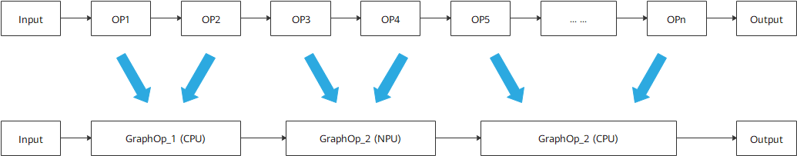

# 异构

更新时间：2026-04-20 06:34:33

来源：https://developer.huawei.com/consumer/cn/doc/harmonyos-guides/cannkit-optimization

## 概述

异构是CANN Kit提供的异构计算能力，能够使开发者App在华为平台上充分享受到硬件平台的计算加速性能，同时提供非华为硬件平台的模型计算兼容性和计算加速，使开发者App开发过程归一化，不再需要为不同硬件平台适配不同模型或者计算框架，减少App开发及维护的难度。 异构的原理如下图所示，指定OP1、OP2、OP5~OPn在CPU上进行推理，OP3、OP4在NPU上进行推理。

实现异构可以通过在线调优方式，以下为在线调优参数设置接口，接口使用见[在线调优开发步骤](#在线调优开发步骤)。如要使用更丰富的设置和查询接口，请参见[API参考](https://developer.huawei.com/consumer/cn/doc/harmonyos-references/cannkit)。 **表1** 在线调优接口及功能介绍
| 接口名 | 描述 |
| --- | --- |
| OH_NN_ReturnCode HMS_HiAIOptions_SetTuningMode(OH_NNCompilation* compilation, HiAI_TuningMode tuningMode); | 芯片调优模式配置。 |
| OH_NN_ReturnCode HMS_HiAIOptions_SetTuningCacheDir(OH_NNCompilation* compilation, const char* cacheDir); | 芯片调优缓存目录配置。 |


## 在线调优开发步骤

设置芯片调优模式。  调用[OH_NNCompilation_ConstructWithOfflineModelFile](https://developer.huawei.com/consumer/cn/doc/harmonyos-references/capi-neural-network-core-h#oh_nncompilation_constructwithofflinemodelfile)，读取模型buffer，创建模型编译实例。调用[HMS_HiAIOptions_SetTuningMode](https://developer.huawei.com/consumer/cn/doc/harmonyos-references/cannkit#hms_hiaioptions_settuningmode)向模型编译实例中设置芯片调优模式调优选项。  调用[HMS_HiAIOptions_SetTuningCacheDir](https://developer.huawei.com/consumer/cn/doc/harmonyos-references/cannkit#hms_hiaioptions_settuningcachedir)向模型编译实例中设置芯片调优缓存目录调优选项。  执行模型编译。  设置好所需调优选项参数后，通过调用[OH_NNCompilation_Build](https://developer.huawei.com/consumer/cn/doc/harmonyos-references/capi-neural-network-core-h#oh_nncompilation_build)，传入创建模型编译实例，即可执行模型编译，编译成功则返回编译后的模型指针。后续流程同[模型推理](https://developer.huawei.com/consumer/cn/doc/harmonyos-guides/cannkit-model-inference)。

## 在线调优示例说明

以下示例代码设置调优参数SetTuningMode及SetTuningCacheDir，实现在线调优。
```text
#include "neural_network_runtime/neural_network_core.h"
#include "CANNKit/hiai_options.h"
// 基于离线模型文件创建编译实例
OH_NNCompilation* compilation = OH_NNCompilation_ConstructWithOfflineModelFile("test.om");
if (compilation == nullptr) {
    return;
}
// 选择辅助调优模式
OH_NN_ReturnCode ret = HMS_HiAIOptions_SetTuningMode(compilation, HIAI_TUNING_MODE_HETER);
if (ret != OH_NN_SUCCESS ) {
    return;
}
// 设置辅助调优的缓存目录
const char* cacheDir = "/data/local/tmp";
ret = HMS_HiAIOptions_SetTuningCacheDir(compilation, cacheDir);
if (ret != OH_NN_SUCCESS ) {
    return;
}
// 编译模型
ret = OH_NNCompilation_Build(compilation);
if (ret != OH_NN_SUCCESS ) {
    return;
}
```
