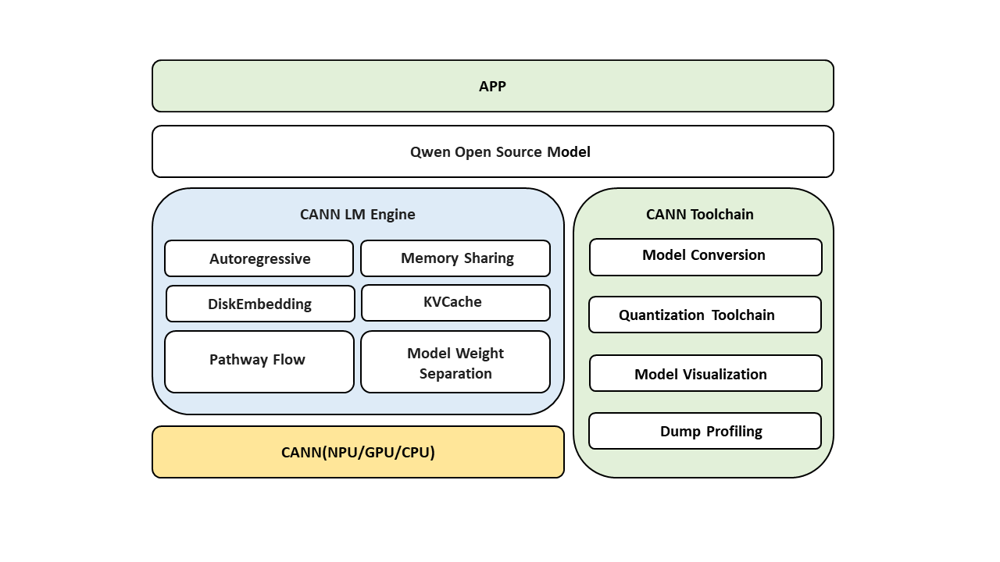
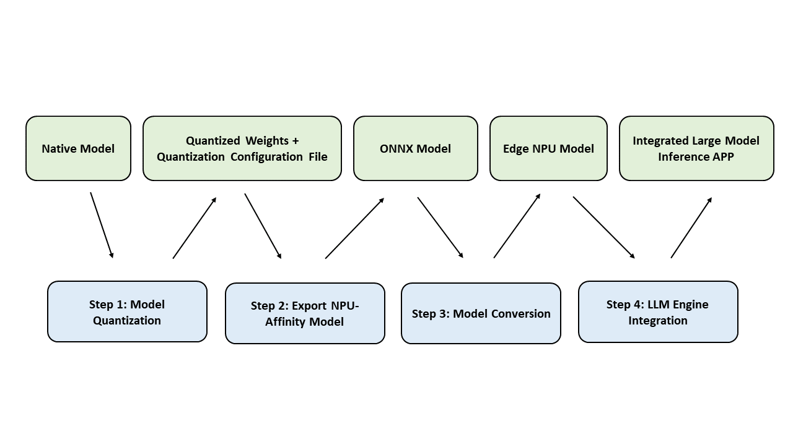

# 简介

更新时间：2026-07-03 02:18:23

来源：https://developer.huawei.com/consumer/cn/doc/harmonyos-guides/cannkit-llm-summary

CANN LM Engine是基于CANN Kit的大模型推理解决方案，为大模型业务提供计算链路的加速封装和计算加速服务。

LLM Engine是其在大语言模型场景下的具体应用，提供的LLM计算链路封装包括多步骤高效串联、内存复用、数据零拷贝等功能，同时提供Lora拓展、多模态拓展，内存优化、kv Cache管理优化、投机推理、端云协同计算等其他功能，实现最佳的能效和系统资源的占用，提供工具链助力开发者完成模型量化、NPU亲和适配、模型转换等准备工作。

#### CANN LM Engine 组件

 - CANN LM Engine：CANN LM Engine为大模型业务提供基于[计算加速服务和标准化API接口](https://developer.huawei.com/consumer/cn/doc/harmonyos-references/cannkit-llm-engine)的端到端计算链路加速封装。
 - CANN工具链：提供模型转换、量化、Ascend C等[工具链](https://link.gitcode.com/?target=https://developer.huawei.com/consumer/cn/doc/harmonyos-guides/hiaifoundation-preparations&from=https://gitcode.com/HarmonyOS_Samples/cannkit_samplecode_lm_engine_cpp&lang=zh&theme=white)。
 - CANN硬件：基于NPU/GPU/CPU加速。

#### 模型要求

当前版本支持Qwen2.5-1.5B、DeepSeek-R1-Distill-Qwen-1.5B、Glm-1.5b、Qwen2.5-7B-Instruct、Qwen3-8B模型。

#### 硬件要求

kirin X90平台。

#### 快速入门

CANN LLM Engine基于CANN硬件加速能力，提供高性能，低功耗的运行LLM模型，助力用户基于CANN硬件环境，获得更好的用户体验。

开发者可通过本指南按照如下pipeline的顺序完成LLM模型在CANN硬件环境上的集成：

1. LLM模型量化，输入是用户原始模型，输出是量化后权重和量化系数文件。
2. 将模型结构导出到ONNX格式，输入是原始模型结构和第一步生成的量化权重，输出是ONNX模型及模型结构NPU亲和适配。
3. 将ONNX模型转换为CANN模型结构格式，输入是ONNX模型和量化系数文件，输出是CANN格式定义模型。
4. 基于CANN LLMEngine集成LLM模型。
