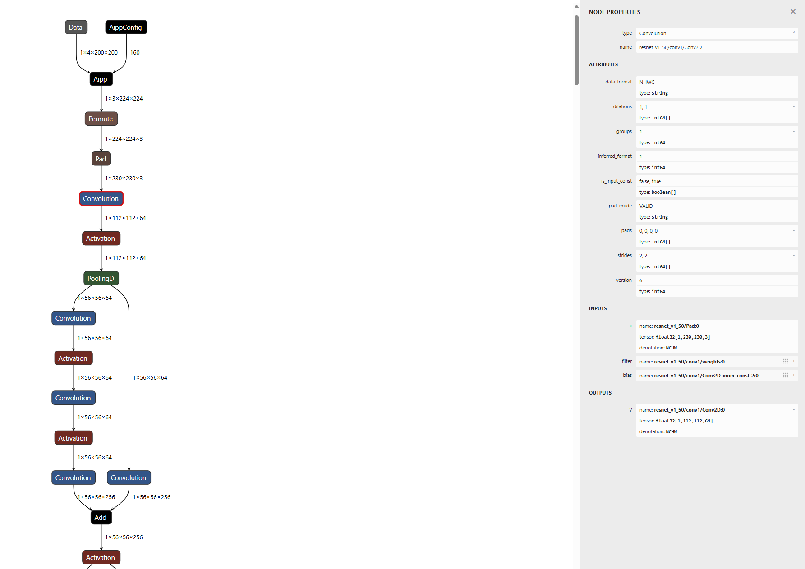
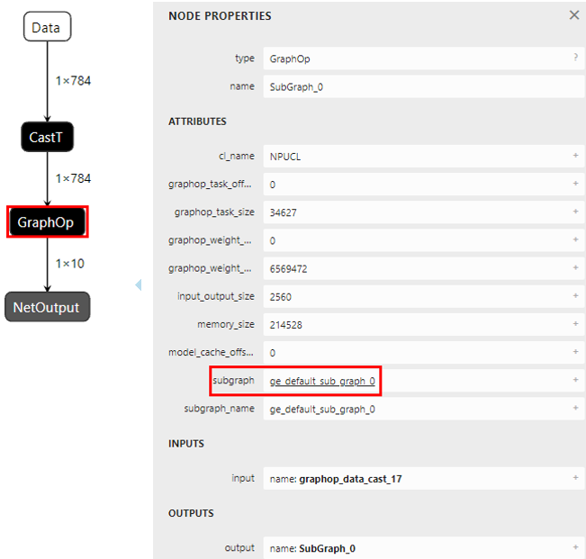
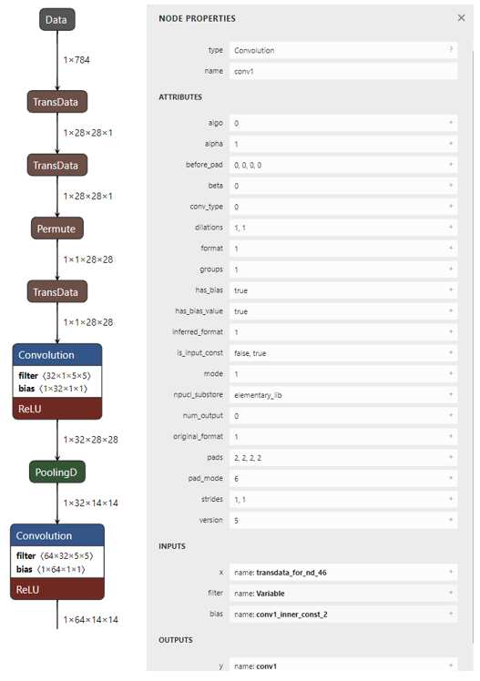
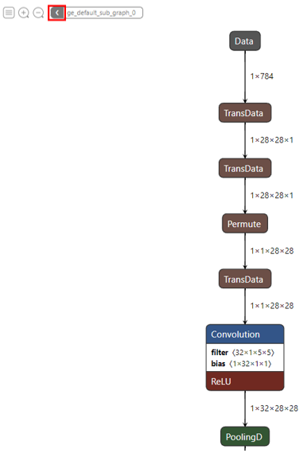

# 可视化工具

更新时间：2026-04-20 06:34:33

来源：https://developer.huawei.com/consumer/cn/doc/harmonyos-guides/cannkit-visualization-tool-usage

##### 概述

[Netron](https://github.com/lutzroeder/netron/tags)是一个神经网络模型可视化工具，支持许多主流AI框架模型的可视化。[Netron](https://github.com/lutzroeder/netron/tags) 5.1.6版本开始支持.om模型可视化。如下图所示，使用Netron工具加载.om模型后，可以展示模型的拓扑结构、图、节点的信息等。
 

 
  

##### 功能描述

- 支持加载.om模型。
- 支持展示拓扑结构和数据流shape。
- 支持查看模型的format、input和output等参数。
- 支持查看编译后模型的子图和算子设备信息。
- 支持查看节点的NODE PROPERTIES、ATTRIBUTES、INPUTS和OUTPUTS等信息。
- 支持保存可视化结果导出为图片。

 
  

##### 使用可视化工具

  

##### 安装工具
1. 下载最新的[Netron](https://github.com/lutzroeder/netron/tags)。
2. 安装Netron。

  
macOS: 下载.dmg文件或者执行brew cask install netron。
3. Linux: 下载.AppImage文件或者执行snap install netron。
4. Windows: 下载.exe文件或者执行winget install netron。
5. Python服务器：执行pip install netron安装Netron，然后通过netron [FILE]或netron.start('[FILE]')加载模型。
6. 浏览器：无需安装，直接打开网页端[Netron](https://netron.app/)可使用。
7. 安装完成后，将模型拖入窗口即可打开。
 
  

##### 查看子图

对于编译后有子图的模型，可按照如下操作查看。
 1. 将编译后的模型拖入[Netron](https://netron.app/)工具，即可打开。
2. 点击子图节点，在右侧查找"ATTRIBUTES->subgraph"，点击"subgraph"的属性值。

  

3. 查看子图节点的NODE PROPERTIES、ATTRIBUTES、INPUTS和OUTPUTS等信息。

  

4. 点击左上角箭头，返回主图。

  

