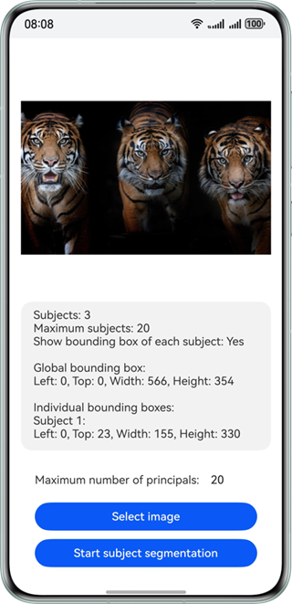

# 主体分割

更新时间：2026-05-12 09:31:20

来源：https://developer.huawei.com/consumer/cn/doc/harmonyos-guides/core-vision-subject-segmentation

##### 适用场景

主体分割，可以检测出图片中区别于背景的前景物体或区域（即"显著主体"），并将其从背景中分离出来，适用于需要识别和提取图像主要信息的场景，广泛使用于前景目标检测和前景主体分离的场景。例如：

 - 主体贴纸，从图片中提取显著性的主体，去掉背景。
 - 背景替换，替换并提取出主体对象的背景。
 - 显著性检测，快速定位图片中显著性区域。
 - 辅助图片编辑，例如单独对主体进行美化处理。


效果如下图所示：





##### 开发步骤
1. 引用相关类添加至工程。

  
```text
import { subjectSegmentation } from '@kit.CoreVisionKit';
import { image } from '@kit.ImageKit';
import { hilog } from '@kit.PerformanceAnalysisKit';
import { BusinessError } from '@kit.BasicServicesKit';
import { fileIo } from '@kit.CoreFileKit';
import { photoAccessHelper } from '@kit.MediaLibraryKit';
```

2. 初始化和释放：在aboutToAppear中调用[subjectSegmentation.init()](https://developer.huawei.com/consumer/cn/doc/harmonyos-references/core-vision-subjectsegmentation-api#subjectsegmentationinit)初始化主体分割服务（加载模型），在aboutToDisappear中调用[subjectSegmentation.release()](https://developer.huawei.com/consumer/cn/doc/harmonyos-references/core-vision-subjectsegmentation-api#subjectsegmentationrelease)释放资源。

  
```text
async aboutToAppear(): Promise<void> {
  const initResult = await subjectSegmentation.init();
  hilog.info(0x0000, 'subjectSegmentationSample', `Subject segmentation initialization result:${initResult}`);
}

async aboutToDisappear(): Promise<void> {
  await subjectSegmentation.release();
  hilog.info(0x0000, 'subjectSegmentationSample', 'Subject segmentation released successfully');
}
```

3. 通过photoAccessHelper.PhotoViewPicker拉起图库选择图片，使用fileIo与image模块将URI转换为[PixelMap](https://developer.huawei.com/consumer/cn/doc/harmonyos-references/arkts-apis-image-pixelmap)，为后续分割接口准备输入数据。

  
```text
private async selectImage() {
  let uri = await this.openPhoto();
  if (uri === undefined) {
    hilog.error(0x0000, TAG, 'uri is undefined');
    return;
  }
  this.loadImage(uri);
}

private async openPhoto(): Promise<Array<string>> {
  return new Promise<Array<string>>((resolve, reject) => {
    let photoSelectOptions = new photoAccessHelper.PhotoSelectOptions();
    photoSelectOptions.MIMEType = photoAccessHelper.PhotoViewMIMETypes.IMAGE_TYPE;
    photoSelectOptions.maxSelectNumber = 1;
    let photoPicker: photoAccessHelper.PhotoViewPicker = new photoAccessHelper.PhotoViewPicker();
    photoPicker.select(photoSelectOptions).then((photoSelectResult) => {
      hilog.info(0x0000, TAG, `PhotoViewPicker.select successfully, photoSelectResult uri: ${photoSelectResult.photoUris}`);
      resolve(photoSelectResult.photoUris);
    }).catch((err: BusinessError) => {
      hilog.error(0x0000, TAG, `PhotoViewPicker.select failed with errCode: ${err.code}, errMessage: ${err.message}`);
      reject(err);
    });
  });
}

private loadImage(names: string[]) {
  setTimeout(async () => {
    let imageSource: image.ImageSource | undefined = undefined;
    let fileSource = await fileIo.open(names[0], fileIo.OpenMode.READ_ONLY);
    imageSource = image.createImageSource(fileSource.fd);
    this.chooseImage = await imageSource.createPixelMap();
    await fileIo.close(fileSource);
  }, 100);
}
```

4. 实例化[VisionInfo](https://developer.huawei.com/consumer/cn/doc/harmonyos-references/core-vision-subjectsegmentation-api#visioninfo)并传入待检测图片的PixelMap，同时配置[SegmentationConfig](https://developer.huawei.com/consumer/cn/doc/harmonyos-references/core-vision-subjectsegmentation-api#segmentationconfig)，设置最大主体个数、是否输出详细信息与前景图。

  
```text
let visionInfo: subjectSegmentation.VisionInfo = {
  pixelMap: this.chooseImage
};
let config: subjectSegmentation.SegmentationConfig = {
  maxCount: parseInt(this.maxNum),
  enableSubjectDetails: true,
  enableSubjectForegroundImage: true
};
```

5. 调用subjectSegmentation的[subjectSegmentation.doSegmentation](https://developer.huawei.com/consumer/cn/doc/harmonyos-references/core-vision-subjectsegmentation-api#subjectsegmentationdosegmentation)接口实现主体分割，并将结果展示在界面上。

  
```text
Button('Image Segmentation')
  .type(ButtonType.Capsule)
  .fontColor(Color.White)
  .alignSelf(ItemAlign.Center)
  .width('80%')
  .margin(10)
  .onClick(() => {
    if (!this.chooseImage) {
      hilog.error(0x0000, TAG, 'imageSegmentation not have chooseImage');
      return;
    }
    let visionInfo: subjectSegmentation.VisionInfo = {
      pixelMap: this.chooseImage
    };
    let config: subjectSegmentation.SegmentationConfig = {
      maxCount: parseInt(this.maxNum),
      enableSubjectDetails: true,
      enableSubjectForegroundImage: true
    };
    subjectSegmentation.doSegmentation(visionInfo, config)
      .then((data: subjectSegmentation.SegmentationResult) => {
        // 拼装分割结果信息
        let outputString = `Subject count: ${data.subjectCount}\n`;
        outputString += `Max subject count: ${config.maxCount}\n`;
        outputString += `Enable subject details: ${config.enableSubjectDetails ? 'Yes' : 'No'}\n\n`;
        let segBox: subjectSegmentation.Rectangle = data.fullSubject.subjectRectangle;
        outputString += `Full subject box:\nLeft: ${segBox.left}, Top: ${segBox.top}, Width: ${segBox.width}, Height: ${segBox.height}\n\n`;

        // 拼装每个主体的详细分割信息
        if (config.enableSubjectDetails && data.subjectDetails) {
          outputString += 'Individual subject boxes:\n';
          for (let i = 0; i < data.subjectDetails.length; i++) {
            let detailSegBox: subjectSegmentation.Rectangle = data.subjectDetails[i].subjectRectangle;
            outputString += `Subject ${i + 1}:\nLeft: ${detailSegBox.left}, Top: ${detailSegBox.top}, Width: ${detailSegBox.width}, Height: ${detailSegBox.height}\n\n`;
          }
        }

        hilog.info(0x0000, TAG, 'Segmentation result: ' + outputString);
        this.dataValues = outputString;

        if (data.fullSubject && data.fullSubject.foregroundImage) {
          this.segmentedImage = data.fullSubject.foregroundImage;
        } else {
          hilog.warn(0x0000, TAG, 'No foreground image in segmentation result');
        }
      })
      .catch((error: BusinessError) => {
        hilog.error(0x0000, TAG, `Image segmentation failed errCode: ${error.code}, errMessage: ${error.message}`);
        this.dataValues = `Error: ${error.message}`;
        this.segmentedImage = undefined;
      });
  })
```


##### 开发实例


##### Index.ets

```text
import { subjectSegmentation } from '@kit.CoreVisionKit';
import { image } from '@kit.ImageKit';
import { hilog } from '@kit.PerformanceAnalysisKit';
import { BusinessError } from '@kit.BasicServicesKit';
import { fileIo } from '@kit.CoreFileKit';
import { photoAccessHelper } from '@kit.MediaLibraryKit';

const TAG: string = 'ImageSegmentationSample';

@Entry
@Component
struct Index {
  @State chooseImage: PixelMap | undefined = undefined;
  @State dataValues: string = '';
  @State segmentedImage: PixelMap | undefined = undefined;
  // 设置识别主体数量的上限
  @State maxNum: string = '20';

  async aboutToAppear(): Promise<void> {
    const initResult = await subjectSegmentation.init();
    hilog.info(0x0000, 'subjectSegmentationSample', `Subject segmentation initialization result:${initResult}`);
  }

  async aboutToDisappear(): Promise<void> {
    await subjectSegmentation.release();
    hilog.info(0x0000, 'subjectSegmentationSample', 'Subject segmentation released successfully');
  }

  build() {
    Column() {
      Image(this.chooseImage)
        .objectFit(ImageFit.Fill)
        .height('30%')
        .accessibilityDescription('Image to be segmented')

      Scroll() {
        Text(this.dataValues)
          .copyOption(CopyOptions.LocalDevice)
          .margin(10)
          .width('100%')
      }
      .height('20%')

      Image(this.segmentedImage)
        .objectFit(ImageFit.Fill)
        .height('30%')
        .accessibilityDescription('Segmented subject image')

      Row() {
        Text('Max subject count:')
          .fontSize(16)
        TextInput({ placeholder: 'Enter max subject count', text: this.maxNum })
          .type(InputType.Number)
          .placeholderColor(Color.Gray)
          .fontSize(16)
          .backgroundColor(Color.White)
          .onChange((value: string) => {
            this.maxNum = value;
          })
      }
      .width('80%')
      .margin(10)

      Button('Select Image')
        .type(ButtonType.Capsule)
        .fontColor(Color.White)
        .alignSelf(ItemAlign.Center)
        .width('80%')
        .margin(10)
        .onClick(() => {
          void this.selectImage();
        })

      Button('Image Segmentation')
        .type(ButtonType.Capsule)
        .fontColor(Color.White)
        .alignSelf(ItemAlign.Center)
        .width('80%')
        .margin(10)
        .onClick(() => {
          if (!this.chooseImage) {
            hilog.error(0x0000, TAG, 'imageSegmentation not have chooseImage');
            return;
          }
          let visionInfo: subjectSegmentation.VisionInfo = {
            pixelMap: this.chooseImage
          };
          let config: subjectSegmentation.SegmentationConfig = {
            maxCount: parseInt(this.maxNum),
            enableSubjectDetails: true,
            enableSubjectForegroundImage: true
          };
          subjectSegmentation.doSegmentation(visionInfo, config)
            .then((data: subjectSegmentation.SegmentationResult) => {
              // 拼装分割结果信息
              let outputString = `Subject count: ${data.subjectCount}\n`;
              outputString += `Max subject count: ${config.maxCount}\n`;
              outputString += `Enable subject details: ${config.enableSubjectDetails ? 'Yes' : 'No'}\n\n`;
              let segBox: subjectSegmentation.Rectangle = data.fullSubject.subjectRectangle;
              outputString += `Full subject box:\nLeft: ${segBox.left}, Top: ${segBox.top}, Width: ${segBox.width}, Height: ${segBox.height}\n\n`;

              // 拼装每个主体的详细分割信息
              if (config.enableSubjectDetails && data.subjectDetails) {
                outputString += 'Individual subject boxes:\n';
                for (let i = 0; i < data.subjectDetails.length; i++) {
                  let detailSegBox: subjectSegmentation.Rectangle = data.subjectDetails[i].subjectRectangle;
                  outputString += `Subject ${i + 1}:\nLeft: ${detailSegBox.left}, Top: ${detailSegBox.top}, Width: ${detailSegBox.width}, Height: ${detailSegBox.height}\n\n`;
                }
              }

              hilog.info(0x0000, TAG, 'Segmentation result: ' + outputString);
              this.dataValues = outputString;

              if (data.fullSubject && data.fullSubject.foregroundImage) {
                this.segmentedImage = data.fullSubject.foregroundImage;
              } else {
                hilog.warn(0x0000, TAG, 'No foreground image in segmentation result');
              }
            })
            .catch((error: BusinessError) => {
              hilog.error(0x0000, TAG, `Image segmentation failed errCode: ${error.code}, errMessage: ${error.message}`);
              this.dataValues = `Error: ${error.message}`;
              this.segmentedImage = undefined;
            });
        })
    }
    .width('100%')
    .height('80%')
    .justifyContent(FlexAlign.Center)
  }

  private async selectImage() {
    let uri = await this.openPhoto();
    if (uri === undefined) {
      hilog.error(0x0000, TAG, 'uri is undefined');
      return;
    }
    this.loadImage(uri);
  }

  private async openPhoto(): Promise<Array<string>> {
    return new Promise<Array<string>>((resolve, reject) => {
      let photoSelectOptions = new photoAccessHelper.PhotoSelectOptions();
      photoSelectOptions.MIMEType = photoAccessHelper.PhotoViewMIMETypes.IMAGE_TYPE;
      photoSelectOptions.maxSelectNumber = 1;
      let photoPicker: photoAccessHelper.PhotoViewPicker = new photoAccessHelper.PhotoViewPicker();
      photoPicker.select(photoSelectOptions).then((photoSelectResult) => {
        hilog.info(0x0000, TAG, `PhotoViewPicker.select successfully, photoSelectResult uri: ${photoSelectResult.photoUris}`);
        resolve(photoSelectResult.photoUris);
      }).catch((err: BusinessError) => {
        hilog.error(0x0000, TAG, `PhotoViewPicker.select failed with errCode: ${err.code}, errMessage: ${err.message}`);
        reject(err);
      });
    });
  }

  private loadImage(names: string[]) {
    setTimeout(async () => {
      let imageSource: image.ImageSource | undefined = undefined;
      let fileSource = await fileIo.open(names[0], fileIo.OpenMode.READ_ONLY);
      imageSource = image.createImageSource(fileSource.fd);
      this.chooseImage = await imageSource.createPixelMap();
      await fileIo.close(fileSource);
    }, 100);
  }
}
```
