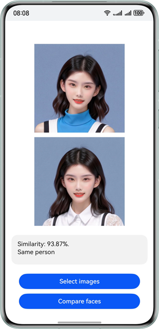

# 人脸比对

更新时间：2026-05-12 09:31:20

来源：https://developer.huawei.com/consumer/cn/doc/harmonyos-guides/core-vision-face-comparator

## 适用场景

输入的两张比对图片是同一个人的照片时，系统返回的比对结果为"同一个人"，置信分数比较高；当两张比对图片不是同一个人的照片时，系统返回的比对结果为"非同一个人"，置信分数很低。可以用于APP中需要用到人脸比对功能的场景，比如娱乐类APP中比较两个人的相似度、与明星的相似度等。 效果如下图所示：


## 开发步骤

在使用人脸比对时，将实现人脸比对相关的类添加至工程。
```text
import { faceComparator } from '@kit.CoreVisionKit';
import { image } from '@kit.ImageKit';
import { hilog } from '@kit.PerformanceAnalysisKit';
import { BusinessError } from '@kit.BasicServicesKit';
import { fileIo } from '@kit.CoreFileKit';
import { photoAccessHelper } from '@kit.MediaLibraryKit';
```

初始化和释放：在aboutToAppear中调用[faceComparator.init()](https://developer.huawei.com/consumer/cn/doc/harmonyos-references/core-vision-facecomparator-api#facecomparatorinit)初始化人脸比对分析器（加载模型），在aboutToDisappear中调用[faceComparator.release()](https://developer.huawei.com/consumer/cn/doc/harmonyos-references/core-vision-facecomparator-api#facecomparatorrelease)释放资源。
```text
async aboutToAppear(): Promise {
  const initResult = await faceComparator.init();
  hilog.info(0x0000, TAG, `Face comparator initialization result:${initResult}`);
}

async aboutToDisappear(): Promise {
  await faceComparator.release();
  hilog.info(0x0000, TAG, 'Face comparator released successfully');
}
```

通过photoAccessHelper.PhotoViewPicker拉起图库选择两张待比对的图片，使用fileIo与image模块将URI转换为[PixelMap](https://developer.huawei.com/consumer/cn/doc/harmonyos-references/arkts-apis-image-pixelmap)，为后续比对接口准备输入数据。
```text
Button('选择图片')
  .type(ButtonType.Capsule)
  .fontColor(Color.White)
  .alignSelf(ItemAlign.Center)
  .width('80%')
  .margin(10)
  .onClick(() => {
    // 拉起图库，获取图片资源
    void this.selectImage();
  })
```

选择图片与解码图片的方法实现如下：
```text
private async selectImage() {
  let uri = await this.openPhoto();
  if (uri === undefined) {
    hilog.error(0x0000, TAG, 'Failed to get two image uris.');
    return;
  }
  this.loadImage(uri);
}

private async openPhoto(): Promise {
  return new Promise((resolve, reject) => {
    let photoPicker: photoAccessHelper.PhotoViewPicker = new photoAccessHelper.PhotoViewPicker();
    photoPicker.select({
      MIMEType: photoAccessHelper.PhotoViewMIMETypes.IMAGE_TYPE,
      maxSelectNumber: 2
    }).then(res => {
      resolve(res.photoUris);
    }).catch((err: BusinessError) => {
      hilog.error(0x0000, TAG, `Failed to get photo image uris. code: ${err.code}, message: ${err.message}`);
      reject();
    });
  });
}

private loadImage(names: string[]) {
  setTimeout(async () => {
    let imageSource: image.ImageSource | undefined = undefined;
    let fileSource: fileIo.File;
    fileSource = await fileIo.open(names[0], fileIo.OpenMode.READ_ONLY);
    imageSource = image.createImageSource(fileSource.fd);
    this.chooseImage = await imageSource.createPixelMap();
    fileSource = await fileIo.open(names[1], fileIo.OpenMode.READ_ONLY);
    imageSource = image.createImageSource(fileSource.fd);
    this.chooseImage1 = await imageSource.createPixelMap();
    await fileIo.close(fileSource);
  }, 100);
}
```

构造[VisionInfo](https://developer.huawei.com/consumer/cn/doc/harmonyos-references/core-vision-facecomparator-api#visioninfo)对象并传入两张图片的PixelMap，调用[faceComparator.compareFaces](https://developer.huawei.com/consumer/cn/doc/harmonyos-references/core-vision-facecomparator-api#facecomparatorcomparefaces)方法，获取相似度分数，并将结果展示在界面上。
```text
Button('人脸比对')
  .type(ButtonType.Capsule)
  .fontColor(Color.White)
  .alignSelf(ItemAlign.Center)
  .width('80%')
  .margin(10)
  .onClick(() => {
    if (!this.chooseImage || !this.chooseImage1) {
      hilog.error(0x0000, TAG, 'Failed to choose image');
      return;
    }
    // 调用人脸比对接口
    let visionInfo: faceComparator.VisionInfo = {
      pixelMap: this.chooseImage
    };
    let visionInfo1: faceComparator.VisionInfo = {
      pixelMap: this.chooseImage1
    };
    faceComparator.compareFaces(visionInfo, visionInfo1)
      .then((data: faceComparator.FaceCompareResult) => {
        let faceString = `degree of similarity: ${this.toPercentage(data.similarity)}${(data.isSamePerson) ? '. is' : '. no'} same person`;
        hilog.info(0x0000, TAG, 'faceString data is ' + faceString);
        this.dataValues = faceString;
      })
      .catch((error: BusinessError) => {
        hilog.error(0x0000, TAG, `Face comparison failed. Code: ${error.code}, message: ${error.message}`);
        this.dataValues = `Error: ${error.message}`;
      });
  })
```

相似度数值转百分比展示的辅助方法：
```text
private toPercentage(num: number): string {
  return `${(num * 100).toFixed(2)}%`;
}
```


## 开发实例


## Index.ets


```text
import { faceComparator } from '@kit.CoreVisionKit';
import { image } from '@kit.ImageKit';
import { hilog } from '@kit.PerformanceAnalysisKit';
import { BusinessError } from '@kit.BasicServicesKit';
import { fileIo } from '@kit.CoreFileKit';
import { photoAccessHelper } from '@kit.MediaLibraryKit';

const TAG: string = 'FaceCompareSample';

@Entry
@Component
struct Index {
  @State chooseImage: PixelMap | undefined = undefined;
  @State chooseImage1: PixelMap | undefined = undefined;
  @State dataValues: string = '';

  async aboutToAppear(): Promise {
    const initResult = await faceComparator.init();
    hilog.info(0x0000, TAG, `Face comparator initialization result:${initResult}`);
  }

  async aboutToDisappear(): Promise {
    await faceComparator.release();
    hilog.info(0x0000, TAG, 'Face comparator released successfully');
  }

  build() {
    Column() {
      Image(this.chooseImage)
        .objectFit(ImageFit.Fill)
        .height('30%')
        .accessibilityDescription('默认图片1')
      Image(this.chooseImage1)
        .objectFit(ImageFit.Fill)
        .height('30%')
        .accessibilityDescription('默认图片2')
      Text(this.dataValues)
        .copyOption(CopyOptions.LocalDevice)
        .height('15%')
        .margin(10)
        .width('60%')
      Button('选择图片')
        .type(ButtonType.Capsule)
        .fontColor(Color.White)
        .alignSelf(ItemAlign.Center)
        .width('80%')
        .margin(10)
        .onClick(() => {
          // 拉起图库
          void this.selectImage();
        })
      Button('人脸比对')
        .type(ButtonType.Capsule)
        .fontColor(Color.White)
        .alignSelf(ItemAlign.Center)
        .width('80%')
        .margin(10)
        .onClick(() => {
          if (!this.chooseImage || !this.chooseImage1) {
            hilog.error(0x0000, TAG, 'Failed to choose image');
            return;
          }
          // 调用人脸比对接口
          let visionInfo: faceComparator.VisionInfo = {
            pixelMap: this.chooseImage
          };
          let visionInfo1: faceComparator.VisionInfo = {
            pixelMap: this.chooseImage1
          };
          faceComparator.compareFaces(visionInfo, visionInfo1)
            .then((data: faceComparator.FaceCompareResult) => {
              let faceString = `degree of similarity: ${this.toPercentage(data.similarity)}${(data.isSamePerson) ? '. is' : '. no'} same person`;
              hilog.info(0x0000, TAG, 'faceString data is ' + faceString);
              this.dataValues = faceString;
            })
            .catch((error: BusinessError) => {
              hilog.error(0x0000, TAG, `Face comparison failed. Code: ${error.code}, message: ${error.message}`);
              this.dataValues = `Error: ${error.message}`;
            });
        })
    }
    .width('100%')
    .height('100%')
    .justifyContent(FlexAlign.Center)
  }

  private toPercentage(num: number): string {
    return `${(num * 100).toFixed(2)}%`;
  }

  private async selectImage() {
    let uri = await this.openPhoto();
    if (uri === undefined) {
      hilog.error(0x0000, TAG, 'Failed to get two image uris.');
      return;
    }
    this.loadImage(uri);
  }

  private async openPhoto(): Promise {
    return new Promise((resolve, reject) => {
      let photoPicker: photoAccessHelper.PhotoViewPicker = new photoAccessHelper.PhotoViewPicker();
      photoPicker.select({
        MIMEType: photoAccessHelper.PhotoViewMIMETypes.IMAGE_TYPE,
        maxSelectNumber: 2
      }).then(res => {
        resolve(res.photoUris);
      }).catch((err: BusinessError) => {
        hilog.error(0x0000, TAG, `Failed to get photo image uris. code: ${err.code}, message: ${err.message}`);
        reject();
      });
    });
  }

  private loadImage(names: string[]) {
    setTimeout(async () => {
      let imageSource: image.ImageSource | undefined = undefined;
      let fileSource: fileIo.File;
      fileSource = await fileIo.open(names[0], fileIo.OpenMode.READ_ONLY);
      imageSource = image.createImageSource(fileSource.fd);
      this.chooseImage = await imageSource.createPixelMap();
      fileSource = await fileIo.open(names[1], fileIo.OpenMode.READ_ONLY);
      imageSource = image.createImageSource(fileSource.fd);
      this.chooseImage1 = await imageSource.createPixelMap();
      await fileIo.close(fileSource);
    }, 100);
  }
}
```
