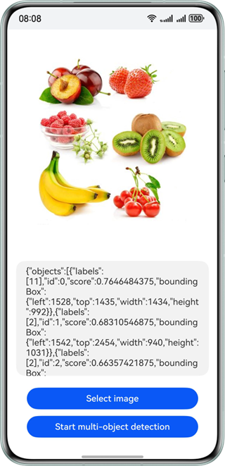

# 多目标识别

更新时间：2026-05-12 09:31:20

来源：https://developer.huawei.com/consumer/cn/doc/harmonyos-guides/core-vision-object-detection

##### 适用场景

可同时检测出给定图片中的各种物体，包括风景、动物、植物、建筑、人脸、表格、文本等位置，并框选出物体。

效果如下图所示：





##### 开发步骤
1. 在使用多目标识别时，将实现多目标识别相关的类添加至工程。

  
```text
import { image } from '@kit.ImageKit';
import { hilog } from '@kit.PerformanceAnalysisKit';
import { BusinessError } from '@kit.BasicServicesKit';
import { fileIo } from '@kit.CoreFileKit';
import { objectDetection, visionBase } from '@kit.CoreVisionKit';
import { photoAccessHelper } from '@kit.MediaLibraryKit';
```

2. 通过photoAccessHelper.PhotoViewPicker拉起图库选择图片，使用fileIo与image模块将URI转换为[PixelMap](https://developer.huawei.com/consumer/cn/doc/harmonyos-references/arkts-apis-image-pixelmap)，为后续检测接口准备输入数据。

  
```text
Button('选择图片')
  .type(ButtonType.Capsule)
  .fontColor(Color.White)
  .alignSelf(ItemAlign.Center)
  .width('80%')
  .margin(10)
  .onClick(() => {
    // 拉起图库，获取图片资源
    void this.selectImage();
  })
```
选择图片与解码图片的方法实现如下：

  
```text
private async selectImage() {
  let uri = await this.openPhoto();
  if (!uri) {
    hilog.error(0x0000, 'objectDetectSample', 'Failed to define uri.');
    return;
  }
  this.loadImage(uri);
}

private async openPhoto(): Promise<string> {
  return new Promise<string>((resolve, reject) => {
    let photoPicker: photoAccessHelper.PhotoViewPicker = new photoAccessHelper.PhotoViewPicker();
    photoPicker.select({
      MIMEType: photoAccessHelper.PhotoViewMIMETypes.IMAGE_TYPE,
      maxSelectNumber: 1
    }).then(res => {
      resolve(res.photoUris[0]);
    }).catch((err: BusinessError) => {
      hilog.error(0x0000, 'objectDetectSample', `Failed to get photo image uri. code: ${err.code}, message: ${err.message}`);
      reject(err);
    });
  });
}

private loadImage(name: string) {
  setTimeout(async () => {
    let fileSource = await fileIo.open(name, fileIo.OpenMode.READ_ONLY);
    this.imageSource = image.createImageSource(fileSource.fd);
    this.chooseImage = await this.imageSource.createPixelMap();
    await fileIo.close(fileSource);
  }, 100);
}
```

3. 实例化visionBase.Request对象，将PixelMap封装为输入参数；调用[ObjectDetector.create()](https://developer.huawei.com/consumer/cn/doc/harmonyos-references/core-vision-object-detection-api#create)创建检测器实例，再调用其[process](https://developer.huawei.com/consumer/cn/doc/harmonyos-references/core-vision-object-detection-api#process)方法，获取图片中各物体的位置与类别信息，并将结果展示在界面上。

  
```text
Button('开始多目标识别')
  .type(ButtonType.Capsule)
  .fontColor(Color.White)
  .alignSelf(ItemAlign.Center)
  .width('80%')
  .margin(10)
  .onClick(() => {
    // 调用封装的异步识别函数
    void this.handleMultiObjectDetection();
  })
```
多目标识别的方法实现如下：

  
```json
private async handleMultiObjectDetection() {
  if (!this.chooseImage) {
    hilog.error(0x0000, 'objectDetectSample', 'Failed to choose image.');
    return;
  }
  // 调用多目标检测接口
  let request: visionBase.Request = {
    inputData: { pixelMap: this.chooseImage }
  };
  let detector = await objectDetection.ObjectDetector.create();
  let data: objectDetection.ObjectDetectionResponse = await detector.process(request);
  let objectJson = JSON.stringify(data);
  hilog.info(0x0000, 'objectDetectSample', `Succeeded in object detection: ${objectJson}`);
  this.dataValues = objectJson;
}
```


##### 开发实例


##### Index.ets

```json
import { image } from '@kit.ImageKit';
import { hilog } from '@kit.PerformanceAnalysisKit';
import { BusinessError } from '@kit.BasicServicesKit';
import { fileIo } from '@kit.CoreFileKit';
import { objectDetection, visionBase } from '@kit.CoreVisionKit';
import { photoAccessHelper } from '@kit.MediaLibraryKit';

@Entry
@Component
struct Index {
  private imageSource: image.ImageSource | undefined = undefined;
  @State chooseImage: PixelMap | undefined = undefined;
  @State dataValues: string = '';

  build() {
    Column() {
      Image(this.chooseImage)
        .objectFit(ImageFit.Fill)
        .height('60%')

      Text(this.dataValues)
        .copyOption(CopyOptions.LocalDevice)
        .height('15%')
        .margin(10)
        .width('60%')

      Button('选择图片')
        .type(ButtonType.Capsule)
        .fontColor(Color.White)
        .alignSelf(ItemAlign.Center)
        .width('80%')
        .margin(10)
        .onClick(() => {
          // 拉起图库
          void this.selectImage();
        })

      Button('开始多目标识别')
        .type(ButtonType.Capsule)
        .fontColor(Color.White)
        .alignSelf(ItemAlign.Center)
        .width('80%')
        .margin(10)
        .onClick(() => {
          // 调用封装的异步识别函数
          void this.handleMultiObjectDetection();
        })
    }
    .width('100%')
    .height('100%')
    .justifyContent(FlexAlign.Center)
  }

  // 封装多目标识别的异步逻辑
  private async handleMultiObjectDetection() {
    if (!this.chooseImage) {
      hilog.error(0x0000, 'objectDetectSample', 'Failed to choose image.');
      return;
    }
    // 调用多目标检测接口
    let request: visionBase.Request = {
      inputData: { pixelMap: this.chooseImage }
    };
    let detector = await objectDetection.ObjectDetector.create();
    let data: objectDetection.ObjectDetectionResponse = await detector.process(request);
    let objectJson = JSON.stringify(data);
    hilog.info(0x0000, 'objectDetectSample', `Succeeded in object detection: ${objectJson}`);
    this.dataValues = objectJson;
  }

  private async selectImage() {
    let uri = await this.openPhoto();
    if (!uri) {
      hilog.error(0x0000, 'objectDetectSample', 'Failed to define uri.');
      return;
    }
    this.loadImage(uri);
  }

  private async openPhoto(): Promise<string> {
    return new Promise<string>((resolve, reject) => {
      let photoPicker: photoAccessHelper.PhotoViewPicker = new photoAccessHelper.PhotoViewPicker();
      photoPicker.select({
        MIMEType: photoAccessHelper.PhotoViewMIMETypes.IMAGE_TYPE,
        maxSelectNumber: 1
      }).then(res => {
        resolve(res.photoUris[0]);
      }).catch((err: BusinessError) => {
        hilog.error(0x0000, 'objectDetectSample', `Failed to get photo image uri. code: ${err.code}, message: ${err.message}`);
        reject(err);
      });
    });
  }

  private loadImage(name: string) {
    setTimeout(async () => {
      let fileSource = await fileIo.open(name, fileIo.OpenMode.READ_ONLY);
      this.imageSource = image.createImageSource(fileSource.fd);
      this.chooseImage = await this.imageSource.createPixelMap();
      await fileIo.close(fileSource);
    }, 100);
  }
}
```
