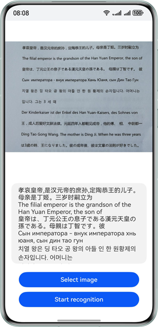

# 通用文字识别

更新时间：2026-05-12 09:31:20

来源：https://developer.huawei.com/consumer/cn/doc/harmonyos-guides/core-vision-text-recognition

#### 适用场景

通用文字识别，是通过拍照、扫描等光学输入方式，将各种票据、卡证、表格、报刊、书籍等印刷品文字转化为图像信息，再利用文字识别技术将图像信息转化为计算机等设备可以使用的字符信息的技术。

 - 可以对文档翻拍、街景翻拍等图片进行文字检测和识别，也可以集成于其他应用中，提供文字检测、识别的功能，并根据识别结果提供翻译、搜索等相关服务。
 - 可以处理来自相机、图库等多种来源的图像数据，提供一个自动检测文本、识别图像中文本位置以及文本内容功能的开放能力。
 - 支持特定角度范围内的文本倾斜、拍摄角度倾斜、复杂光照条件以及复杂文本背景等场景的文字识别。


效果如下图所示：





#### 开发步骤
1. 在使用通用文字识别时，将实现文字识别的相关的类添加至工程。

  
```text
import { textRecognition } from '@kit.CoreVisionKit';
import { image } from '@kit.ImageKit';
import { hilog } from '@kit.PerformanceAnalysisKit';
import { BusinessError } from '@kit.BasicServicesKit';
import { fileIo } from '@kit.CoreFileKit';
import { photoAccessHelper } from '@kit.MediaLibraryKit';
```

2. 初始化和释放：在aboutToAppear中调用[textRecognition.init()](https://developer.huawei.com/consumer/cn/doc/harmonyos-references/core-vision-text-recognition-api#textrecognitioninit)初始化文字识别服务（加载模型），在aboutToDisappear中调用[textRecognition.release()](https://developer.huawei.com/consumer/cn/doc/harmonyos-references/core-vision-text-recognition-api#textrecognitionrelease)释放资源。

  
```text
async aboutToAppear(): Promise<void> {
  const initResult = await textRecognition.init();
  hilog.info(0x0000, 'OCRDemo', `OCR service initialization result:${initResult}`);
}

async aboutToDisappear(): Promise<void> {
  await textRecognition.release();
  hilog.info(0x0000, 'OCRDemo', 'OCR service released successfully');
}
```

3. 通过photoAccessHelper.PhotoViewPicker拉起图库选择图片，使用fileIo与image模块将URI转换为[PixelMap](https://developer.huawei.com/consumer/cn/doc/harmonyos-references/arkts-apis-image-pixelmap)，为后续识别接口准备输入数据。

  
```text
Button('选择图片')
  .type(ButtonType.Capsule)
  .fontColor(Color.White)
  .alignSelf(ItemAlign.Center)
  .width('80%')
  .margin(10)
  .onClick(() => {
    // 拉起图库，获取图片资源
    void this.selectImage();
  })
```
选择图片与解码图片的方法实现如下：

  
```text
private async selectImage() {
  let uri = await this.openPhoto();
  if (uri === undefined) {
    hilog.error(0x0000, 'OCRDemo', 'Failed to get uri.');
    return;
  }
  this.loadImage(uri);
}

private async openPhoto(): Promise<string> {
  return new Promise<string>((resolve) => {
    let photoPicker: photoAccessHelper.PhotoViewPicker = new photoAccessHelper.PhotoViewPicker();
    photoPicker.select({
      MIMEType: photoAccessHelper.PhotoViewMIMETypes.IMAGE_TYPE,
      maxSelectNumber: 1
    }).then((res: photoAccessHelper.PhotoSelectResult) => {
      resolve(res.photoUris[0]);
    }).catch((err: BusinessError) => {
      hilog.error(0x0000, 'OCRDemo', `Failed to get photo image uri. code: ${err.code}, message: ${err.message}`);
      resolve('');
    });
  });
}

private loadImage(name: string) {
  setTimeout(async () => {
    let fileSource = await fileIo.open(name, fileIo.OpenMode.READ_ONLY);
    this.imageSource = image.createImageSource(fileSource.fd);
    this.chooseImage = await this.imageSource.createPixelMap();
    await fileIo.close(fileSource);
  }, 100);
}
```

4. 构造[VisionInfo](https://developer.huawei.com/consumer/cn/doc/harmonyos-references/core-vision-text-recognition-api#visioninfo)并传入待检测图片的PixelMap，同时配置[TextRecognitionConfiguration](https://developer.huawei.com/consumer/cn/doc/harmonyos-references/core-vision-text-recognition-api#textrecognitionconfiguration)（用于配置是否支持朝向检测），调用[textRecognition.recognizeText](https://developer.huawei.com/consumer/cn/doc/harmonyos-references/core-vision-text-recognition-api#textrecognitionrecognizetext-1)接口，获取图片中文字识别的结果并展示在界面上。

  
```text
Button('开始识别')
  .type(ButtonType.Capsule)
  .fontColor(Color.White)
  .alignSelf(ItemAlign.Center)
  .width('80%')
  .margin(10)
  .onClick(() => {
    this.textRecognitionTest();
  })
```
文字识别的方法实现如下：

  
```json
private textRecognitionTest() {
  if (!this.chooseImage) {
    return;
  }
  // 调用文本识别接口
  let visionInfo: textRecognition.VisionInfo = {
    pixelMap: this.chooseImage
  };
  let textConfiguration: textRecognition.TextRecognitionConfiguration = {
    isDirectionDetectionSupported: false
  };
  textRecognition.recognizeText(visionInfo, textConfiguration)
    .then((data: textRecognition.TextRecognitionResult) => {
      // 识别成功，获取对应的结果
      let recognitionString = JSON.stringify(data);
      hilog.info(0x0000, 'OCRDemo', `Succeeded in recognizing text: ${recognitionString}`);
      // 将结果更新到Text中显示
      this.dataValues = data.value;
    })
    .catch((error: BusinessError) => {
      hilog.error(0x0000, 'OCRDemo', `Failed to recognize text. Code: ${error.code}, message: ${error.message}`);
      this.dataValues = `Error: ${error.message}`;
    });
}
```


#### 开发实例

点击按钮，识别一张图片的文字内容，并通过日志打印。


#### Index.ets

```json
import { textRecognition } from '@kit.CoreVisionKit';
import { image } from '@kit.ImageKit';
import { hilog } from '@kit.PerformanceAnalysisKit';
import { BusinessError } from '@kit.BasicServicesKit';
import { fileIo } from '@kit.CoreFileKit';
import { photoAccessHelper } from '@kit.MediaLibraryKit';

@Entry
@Component
struct Index {
  private imageSource: image.ImageSource | undefined = undefined;
  @State chooseImage: PixelMap | undefined = undefined;
  @State dataValues: string = '';

  async aboutToAppear(): Promise<void> {
    const initResult = await textRecognition.init();
    hilog.info(0x0000, 'OCRDemo', `OCR service initialization result:${initResult}`);
  }

  async aboutToDisappear(): Promise<void> {
    await textRecognition.release();
    hilog.info(0x0000, 'OCRDemo', 'OCR service released successfully');
  }

  build() {
    Column() {
      Image(this.chooseImage)
        .objectFit(ImageFit.Fill)
        .height('60%')

      Text(this.dataValues)
        .copyOption(CopyOptions.LocalDevice)
        .height('15%')
        .margin(10)
        .width('60%')

      Button('选择图片')
        .type(ButtonType.Capsule)
        .fontColor(Color.White)
        .alignSelf(ItemAlign.Center)
        .width('80%')
        .margin(10)
        .onClick(() => {
          // 拉起图库，获取图片资源
          void this.selectImage();
        })

      Button('开始识别')
        .type(ButtonType.Capsule)
        .fontColor(Color.White)
        .alignSelf(ItemAlign.Center)
        .width('80%')
        .margin(10)
        .onClick(() => {
          this.textRecognitionTest();
        })
    }
    .width('100%')
    .height('100%')
    .justifyContent(FlexAlign.Center)
  }

  private textRecognitionTest() {
    if (!this.chooseImage) {
      return;
    }
    // 调用文本识别接口
    let visionInfo: textRecognition.VisionInfo = {
      pixelMap: this.chooseImage
    };
    let textConfiguration: textRecognition.TextRecognitionConfiguration = {
      isDirectionDetectionSupported: false
    };
    textRecognition.recognizeText(visionInfo, textConfiguration)
      .then((data: textRecognition.TextRecognitionResult) => {
        // 识别成功，获取对应的结果
        let recognitionString = JSON.stringify(data);
        hilog.info(0x0000, 'OCRDemo', `Succeeded in recognizing text: ${recognitionString}`);
        // 将结果更新到Text中显示
        this.dataValues = data.value;
      })
      .catch((error: BusinessError) => {
        hilog.error(0x0000, 'OCRDemo', `Failed to recognize text. Code: ${error.code}, message: ${error.message}`);
        this.dataValues = `Error: ${error.message}`;
      });
  }

  private async selectImage() {
    let uri = await this.openPhoto();
    if (uri === undefined) {
      hilog.error(0x0000, 'OCRDemo', 'Failed to get uri.');
      return;
    }
    this.loadImage(uri);
  }

  private async openPhoto(): Promise<string> {
    return new Promise<string>((resolve) => {
      let photoPicker: photoAccessHelper.PhotoViewPicker = new photoAccessHelper.PhotoViewPicker();
      photoPicker.select({
        MIMEType: photoAccessHelper.PhotoViewMIMETypes.IMAGE_TYPE,
        maxSelectNumber: 1
      }).then((res: photoAccessHelper.PhotoSelectResult) => {
        resolve(res.photoUris[0]);
      }).catch((err: BusinessError) => {
        hilog.error(0x0000, 'OCRDemo', `Failed to get photo image uri. code: ${err.code}, message: ${err.message}`);
        resolve('');
      });
    });
  }

  private loadImage(name: string) {
    setTimeout(async () => {
      let fileSource = await fileIo.open(name, fileIo.OpenMode.READ_ONLY);
      this.imageSource = image.createImageSource(fileSource.fd);
      this.chooseImage = await this.imageSource.createPixelMap();
      await fileIo.close(fileSource);
    }, 100);
  }
}
```
