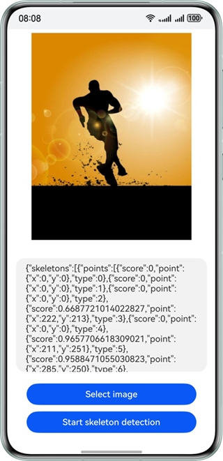

# 骨骼点检测

更新时间：2026-05-12 09:31:20

来源：https://developer.huawei.com/consumer/cn/doc/harmonyos-guides/core-vision-skeleton-detection

## 适用场景

人体骨骼关键点检测，主要检测人体的一些关键点，通过关键点描述人体骨骼信息。具体应用主要集中在智能视频监控，病人监护系统，人机交互，虚拟现实，人体动画，智能家居，智能安防，运动员辅助训练等等。 支持17个关键点的识别，具体为鼻子，左右眼，左右耳，左右肩，左右肘、左右手腕、左右髋、左右膝、左右脚踝。 效果如下图所示：


## 开发步骤

在使用骨骼点检测时，将实现骨骼点检测相关的类添加至工程。
```text
import { image } from '@kit.ImageKit';
import { hilog } from '@kit.PerformanceAnalysisKit';
import { BusinessError } from '@kit.BasicServicesKit';
import { fileIo } from '@kit.CoreFileKit';
import { skeletonDetection, visionBase } from '@kit.CoreVisionKit';
import { photoAccessHelper } from '@kit.MediaLibraryKit';
```

通过photoAccessHelper.PhotoViewPicker拉起图库选择图片，使用fileIo与image模块将URI转换为[PixelMap](https://developer.huawei.com/consumer/cn/doc/harmonyos-references/arkts-apis-image-pixelmap)，为后续检测接口准备输入数据。
```text
Button('选择图片')
  .type(ButtonType.Capsule)
  .fontColor(Color.White)
  .alignSelf(ItemAlign.Center)
  .width('80%')
  .margin(10)
  .onClick(() => {
    // 拉起图库，获取图片资源
    void this.selectImage();
  })
```

选择图片与解码图片的方法实现如下：
```text
private async selectImage() {
  let uri = await this.openPhoto();
  if (!uri) {
    hilog.error(0x0000, 'skeletonDetectSample', 'Failed to define uri.');
    return;
  }
  this.loadImage(uri);
}

private async openPhoto(): Promise {
  return new Promise((resolve, reject) => {
    let photoPicker: photoAccessHelper.PhotoViewPicker = new photoAccessHelper.PhotoViewPicker();
    photoPicker.select({
      MIMEType: photoAccessHelper.PhotoViewMIMETypes.IMAGE_TYPE,
      maxSelectNumber: 1
    }).then(res => {
      resolve(res.photoUris[0]);
    }).catch((err: BusinessError) => {
      hilog.error(0x0000, 'skeletonDetectSample', `Failed to get photo image uri. code: ${err.code}, message: ${err.message}`);
      reject(err);
    });
  });
}

private loadImage(name: string) {
  setTimeout(async () => {
    let fileSource = await fileIo.open(name, fileIo.OpenMode.READ_ONLY);
    this.imageSource = image.createImageSource(fileSource.fd);
    this.chooseImage = await this.imageSource.createPixelMap();
    await fileIo.close(fileSource);
  }, 100);
}
```

实例化visionBase.Request对象，将PixelMap封装为输入参数；调用[SkeletonDetector.create()](https://developer.huawei.com/consumer/cn/doc/harmonyos-references/core-vision-skeleton-detection-api#create)创建检测器实例，再调用其[process](https://developer.huawei.com/consumer/cn/doc/harmonyos-references/core-vision-skeleton-detection-api#process)方法，获取图片中人体的17个关键点信息，并将结果展示在界面上。
```text
Button('开始骨骼点识别')
  .type(ButtonType.Capsule)
  .fontColor(Color.White)
  .alignSelf(ItemAlign.Center)
  .width('80%')
  .margin(10)
  .onClick(() => {
    // 调用封装的异步处理函数
    void this.handleSkeletonDetection();
  })
```

骨骼点识别的方法实现如下：
```text
private async handleSkeletonDetection() {
  if (!this.chooseImage) {
    hilog.error(0x0000, 'skeletonDetectSample', 'Failed to choose image.');
    return;
  }
  // 调用骨骼点识别接口
  let request: visionBase.Request = {
    inputData: { pixelMap: this.chooseImage }
  };
  let detector = await skeletonDetection.SkeletonDetector.create();
  let data: skeletonDetection.SkeletonDetectionResponse = await detector.process(request);
  let poseJson = JSON.stringify(data);
  hilog.info(0x0000, 'skeletonDetectSample', `Succeeded in skeleton detection: ${poseJson}`);
  this.dataValues = poseJson;
}
```


## 开发实例


## Index.ets


```text
import { image } from '@kit.ImageKit';
import { hilog } from '@kit.PerformanceAnalysisKit';
import { BusinessError } from '@kit.BasicServicesKit';
import { fileIo } from '@kit.CoreFileKit';
import { skeletonDetection, visionBase } from '@kit.CoreVisionKit';
import { photoAccessHelper } from '@kit.MediaLibraryKit';

@Entry
@Component
struct Index {
  private imageSource: image.ImageSource | undefined = undefined;
  @State chooseImage: PixelMap | undefined = undefined;
  @State dataValues: string = '';

  build() {
    Column() {
      Image(this.chooseImage)
        .objectFit(ImageFit.Fill)
        .height('60%')

      Text(this.dataValues)
        .copyOption(CopyOptions.LocalDevice)
        .height('15%')
        .margin(10)
        .width('60%')

      Button('选择图片')
        .type(ButtonType.Capsule)
        .fontColor(Color.White)
        .alignSelf(ItemAlign.Center)
        .width('80%')
        .margin(10)
        .onClick(() => {
          // 拉起图库
          void this.selectImage();
        })

      Button('开始骨骼点识别')
        .type(ButtonType.Capsule)
        .fontColor(Color.White)
        .alignSelf(ItemAlign.Center)
        .width('80%')
        .margin(10)
        .onClick(() => {
          // 调用封装的异步处理函数
          void this.handleSkeletonDetection();
        })
    }
    .width('100%')
    .height('100%')
    .justifyContent(FlexAlign.Center)
  }

  // 封装骨骼点识别的异步逻辑
  private async handleSkeletonDetection() {
    if (!this.chooseImage) {
      hilog.error(0x0000, 'skeletonDetectSample', 'Failed to choose image.');
      return;
    }
    // 调用骨骼点识别接口
    let request: visionBase.Request = {
      inputData: { pixelMap: this.chooseImage }
    };
    let detector = await skeletonDetection.SkeletonDetector.create();
    let data: skeletonDetection.SkeletonDetectionResponse = await detector.process(request);
    let poseJson = JSON.stringify(data);
    hilog.info(0x0000, 'skeletonDetectSample', `Succeeded in skeleton detection: ${poseJson}`);
    this.dataValues = poseJson;
  }

  private async selectImage() {
    let uri = await this.openPhoto();
    if (!uri) {
      hilog.error(0x0000, 'skeletonDetectSample', 'Failed to define uri.');
      return;
    }
    this.loadImage(uri);
  }

  private async openPhoto(): Promise {
    return new Promise((resolve, reject) => {
      let photoPicker: photoAccessHelper.PhotoViewPicker = new photoAccessHelper.PhotoViewPicker();
      photoPicker.select({
        MIMEType: photoAccessHelper.PhotoViewMIMETypes.IMAGE_TYPE,
        maxSelectNumber: 1
      }).then(res => {
        resolve(res.photoUris[0]);
      }).catch((err: BusinessError) => {
        hilog.error(0x0000, 'skeletonDetectSample', `Failed to get photo image uri. code: ${err.code}, message: ${err.message}`);
        reject(err);
      });
    });
  }

  private loadImage(name: string) {
    setTimeout(async () => {
      let fileSource = await fileIo.open(name, fileIo.OpenMode.READ_ONLY);
      this.imageSource = image.createImageSource(fileSource.fd);
      this.chooseImage = await this.imageSource.createPixelMap();
      await fileIo.close(fileSource);
    }, 100);
  }
}
```
