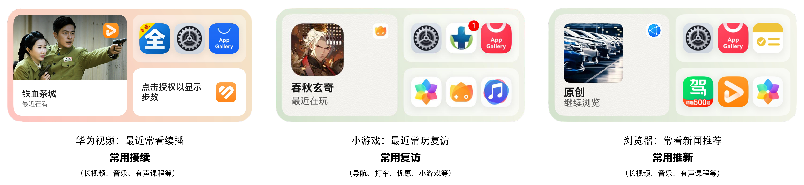
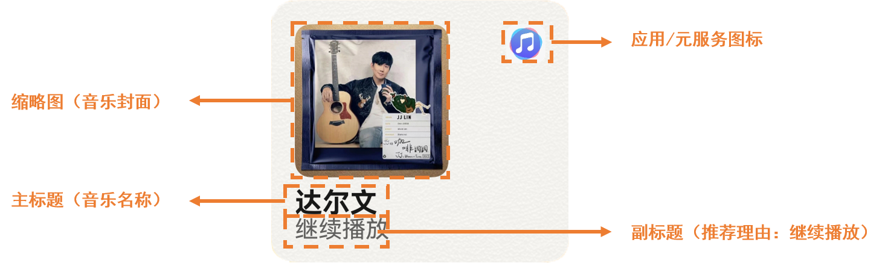

# 场景体验

更新时间：2026-04-20 06:34:33

来源：https://developer.huawei.com/consumer/cn/doc/harmonyos-guides/intents-habit-rec-scene-experience

##### 典型场景

当前习惯推荐可在小艺建议入口分发，在不同垂域中，填充功能详细参数或内容的逻辑不同，主要典型场景可分为常用接续、常用复访、常用推新三类。
 

 
以常看视频续播为例，系统预测当前用户使用华为视频的播放视频功能概率较高，会选择用户最近观看且还没看完的视频内容来补充功能细节，在小艺建议中以模板卡形式推荐展示，用户点击卡片后，实现一步跳转进应用的视频播放页。
 
  

##### 卡片展示效果

意图框架提供各垂域习惯推荐在小艺建议中展示使用的标准模板卡片，开发者无需开发展示卡片。在展示模板上，会展示应用/元服务名称与logo和内容必要信息，比如音乐名、音乐图片，这类参数需要开发者共享到系统。
 
以下为播放歌曲-习惯推荐的卡片示例。
 

