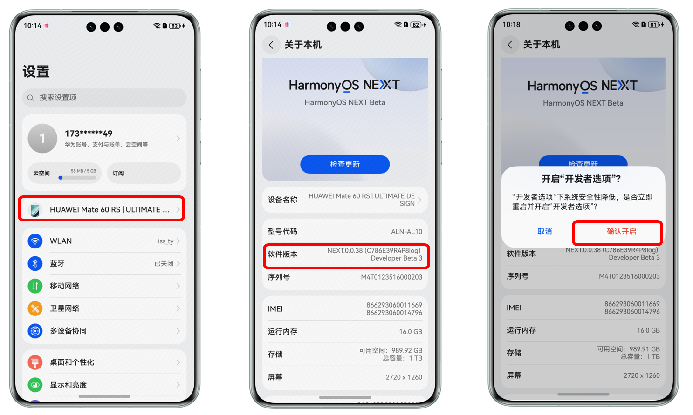
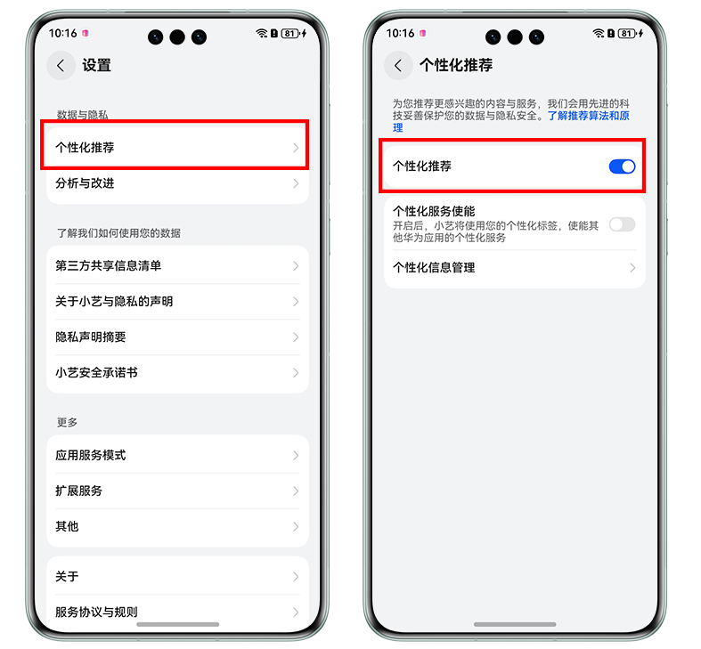
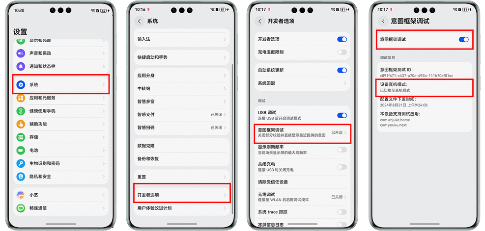

# 开发者测试

更新时间：2026-05-26 06:48:54

来源：https://developer.huawei.com/consumer/cn/doc/harmonyos-guides/intents-habit-rec-dp-self-validation

Intents Kit向开发者提供真机测试能力，即开发者可连接设备进行调测。开发者完成代码开发之后，功能正式上架应用市场前，可以在HarmonyOS 5及以上的设备上面进行自验证，打磨体验。真机测试分为三个步骤：基础信息提供，环境准备，联调验证。

##### 基础信息提供

开发者在AppGallery Connect平台上提交的习惯推荐方案能力申请审核成功后，可根据审核成功的反馈提示，提供测试应用的信息。能力申请的步骤参考[Intents Kit接入流程](https://developer.huawei.com/consumer/cn/doc/harmonyos-guides/intents-access-flow)。

| 序号 | 基础信息 | 描述 |
| --- | --- | --- |
| 1 | 应用名称 | 应用市场上架的应用名称。 |
| 2 | 应用包名 | 应用市场上架的应用包名。 |
| 3 | 接入意图名称 | 开发者意向接入的意图名称（中英文）。 |
| 4 | 应用图标 | 应用的图标，具体要求如下： 图标背景：非透明。 比例&尺寸：1:1，72px*72px。 大小：不超过1M。 格式：png、jpg、jpeg。 |
| 5 | APP ID | 登录AppGallery Connect，在“开发与服务 > 我的项目 > 项目设置 > 常规 > 应用-APP ID”中获取。 |
| 6 | Client ID | 登录AppGallery Connect，在“开发与服务 > 我的项目 > 项目设置 > 常规 > 应用 > OAuth 2.0客户端ID(凭据) > Client ID”中获取。 |
| 7 | 华为账号（UID） | 参考附录A获取UID。 |

##### 环境准备

准备一台装有HarmonyOS 5及以上版本的手机设备，系统版本最低要求为 Developer Beta 3，并按照以下顺序依次执行，不能更换执行顺序。
1. 保持设备联网，并且设备时间和实际北京时间保持一致。
2. 点击桌面的小艺建议卡片。此时卡片显示的是“欢迎使用小艺建议”，点击卡片打开小艺的隐私页面，并选择“同意”。如果此前已经同意过小艺的隐私协议，此步骤可以跳过。

  

3. 打开开发者调试模式：进入设置 > 机型 > 关于手机，连续点击软件版本7次，弹出“开启“开发者模式””，点击“确认开启”。

  

4. 长按电源键唤醒小艺，将半屏态小艺向上拉升至全屏态，点击左上角返回上层，返回后点击右上角的头像，进入“设置”，找到并进入应用网络设置，打开“WLAN下自动更新”开关。

  

5. 在上一步页面中下滑，点击“个性化推荐”，进入后打开“个性化推荐”的开关。

  

6. 进入设置 > 系统 > 开发者选项 > 意图框架调试，打开意图框架调试开关，如果下方显示已切换至真机模式并且测试应用包名在“本设备支持测试应用”下，则代表真机模式切换成功。

  

  【提示】如果出现意图框架调试打开后，设备长时间无法出现“已切换至真机模式”或者出现“已切换至真机模式”但没有包名的时候，可以尝试以下操作：

  
 - 登出华为账号，再登录之后重新开启意图框架调试开关。

7. 在小艺对话中点击右上角头像，设置 > 服务管理 > 注销服务 > 注销服务，然后返回桌面重新点击小艺建议的卡片，将展示“欢迎使用小艺建议”的卡片刷新成有服务推荐的卡片，最后重新开启意图框架调试开关。
 - 完成以上所有步骤，即可进行联调。

##### 联调验证
1. 意图共享：在测试应用当中成功触发意图共享。即通过测试应用内的操作触发[shareIntent()](https://developer.huawei.com/consumer/cn/doc/harmonyos-references/intents-arkts-api-insightintent#shareintent)接口的调用，并且意图共享成功。

  【举例】某音乐App接入意图框架音乐续播的特性。通过播放某一首歌曲的用户操作，触发某音乐App调用系统接口[shareIntent()](https://developer.huawei.com/consumer/cn/doc/harmonyos-references/intents-arkts-api-insightintent#shareintent)。开发者可通过接口回调的信息来确认本次意图共享是否成功。
2. 卡片渲染：点击桌面上的小艺建议卡片中任意服务，然后返回桌面，会触发小艺建议卡片强制刷新。刷新之后会展示前一步意图共享的数据所形成的模板卡片。具体卡片样式可参考具体特性的场景说明文档。

  【提示】重复意图共享和卡片渲染两步，可以触发卡片上文字元素和图片元素的刷新。
3. 意图调用：点击小艺建议卡片中的模板卡片，能够跳转至测试应用的目标页面，则说明意图调用的过程是正确的。

  
 - 【提示】意图调用的验证过程中，应当对测试应用的冷启动和热启动场景都进行验证，两个场景最终的跳转页面应当与预期的页面保持一致。

4. 如果卡片没有正常渲染。可以尝试通过下列方法出卡：         
检查个性化推荐开关是否开启，详见[环境准备](#环境准备)章节步骤5；检查意图框架测试开关是否开启，详见[环境准备](#环境准备)章节步骤6；检查完后重新执行卡片渲染步骤。

5. 重新触发意图共享，并且在接口结果返回success之后，重新连接充电线，手机灭屏等待8分钟，再重新执行卡片渲染步骤。

##### 端云结合的习惯推荐

涉及习惯推荐叠加上云搜索场景的开发者优先完成习惯推荐在设备上联调，确保测试应用的意图共享和意图调用的业务逻辑正确。后端接口开发完毕，需自行检查接口的出参是否满足意图框架云侧接口规范。以上两步完成之后，可联系华为意图框架接口同事提交后端接口文档，华为同事会配合开发者进行联调。
