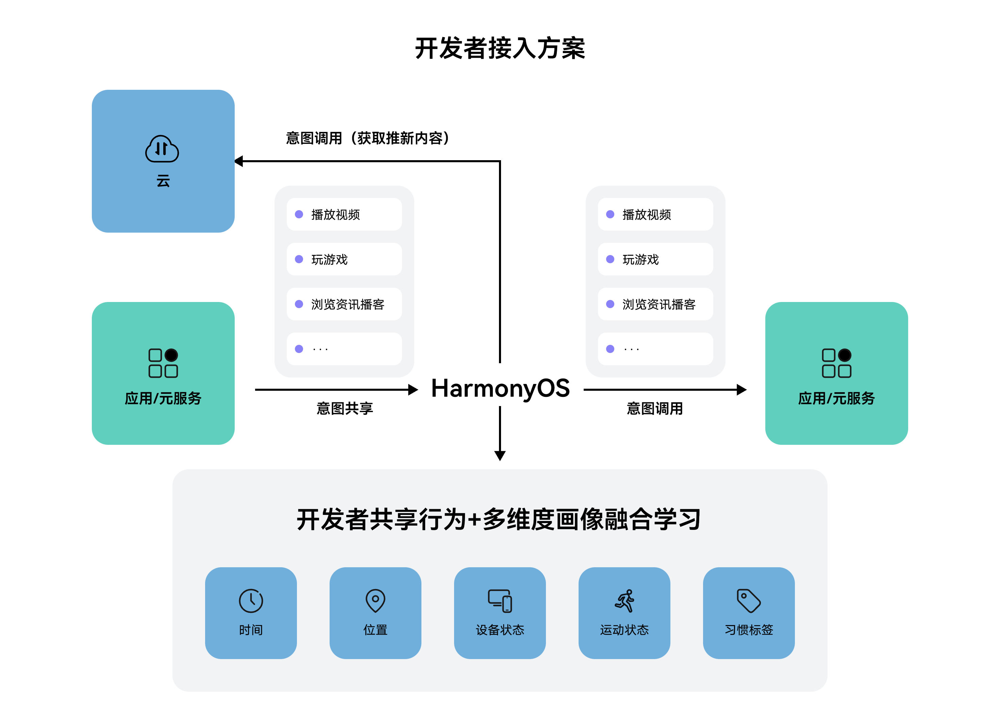

# 接入方案

更新时间：2026-05-19 09:13:51

来源：https://developer.huawei.com/consumer/cn/doc/harmonyos-guides/intents-habit-rec-access-programme

#### 方案概述
当用户在应用/元服务内使用功能时，开发者需要按照标准意图Schema向系统共享行为数据，并支持意图调用（空调用与传参调用），以实现用户点击模板卡后跳转回对应页面。



#### 意图注册
以歌曲续听推荐特性为例，首先要注册播放歌曲意图（PlayMusic），其他意图见[各垂域意图Schema](https://developer.huawei.com/consumer/cn/doc/service/intents-schema-0000001901962713)。
开发者需要编辑对应的意图配置insight_intent.json文件实现意图声明。insight_intent.json文件需要放置在任意一个module下面的指定目录：src/main/resources/base/profile/insight_intent.json，并且整个工程中只能存在一个insight_intent.json文件。

```ts
{
  // 应用支持的意图列表
  // 必须声明应用支持插件包含的必选意图，应用上架时会进行校验
  "insightIntents": [
    {
      // 意图名称
      // 名称应当遵循意图框架规范，当前仅支持预置垂域意图，不允许自定义
      // 应用内意图名称唯一，不允许出现相同的名称定义
      "intentName": "PlayMusic",
      // 意图所属的垂域
      "domain": "MusicDomain",
      // 意图版本号
      // 插件引用意图时会校验该版本号，只有和插件定义的版本号一致才能正常调用
      "intentVersion": "1.0.1",
      // 意图调用逻辑入口
      // 根据意图调用文件实际路径和实际名称进行填写，此处文件仅做示意
      "srcEntry": "./ets/entryability/InsightIntentExecutorImpl.ets",
      "uiAbility": {
        // 意图所在ability
        "ability": "EntryAbility",
        // UIAbility支持前后台两种执行模式
        "executeMode": [
          "background",
          "foreground"
        ]
      }
    }
  ]
}
```

#### 端侧意图共享
构建意图对象，并且调用[shareIntent()](https://developer.huawei.com/consumer/cn/doc/harmonyos-references/intents-arkts-api-insightintent#shareintent-1)，实现意图共享。可同时构建多个PlayMusic或PlayMusicList的意图对象。PlayMusic的意图共享字段定义见[各垂域意图Schema](https://developer.huawei.com/consumer/cn/doc/service/intents-schema-0000001901962713)定义，完整的意图共享示例如下所示，该示例构建了一个PlayMusic意图，并进行了shareIntent调用。

```ts
import { insightIntent } from '@kit.IntentsKit';
import { BusinessError } from '@kit.BasicServicesKit';

@Entry
@Component
struct Index {
  build() {
    Column() {
      Row() {
        Button('shareIntent')
          .onClick(() => {
            let playMusicIntent: insightIntent.InsightIntent = {
              intentName: 'PlayMusic',
              intentVersion: '1.0.1',
              identifier: '52dac3b0-6520-4974-81e5-25f0879449b5',
              intentActionInfo: {
                actionMode: 'EXECUTED',
                executedTimeSlots: {
                  executedStartTime: 1637393112000,
                  executedEndTime: 1637393212000
                },
                currentPercentage: 50
              },
              intentEntityInfo: {
                entityName: 'Music',
                entityId: 'C10194368',
                entityGroupId: 'C10194321312',
                displayName: '测试歌曲1',
                description: 'NA',
                logoURL: 'https://www-file.abc.com/-/media/corporate/images/home/logo/abc_logo.png',
                keywords: ['华为音乐', '化妆'],
                rankingHint: 99,
                expirationTime: 1637393212000,
                metadataModificationTime: 1637393212000,
                activityType: ['1', '2', '3'],
                artist: ['测试歌手1', '测试歌手2'],
                lyricist: ['测试词作者1', '测试词作者2'],
                composer: ['测试曲作者1', '测试曲作者2'],
                albumName: '测试专辑',
                duration: 244000,
                playCount: 100000,
                musicalGenre: ['流行', '华语', '金曲', '00后'],
                isPublicData: false
              }
            };
            // 共享数据接口  意图数组可以是更多的实体
            // 根据实际代码上下文自行传入合适的context
            insightIntent.shareIntent(this.getUIContext().getHostContext(), [playMusicIntent]).then(() => {
              console.info('shareIntent succeed');
            }).catch((err: BusinessError) => {
              console.error(`shareIntent failed, Code: ${err?.code}, message: ${err?.message}`);
            });
          })
      }
      .justifyContent(FlexAlign.Center)
      .alignItems(VerticalAlign.Center)
      .width('100%')
    }
    .height('100%')
    .width('100%')
  }
}
```

#### 端侧意图调用
#### 意图执行组件为uiAbility的意图调用
如上文意图注册，当开发者注册的意图承载的运行组件为uiAbility时，开发者需要自己实现InsightIntentExecutor，并在对应回调实现打开落地页（点击推荐卡片跳转的界面）的能力，PlayMusic的意图调用字段定义见[各垂域意图Schema](https://developer.huawei.com/consumer/cn/doc/service/intents-schema-0000001901962713)。
步骤如下：
1. 继承InsightIntentExecutor。
2. 重写对应方法，例如目标拉起前台页面，则可重写onExecuteInUIAbilityForegroundMode方法。
3. 通过意图名称，识别播放歌曲意图（PlayMusic），在对应的方法中传递意图参数（param），并拉起对应落地页（如歌曲落地页）。 import { insightIntent, InsightIntentExecutor } from '@kit.AbilityKit';
import { window } from '@kit.ArkUI';
import { BusinessError } from '@kit.BasicServicesKit';

/**
 * 意图调用样例
 */
export default class InsightIntentExecutorImpl extends InsightIntentExecutor {
  private static readonly PLAY_MUSIC = 'PlayMusic';
  /**
   * override 执行前台UIAbility意图
   *
   * @param name 意图名称
   * @param param 意图参数
   * @param pageLoader 窗口
   * @returns 意图调用结果
   */
   onExecuteInUIAbilityForegroundMode(name: string, param: Record<string, Object>, pageLoader: window.WindowStage):
 Promise&lt;insightIntent.ExecuteResult&gt; {
 // 根据意图名称分发处理逻辑。接入方可根据实际业务实现页面跳转
 switch (name) {
 case InsightIntentExecutorImpl.PLAY_MUSIC:
 return this.playMusic(param, pageLoader);
 default:
 break;
 }
 const data: insightIntent.ExecuteResult = {
 code: -1,
 result: {
 message: 'unknown intent'
 }
 };
 return Promise.resolve(data);
   }

  /**
   * 实现调用播放歌曲功能
   *
   * @param param 意图参数
   * @param pageLoader 窗口
   */
  private playMusic(param: Record<string, Object>, pageLoader: window.WindowStage): Promise&lt;insightIntent.ExecuteResult&gt; {
 return new Promise((resolve, reject) => {
 let localStorage: LocalStorage = new LocalStorage(param);
 pageLoader.loadContent('pages/Index', localStorage)
 .then(() => {
 const items: Array&lt;PlayMusicEntity&gt; = (param.items instanceof Array) ? param.items : [];
 const entityId: string = items[0]?.entityId;
 console.info(`Intent param, entityId: ${entityId}`);
 const data: insightIntent.ExecuteResult = {
 code: 0,
 result: {
 message: 'Intent execute succeed'
 }
 };
 resolve(data);
 })
 .catch((err: BusinessError) => {
 console.error(`Intent execute failed, Code: ${err?.code}, message: ${err?.message}`);
 const data: insightIntent.ExecuteResult = {
 code: -1,
 result: {
 message: 'Intent execute failed'
 }
 };
 reject(data);
 });
 })
  }
}

interface PlayMusicEntity {
  entityId: string;
}

#### 意图执行组件为form的意图调用
如上文意图注册，当开发者注册的意图承载的运行组件为form（运行组件FormExtensionAbility）时，则需要开发者在实现的FormExtensionAbility中从want中获取并解析意图名和执行参数，用于卡片展示。
步骤如下：
1. 在意图执行绑定FormExtensionAbility的onAddForm(want: Want)中获取运行态意图框架传入的意图名（预定义keyName为ohos.insightIntent.executeParam.name）和意图执行参数（预定义keyName为ohos.insightIntent.executeParam.param）；
2. 通过意图名称，识别播放歌曲意图(PlayMusic)，在对应的方法中传递意图参数（param），并加载对应数据用于卡片展示。

```ts
import { Want } from '@kit.AbilityKit';
import { formBindingData, FormExtensionAbility } from '@kit.FormKit';

/**
 * 卡片意图调用示例
 */
export default class LoadCardFormAbility extends FormExtensionAbility {
  private static readonly NAME = 'ohos.insightIntent.executeParam.name';
  private static readonly PARAM = 'ohos.insightIntent.executeParam.param';

  onAddForm(want: Want): formBindingData.FormBindingData {
    if (want?.parameters?.[LoadCardFormAbility.NAME] != undefined) {
      const intentName = want.parameters[LoadCardFormAbility.NAME]; // 意图名
      // 根据意图名称分发处理逻辑，若仅一个卡片意图，则可以忽略
      console.info(`intentName is ${intentName}`);
    }

    if (want?.parameters?.[LoadCardFormAbility.PARAM] != undefined) {
      const executeParameter = want.parameters[LoadCardFormAbility.PARAM]; // 意图执行参数
      // 从 executeParameter 中解析具体意图执行参数，用于卡片内容展示
      console.info(`executeParameter is ${JSON.stringify(executeParameter)}`);
    }

    let formData = ''; // 仅示例，根据具体逻辑封装
    return formBindingData.createFormBindingData(formData);
  }
}
```
