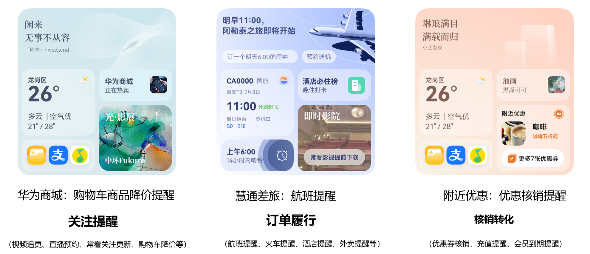
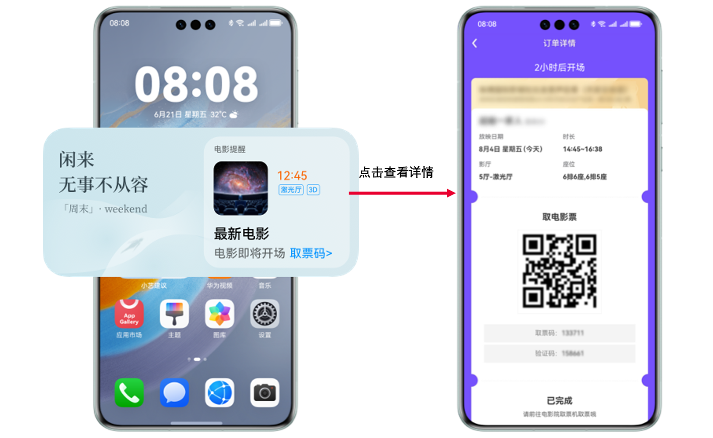
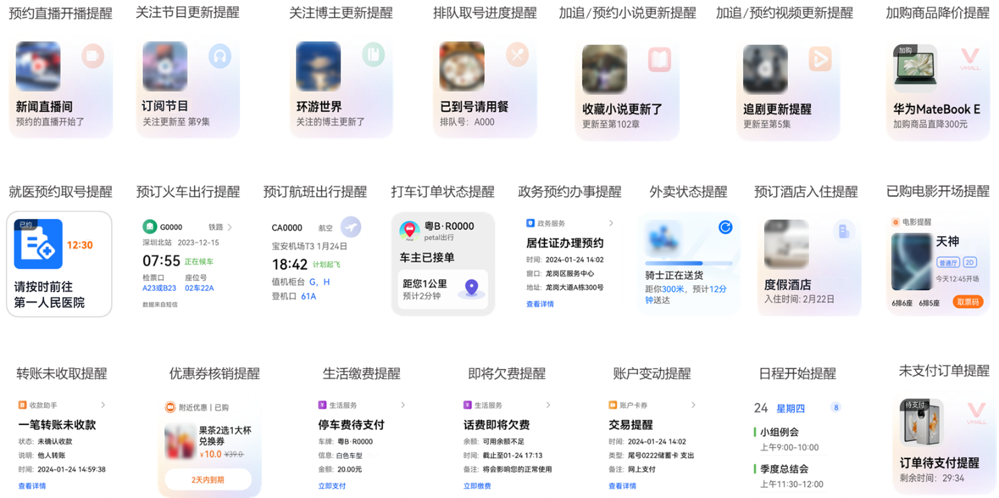

# 场景体验

更新时间：2026-04-20 06:34:33

来源：https://developer.huawei.com/consumer/cn/doc/harmonyos-guides/intents-event-rec-scene-experience

## 典型场景

**事件推荐典型场景包括：** 关注提醒事件（购物车降价、加追更新）  订单履行提醒事件（门票、机票、打车、外卖、挂号）  核销转化事件（会员、优惠券、话费余额）   各垂域也可根据垂域的实际情况定义具体的事件。

以电影开场提醒为例，用户在应用/元服务中购买了电影票，在电影开场前半小时（具体生效时间将根据具体垂域的情况和用户最佳体验确定），用户可在小艺建议入口看到电影取票提醒的卡片，点击卡片可跳转到应用/元服务的订单详情页，用户可在该页面完成电影取票。

## 卡片展示效果

意图框架将提供系统标准的事件模板卡片，无需开发者开发，开发者只需按照具体垂域事件的[意图Schema](https://developer.huawei.com/consumer/cn/doc/service/intents-schema-0000001901962713)将事件推送至智慧分发平台服务器即可。各垂域事件卡片样式的示例如下：

