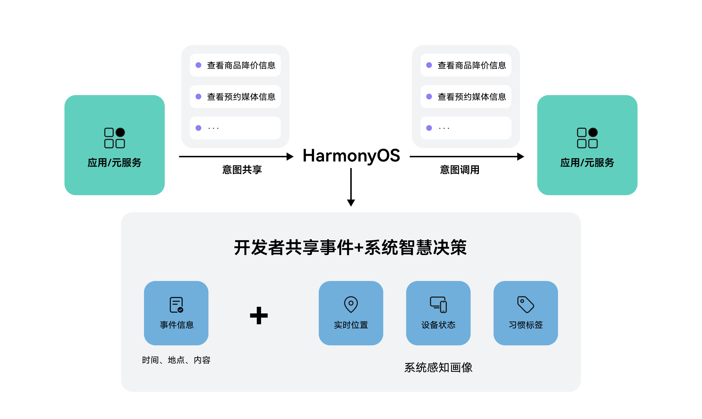
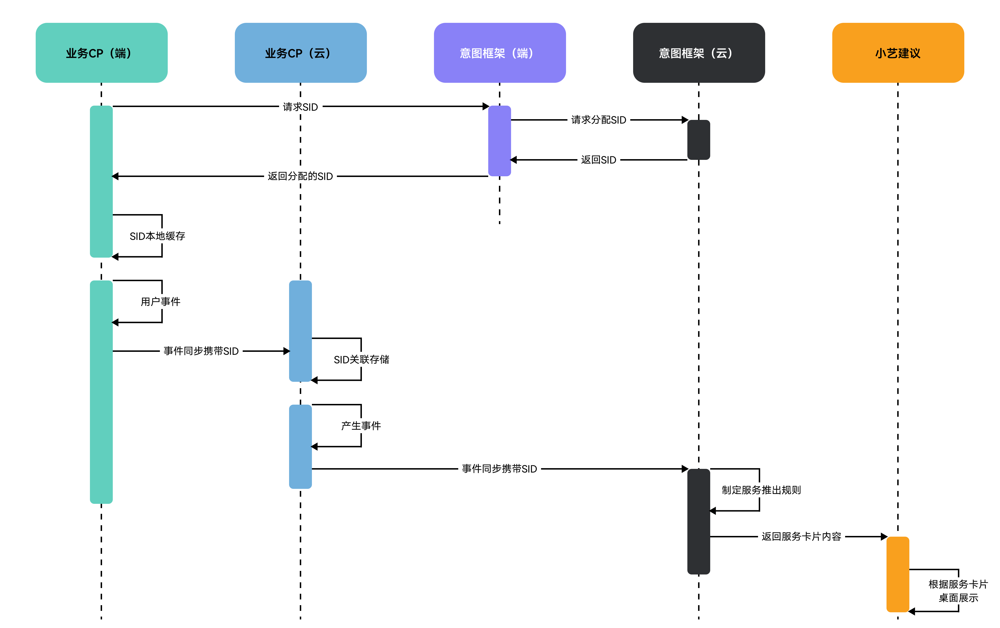

# 接入方案

更新时间：2026-05-19 09:13:51

来源：https://developer.huawei.com/consumer/cn/doc/harmonyos-guides/intents-event-rec-access-programme

##### 方案概述

当开发者有事件想要通知到用户时，可通过应用/元服务的云侧服务器向智慧分发平台推送事件内容（意图共享）。系统通过智慧决策判断事件发生的条件，在满足条件时，向用户推荐事件提醒卡片，当用户点击卡片后，可跳转到应用/元服务的详情页查看事件详情（意图调用）。





##### 流程图
1. 开发者获取云侧事件捐赠所需的SID（Service OpenID）。
2. 当用户有订单事件后，开发者云将事件内容和SID同步到业务云。
3. 华为侧会根据事件和具体场景制定事件服务推出规则和时机。
4. 在满足制定规则场景下展示对应用户事件，增加服务曝光率。





##### 意图注册

以还款待办事件提醒特性为例，首先要注册查看还款意图（ViewRepayment），详见[各垂域意图Schema](https://developer.huawei.com/consumer/cn/doc/service/intents-schema-0000001901962713)。

开发者需要编辑对应的意图配置insight_intent.json文件实现意图声明。insight_intent.json文件需要放置在任意一个module下面的指定目录：src/main/resources/base/profile/insight_intent.json，并且整个工程中只能存在一个insight_intent.json文件。

```ArkTS
{
  // 应用支持的意图列表
  // 必须声明应用支持插件包含的必选意图，应用上架时会进行校验
  "insightIntents": [
    {
      // 意图名称
      // 名称应当遵循意图框架规范，当前仅支持预置垂域意图，不允许自定义
      // 应用内意图名称唯一，不允许出现相同的名称定义
      "intentName": "ViewRepayment",
      // 意图所属的垂域
      "domain": "BankingDomain",
      // 意图版本号
      // 插件引用意图时会校验该版本号，只有和插件定义的版本号一致才能正常调用
      "intentVersion": "1.0.1",
      // 意图调用逻辑入口
      "srcEntry": "./ets/entryability/InsightIntentExecutorImpl.ets",
      "uiAbility": {
        // 意图所在ability
        "ability": "EntryAbility",
        // UIAbility支持前后台两种执行模式
        "executeMode": [
          "background",
          "foreground"
        ]
      }
    }
  ]
}
```


##### 获取SID

> [!NOTE]
> API文档参见： 意图框架API参考 > getSid 。


云侧事件捐赠凭证SID（Service OpenID）优先从缓存获取，当缓存获取失败可以强制从云侧获取新的SID。

```text
import { insightIntent } from '@kit.IntentsKit';
import { BusinessError } from '@kit.BasicServicesKit';

@Entry
@Component
struct Index {
  build() {
    Column() {
      Row() {
        Button('getSid')
          .onClick(() => {
            // 根据实际代码上下文自行传入合适的context
            insightIntent.getSid(this.getUIContext().getHostContext(), false) // 优先获取缓存SID，改为true则强制从云侧获取新SID
              .then((sid: string) => {
                // 获取SID成功
                console.info('getSid succeed!');
              }).catch((error: BusinessError) => {
              // 获取SID失败
              console.error(`getSid failed! Code: ${error?.code} message: ${error?.message}`);
            });
          })
      }
      .justifyContent(FlexAlign.Center)
      .alignItems(VerticalAlign.Center)
      .width('100%')
    }
    .height('100%')
    .width('100%')
  }
}
```


##### 云侧意图共享


##### 意图共享接口调用

应用/元服务通过[云侧意图共享接口](https://developer.huawei.com/consumer/cn/doc/harmonyos-references/intents-rest-api-intent-share#功能介绍)，把对应意图的相关事件数据共享给Intents Kit，用于事件提醒服务。


##### 事件撤销接口调用

当应用/元服务共享的意图相关事件数据超过时效期，Intents Kit需要通过[云侧事件撤销接口](https://developer.huawei.com/consumer/cn/doc/harmonyos-references/intents-rest-api-revoke-event)把相关事件数据撤销，以避免触发超过时效期的事件提醒。


##### 端侧意图调用

开发者需要自己实现InsightIntentExecutor，并在对应回调实现打开落地页（点击推荐卡片跳转的界面）的能力，ViewRepayment的意图调用字段定义见对应[垂域意图Schema](https://developer.huawei.com/consumer/cn/doc/service/intents-schema-0000001901962713)定义表。

步骤如下：
1. 继承InsightIntentExecutor。
2. 重写对应方法，例如目标拉起前台页面，则可重写onExecuteInUIAbilityForegroundMode方法。
3. 通过意图名称，识别查看还款意图（ViewRepayment）。
4. 在对应的方法中传递意图参数（param），并拉起对应落地页（如还款页面）。

  
```text
import { insightIntent, InsightIntentExecutor } from '@kit.AbilityKit';
import { window } from '@kit.ArkUI';
import { BusinessError } from '@kit.BasicServicesKit';

/**
 * 意图调用样例
 */
export default class InsightIntentExecutorImpl extends InsightIntentExecutor {
  private static readonly VIEW_REPAYMENT = 'ViewRepayment';
  /**
   * override 执行前台UIAbility意图
   *
   * @param name 意图名称
   * @param param 意图参数
   * @param pageLoader 窗口
   * @returns 意图调用结果
   */
  onExecuteInUIAbilityForegroundMode(name: string, param: Record<string, Object>, pageLoader: window.WindowStage):
    Promise<insightIntent.ExecuteResult> {
    // 根据意图名称分发处理逻辑。接入方可根据实际业务实现页面跳转
    switch (name) {
      case InsightIntentExecutorImpl.VIEW_REPAYMENT:
        return this.viewRepayment(param, pageLoader);
      default:
        break;
    }
    const data: insightIntent.ExecuteResult = {
      code: -1,
      result: {
        message: 'unknown intent'
      }
    };
    return Promise.resolve(data);
  }

  /**
   * 实现调用查看还款功能
   *
   * @param param 意图参数
   * @param pageLoader 窗口
   */
  private viewRepayment(param: Record<string, Object>, pageLoader: window.WindowStage): Promise<insightIntent.ExecuteResult> {
    return new Promise((resolve, reject) => {
      let localStorage: LocalStorage = new LocalStorage(param);
      // TODO 实现意图调用，loadContent的入参为查看还款落地页路径，例如：'pages/Index'
      pageLoader.loadContent('pages/Index', localStorage)
        .then(() => {
          const entityId: string = (typeof param.entityId === 'string') ? param.entityId : '';
          console.info(`Intent param, entityId: ${entityId}`);
          const data: insightIntent.ExecuteResult = {
            code: 0,
            result: {
              message: 'Intent execute succeed'
            }
          };
          resolve(data);
        })
        .catch((err: BusinessError) => {
          console.error(`Intent execute failed, Code: ${err?.code}, message: ${err?.message}`);
          const data: insightIntent.ExecuteResult = {
            code: -1,
            result: {
              message: 'Intent execute failed'
            }
          };
          reject(data);
        });
    })
  }
}
```
