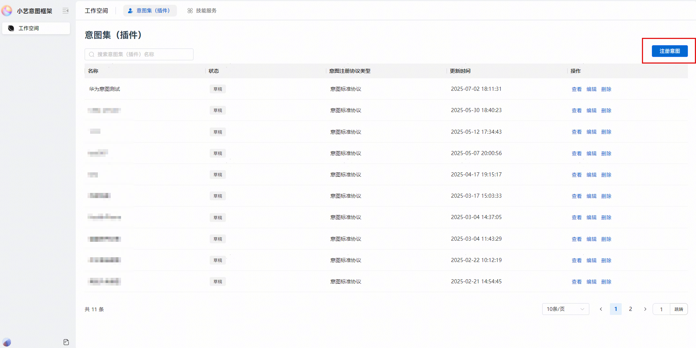
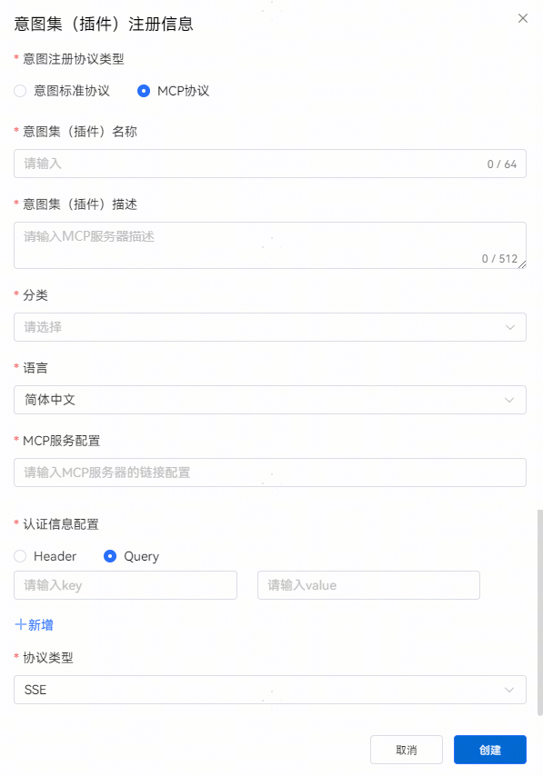
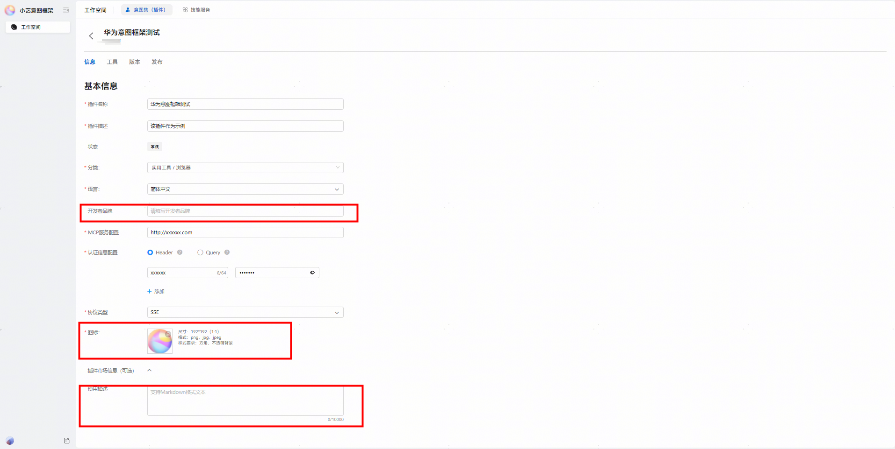
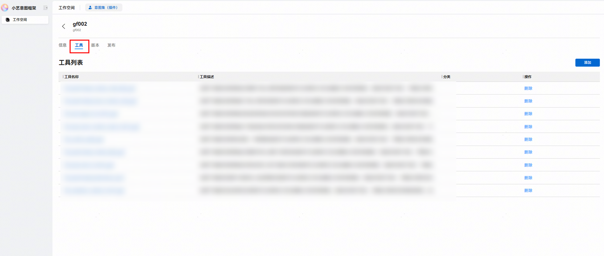
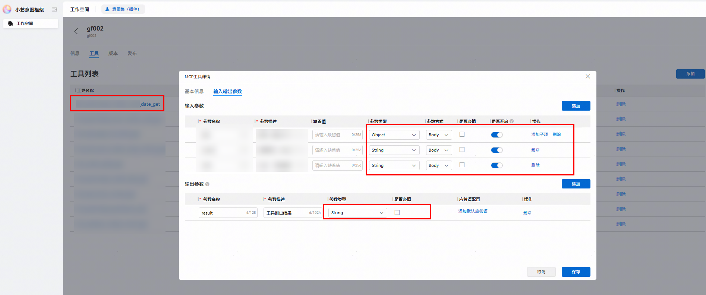
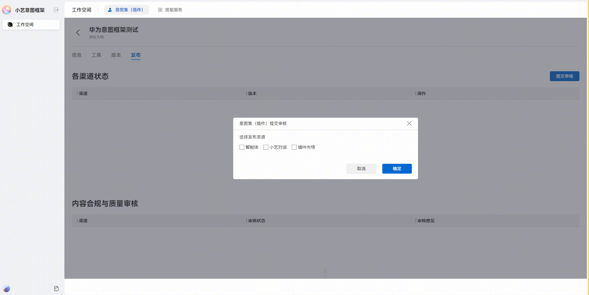

# MCP协议上架指导

更新时间：2026-04-29 07:35:50

来源：https://developer.huawei.com/consumer/cn/doc/harmonyos-guides/intents-kit-listing-mcp-protocol

#### **意图注册配置操作步骤**
1. 账号登录：

  
- 通过“[华为开发者联盟](https://developer.huawei.com/consumer/cn/) > 管理中心 > 生态服务 > 智慧服务 > 小艺开放平台（原HarmonyOS服务开放平台） > 意图框架”，进入意图注册入口。发布渠道为“智能体/小艺对话”只能使用与应用上架相同的账号登录，若发布渠道为“插件市场”则无特殊账号要求。

  

2. 点击“立即体验”即可进入意图注册入口。

  

- 注册意图集

1. 如图，点击“注册意图”。

  

2. 选择“MCP协议”并填写基本信息创建意图集。

  
意图集（插件）名称：需唯一标识。

3. 意图集（插件）描述：开发者自定义插件描述信息。

4. 分类：按业务场景选择。

5. MCP服务配置：填写MCP URL（服务器地址信息，不含鉴权信息）。

6. 认证信息配置：对应鉴权信息（注意放在Header/Query）。

7. 协议类型：根据情况选择，提供SSE/Streamable两种。

  

  - 编辑：创建后自动进入”插件编辑“页面。

1. 编辑基本信息：

  
开发者品牌：该信息是对外露出的品牌传播名（注意和企业账号，公司名称区别开）。

2. 图标：192*192。

3. 使用描述：需使用Markdown格式。（需对server的功能概述、apikey申请方式表达准确清晰）。

  

  - 工具检查：保存后切换至"工具"页签。若基本信息配置无误，工具列表中会根据基本信息内容自动生成1条/多条信息。

  

1. 出现工具列表：请检查工具入参，参数是否重复或者缺失，参数类型是否正确。若一切无误，则配置成功。

  

2. 未出现工具列表：请等候几分钟重新进入，后台加载存在延时；如若重新进入后，仍未加载出工具信息，可能是插件的链接和鉴权信息配置错误。多次尝试后仍未解决，请通过邮箱联系华为意图框架同学（hagservice@huawei.com） 。
- 审核：切换至“发布”页签，点击“提交审核”。

1. 选择发布渠道，点击确定，提交审核。
智能体：开发者上架MCP Server，仅供开发者自己开发的智能体来调用。

2. 小艺对话：开发者上架MCP Server，可供开发者自己开发的智能体调用，也可供小艺APP主对话调用（当前暂不支持开发者独立在小艺主对话上线该能力，需联系华为意图框架同学）。

3. 插件市场：开发者上架MCP server，可供开发者自己开发的智能体调用，也可供平台上其他开发者开发智能体时调用（回到开发者源头平台去开服）。

  

- 提交审核后，请耐心等待平台相关审核流程完成；完成后即可在“[华为开发者联盟](https://developer.huawei.com/consumer/cn/) > 管理中心 > 生态服务 > 智慧服务 > 小艺开放平台（原HarmonyOS服务开放平台） > 意图框架 > 小艺插件市场”中找到您的工具。
