# 意图标准协议上架指导

更新时间：2026-07-28 11:23:46

来源：https://developer.huawei.com/consumer/cn/doc/harmonyos-guides/intents-kit-listing-standard-protocol

该配置需开发者完成自测后，先将携有对应意图信息的App在AppGallery Connect（以下简称AGC）完成应用上架，具体操作步骤参见[应用开发准备](https://developer.huawei.com/consumer/cn/doc/harmonyos-guides/application-dev-overview)。
  

#### 意图注册配置操作步骤
1. 进入意图注册配置入口。

  
- 登录[华为开发者联盟](https://developer.huawei.com/consumer/cn/) ，选择“管理中心 > 生态服务 > 智慧服务 > 小艺开放平台”，在管理中心找到小艺开放平台。

  
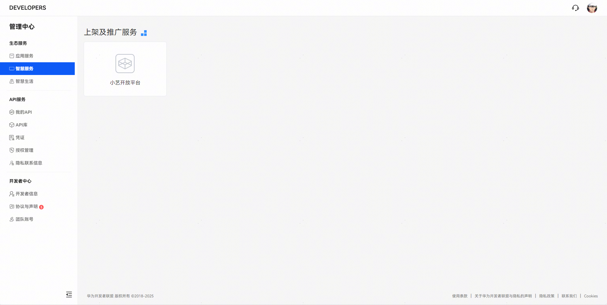

2. 点击“立即体验”按钮，进入项目管理页面。

  
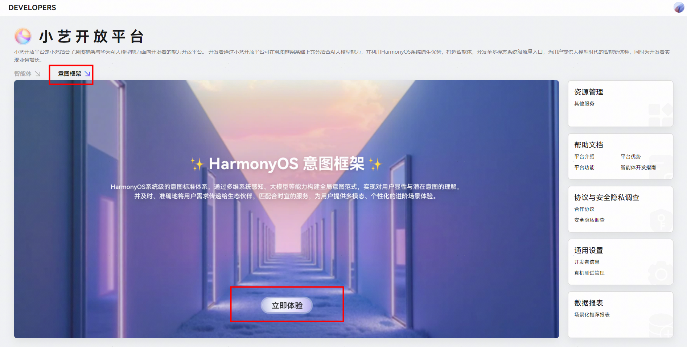

3. 在资源库中点击“意图框架”页签，即可到达意图注册配置操作入口。

  
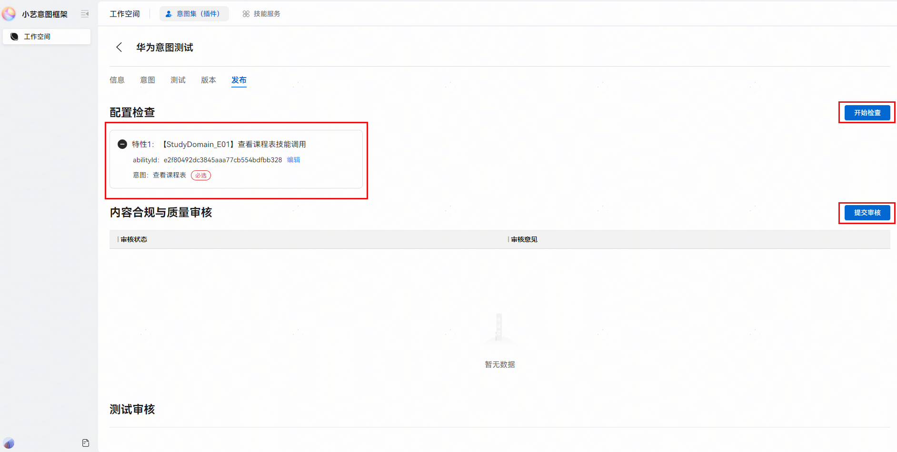

- 选择意图集：携有意图声明文件的应用在AGC**正式上架**后可**自动生成**一条草稿态的记录，记录中包含开发者在意图配置文件中声明的所有**端侧意图**。如果本次接入意图框架也涉及到使用**云侧意图**，则需要在意图集内手动进行云侧意图的配置（配置方式参考下文意图配置部分）。

  
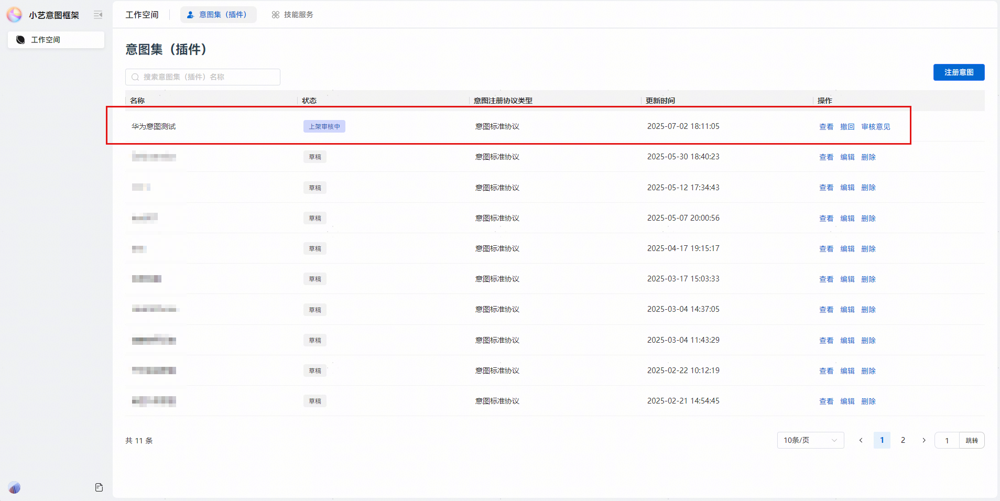

- 基本信息编辑：点击对应的意图集记录的“编辑”按钮，进入基本信息编辑页面。

  
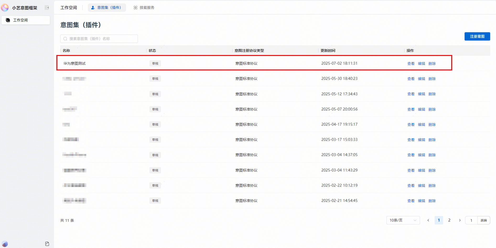

  此处的版本号和版本描述为智慧分发配置的版本信息，用于开发者记录和识别智慧分发配置版本变更，与APP软件包版本无关，意图注册名称与APP名称保持一致。开发者补充完基本信息后点击“保存”即可。

  
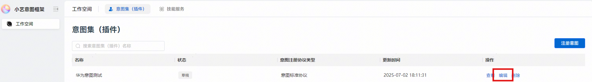

- 意图配置：切换至“意图”页签，点击“保存”会触发刷新，需检查接入特性所依赖的全量意图是否在此页面都已列出。

  
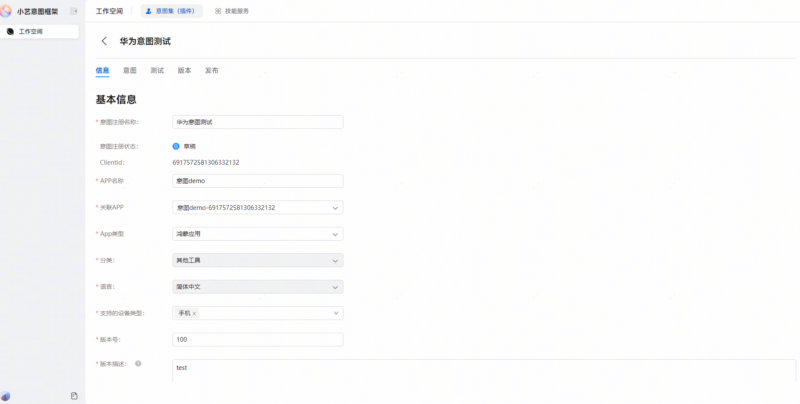

  
端侧意图：“端云类型”为端侧的意图，在APP软件包中定义，此处会自动呈现。

  
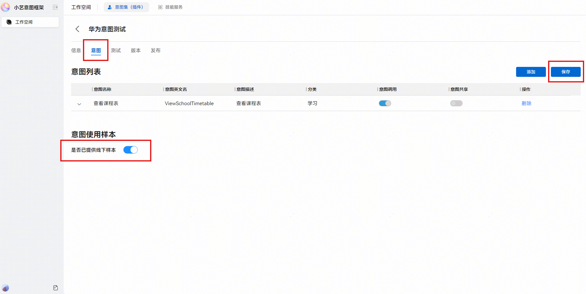

- 云侧意图：“端云类型”为云侧的意图，需在此页面手动添加。可参照如下步骤配置：

1. 点击“添加”，进行意图新增。

  
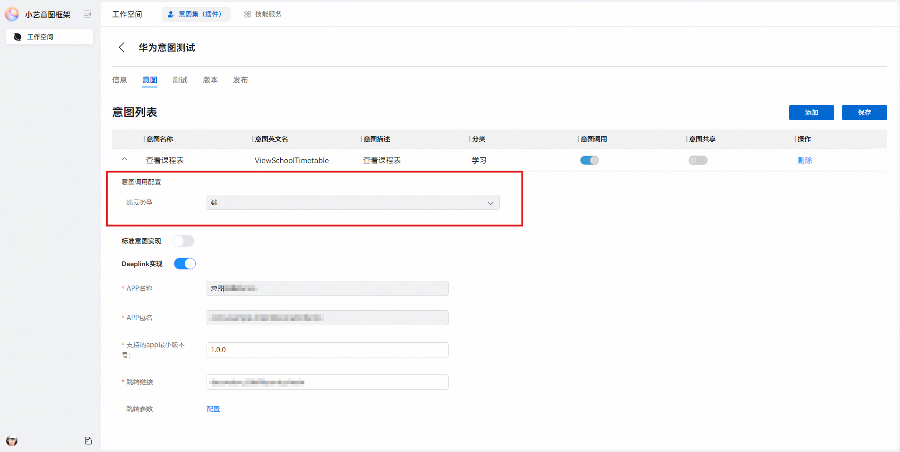

2. 选择云侧意图分类，搜索意图名称，勾选所需意图进行添加。

  
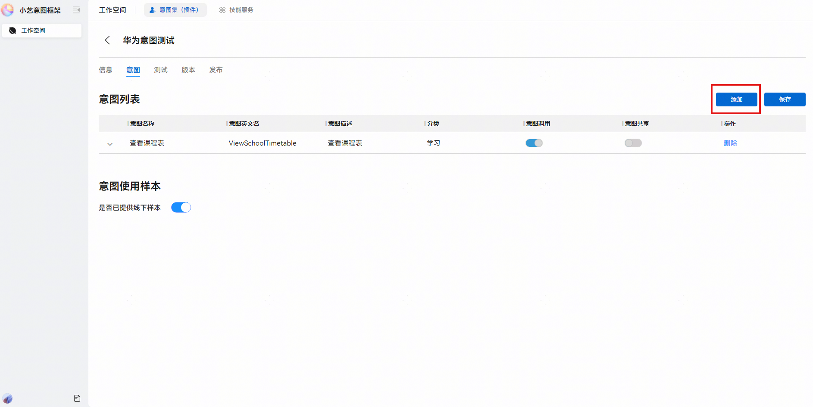

3. 添加完成后，需录入接口信息配置，具体信息如下：

  
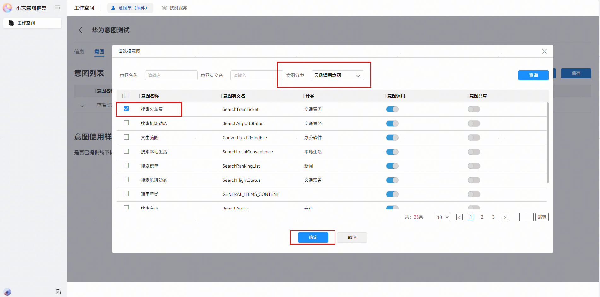

  
API：即开发者的URL地址信息，供华为侧服务器进行云侧意图调用。

4. 认证方式：如果涉及接口鉴权，则选择认证方式（例如AK/SK认证）并配置密钥信息；如果不涉及则选择不认证。

5. 个人数据授权：该信息是指华为侧服务器携带对应信息访问开发者服务器，当有个性化推荐诉求时需要填写，默认不填写；比如选中“用户授权的用户唯一标识”（即SID），则华为侧服务器访问开发者服务器时会携带SID，开发者服务器则可以识别用户返回个性化的数据用户推荐展示。
- 如仍未全部列出，检查软件包中意图注册配置文件是否漏配，若漏配则在意图配置文件中补充配置，并重新在AGC进行应用上架/升级，完成后在小艺开放平台进行意图注册。
- 如果提示声明意图不存在，开发者可以继续点击保存走完本次流程，但相应意图和关联特性不会生效；如需使该云侧意图生效，请按照[Intents Kit接入流程](https://developer.huawei.com/consumer/cn/doc/harmonyos-guides/intents-access-flow)中的能力申请步骤，表述意图使用的场景提交审核。审核成功后，根据审核成功的反馈提示，重新操作该意图的配置即可。

  - 检查完成：如果特性依赖的所有意图都已列出，检查意图名称、意图调用配置和意图共享配置等是否正确，正确则点击“保存”，进入下一步。
- 选择“发布”页签，进入配置检查页面。点击“开始检查”，检查接入特性和其关联的意图是否正确。

  
如果正确会同时生成特性以及abilityId，若开发者接入特性的方案涉及此参数（例如事件推荐场景），则意图共享中请求字段的abilityId参数需要填写当前界面的abilityId值。特性检查无误后，点击“提交审核”。
- 若提示特性undefined，则说明华为意图框架后台未配置该特性。如需使该特性生效，请按照[Intents Kit接入流程](https://developer.huawei.com/consumer/cn/doc/harmonyos-guides/intents-access-flow)中的能力申请步骤，表述意图使用的场景提交审核。审核成功后，根据审核成功的反馈提示，重新操作该特性的配置。

  

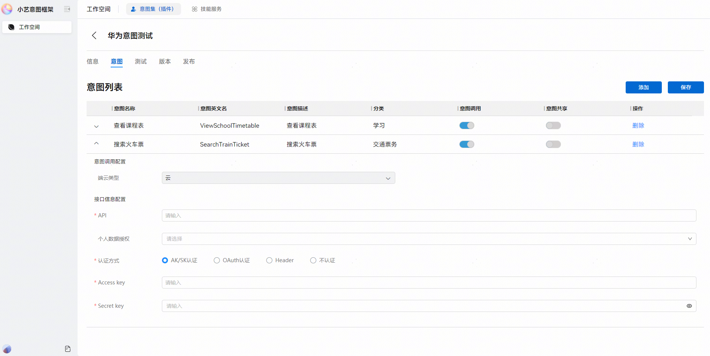

  - 审核：提交审核后，该条记录状态变为“上架审核中”，一般审核周期为3-5个工作日，审核通过后状态变为“已上架”，至此意图标准协议上架配置已完成。

  

- 若开发者后续有新意图上架，可在同一条意图记录上进行编辑后提交，操作流程同上述步骤，未提交审核不影响已经注册的意图。
