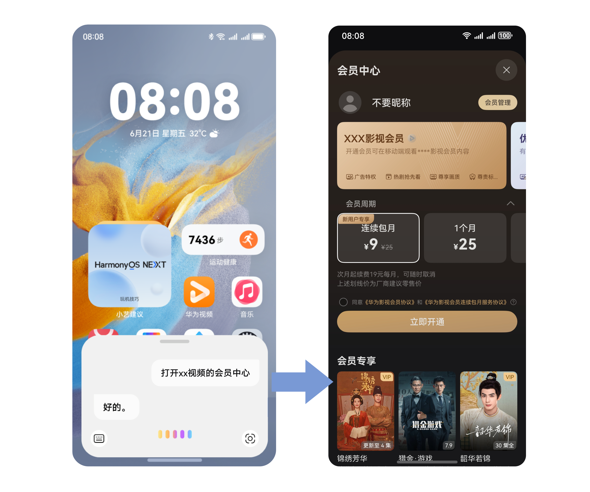

# 场景体验

更新时间：2026-04-20 06:34:33

来源：https://developer.huawei.com/consumer/cn/doc/harmonyos-guides/intents-skill-all-rec-scene-experience

用户通过小艺对话进行自然语言输入实现服务闭环和内容查询。主要场景分为两大类：任务执行和功能一步达。其中任务执行体验又分为两种：功能服务类和信息交互类。

## 典型场景

## 功能服务类

跳转页面不带参数场景。例如查询交易明细：语音对话输入“查询XX银行卡交易明细”，即跳转至对应App落地页。  跳转页面带参数场景。例如用XX应用打车：语音对话输入“用xx应用打车去xx商场”，即可跳转对应打车页面并填入提取的地址信息。  功能执行并展示窗口化界面。例如操控蓝牙开关：语音对话输入“打开蓝牙”，即可弹窗蓝牙设置窗口，并执行打开蓝牙开关操作。

## 信息交互类

内容展示场景。例如查找菜谱：语音对话输入“鱼香肉丝怎么做”，即可搜索到对应的菜谱。  功能履约场景。例如订电影票：语音对话输入“买两张今天的电影票，xxx电影”，即可进行电影票购买选座。

## 功能一步达

开发者将应用内的功能声明接入意图框架后，用户可以通过小艺直接打开相应功能页面，比如“打开XX视频的会员中心”，可直接拉起对应页面，实现一步直达。

