# 装饰器接入方式自测试方案

更新时间：2026-04-29 07:35:50

来源：https://developer.huawei.com/consumer/cn/doc/harmonyos-guides/intents-skill-all-rec-dp-self-validation-decorator

从6.0.0(20)开始，Intents Kit向开发者提供意图调用调试能力。开发者完成代码开发之后，功能正式上架应用市场前，可以在HarmonyOS 5及以上的设备上面进行自验证，调试分为两个步骤：环境准备和联调验证。
  

#### 环境准备
1. 登录[华为开发者联盟](https://developer.huawei.com/consumer/cn/) ，通过“管理中心 > 生态服务 > 智慧服务 > 小艺开放平台（原HarmonyOS服务开放平台） > 意图框架”，点击“立即体验”进入意图注册入口，需使用与应用上架相同的账号登录。

  
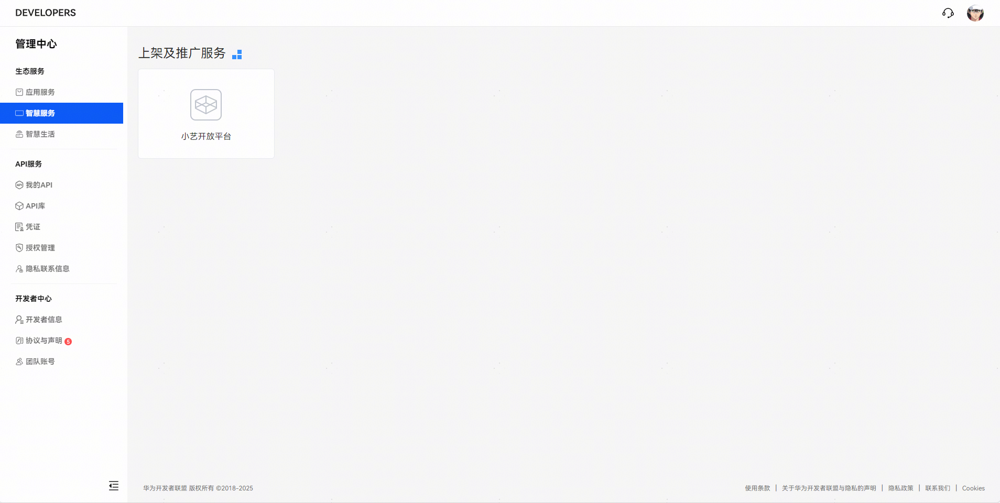

  
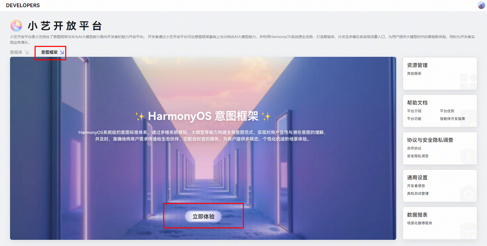

2. 点击注册意图新增意图集。

  
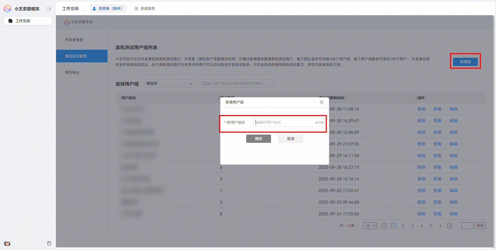

  
- 点击新增注册意图，填写注册信息进行创建。

  
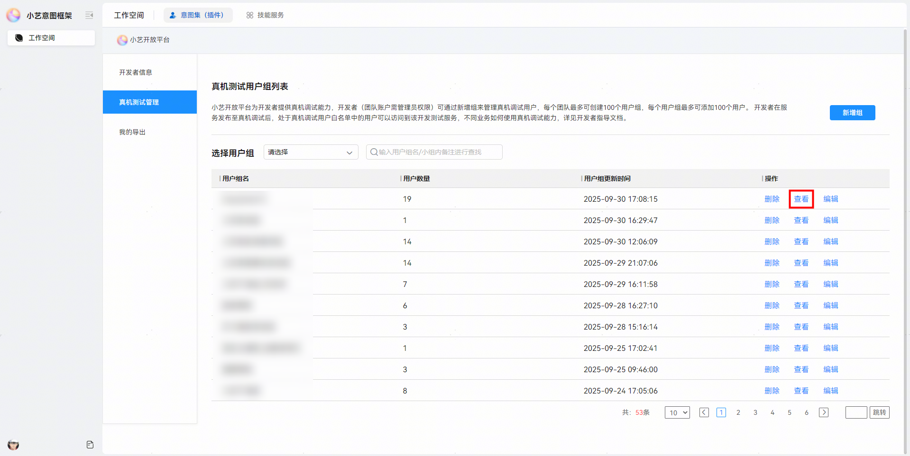

| 名称 | 描述 |

| --- | --- |

| 意图注册协议类型 | 选择意图标准协议。 |

| 意图集（插件）名称 | 需唯一标识。 |

| 分类 | 开发者根据自定义意图选择对应垂域。 |

3. 编辑意图集基本信息。

  
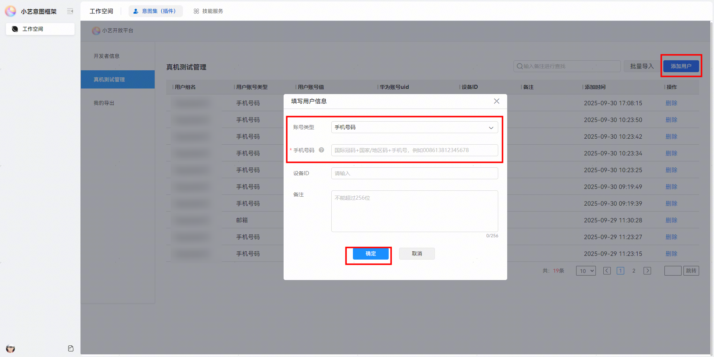

| 名称 | 描述 |

| --- | --- |

| 意图注册名称 | 填写应用名称。 |

| APP名称 | 填写应用名称。 |

| 关联APP | 选择需要进行测试的应用。 |

| 支持的设备类型 | 选择手机、平板、PC。 |

| 版本号 | 开发者自定义，仅支持正整数。 |

| 版本描述 | 开发者自定义，该内容不对外展示。 |

| 图标 | 尺寸：72*72（1:1） 格式：png、jpg、jpeg 样式要求：方角、不透明背景 |
- 添加意图。

1. 切换至意图页签并添加意图。

  
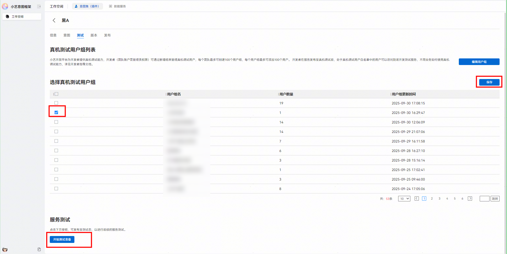

2. 选择自定义意图并填入意图信息（根据接入方案进行填入）并确定。

  
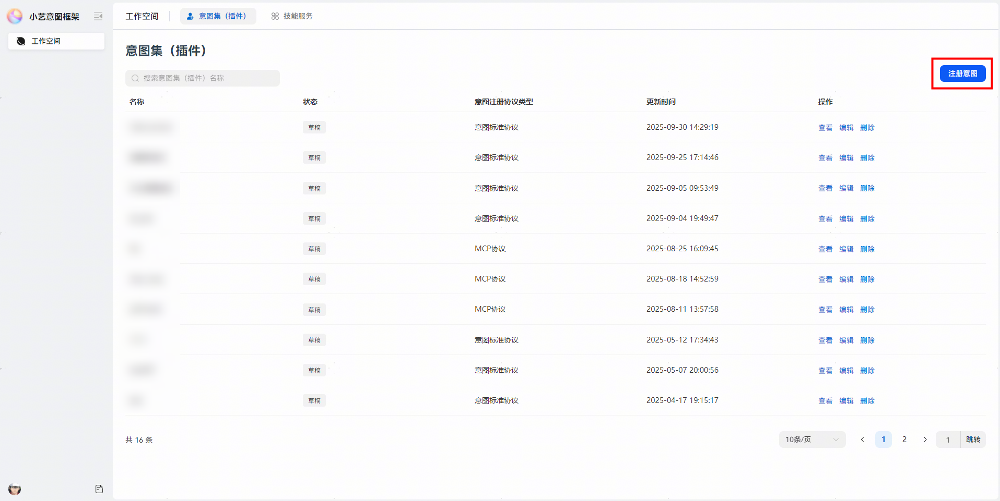

3. 展开已创建的意图，并填入自定义输入、输出参数，点击保存。

  
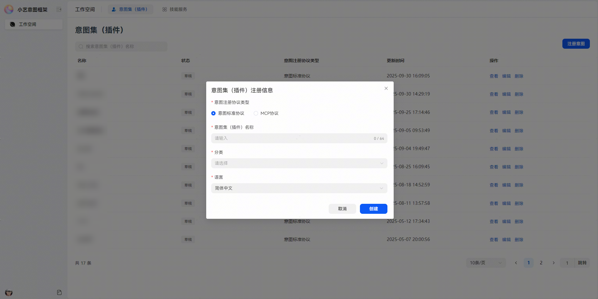

- 添加意图使用样本（意图样本用于提升模型对意图识别的准确率）。

1. 意图使用样本可通过新增/批量导入进行上传。

2. 若无需添加意图使用样本，打开是否已提供线下样本开关即可。

  
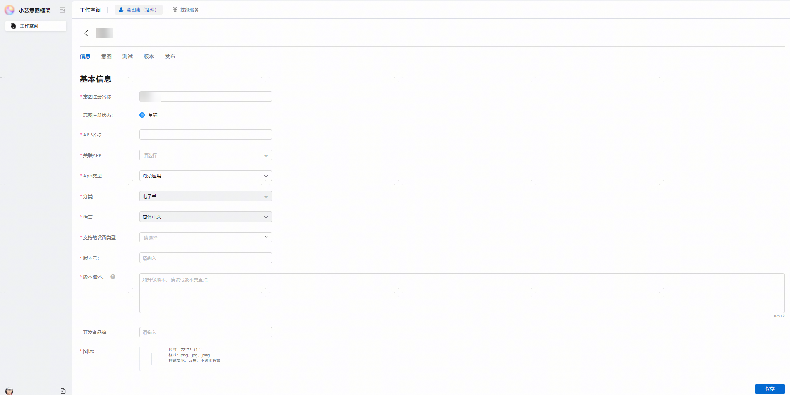

- 添加账号至真机测试用户组。

1. 切换至测试页签，点击编辑用户组。

  
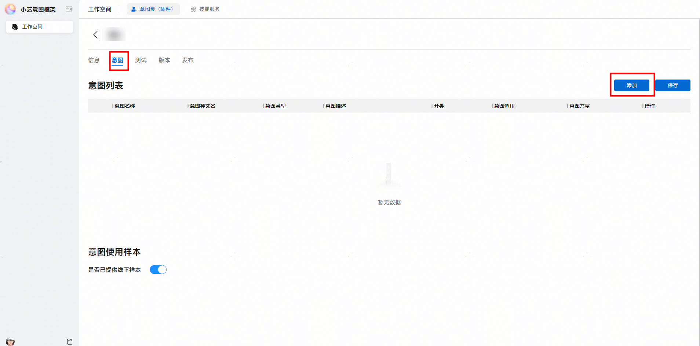

2. 点击新增组，输入新用户组名称（名称自定义）。

  
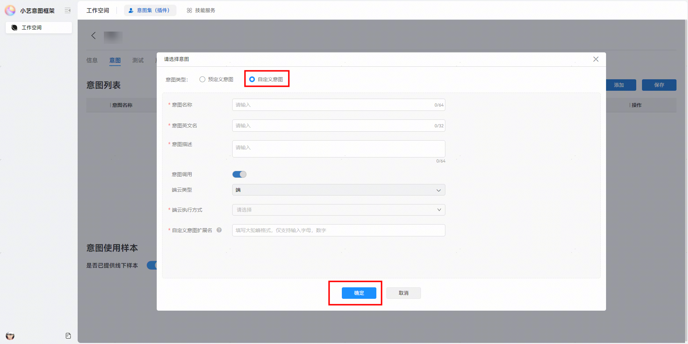

3. 选择已新增用户组，点击查看进入。

  
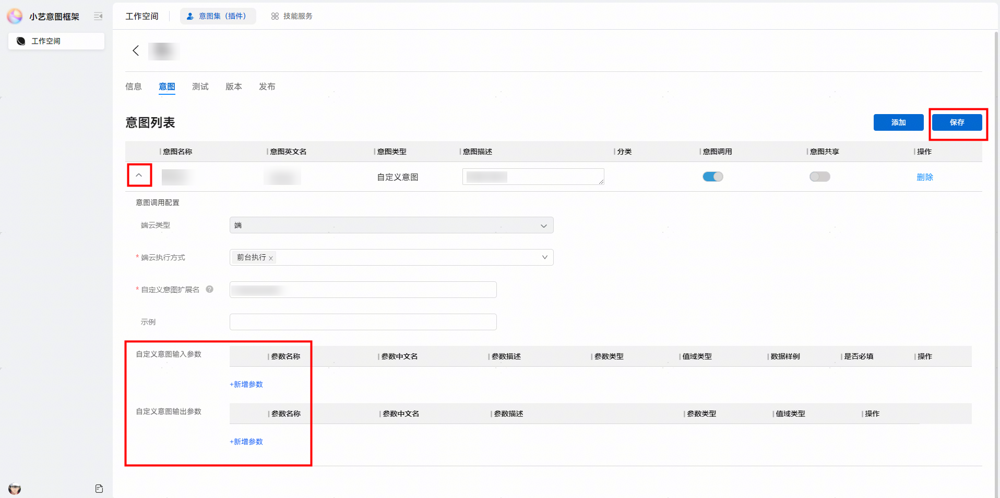

4. 点击添加用户，选择账号类型为邮箱/手机号码，填入后点击确定（测试用户须为该项目团队下的成员）。

  
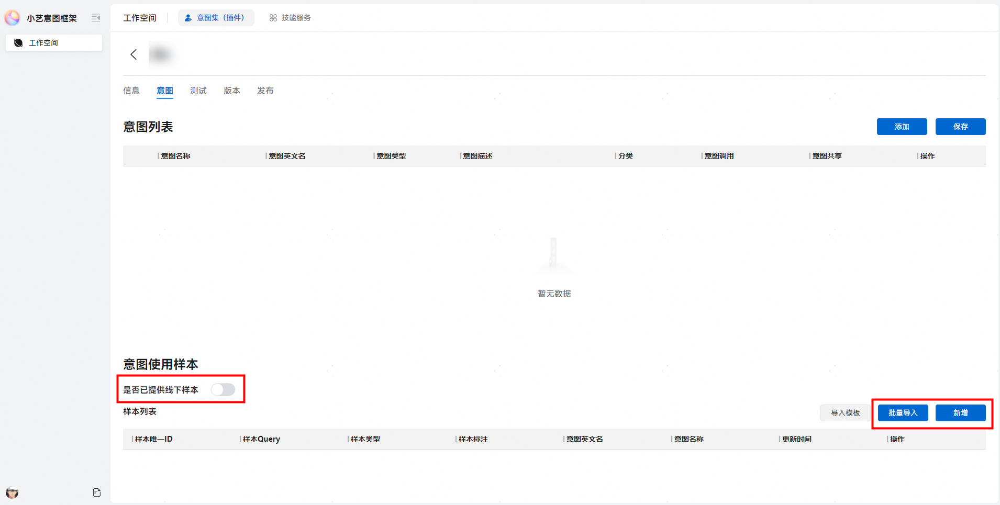

5. 返回测试页签，选择所创建的真机测试用户组进行保存，点击开始测试准备，开发者即可通过HarmonyOS 6.0.0(20)版本及以上的设备在小艺进行端到端测试。

  
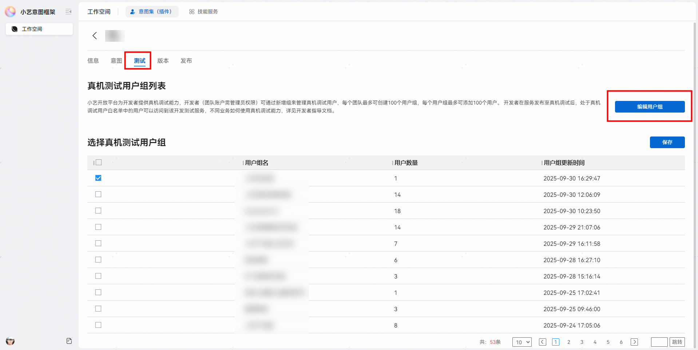

 
  

#### 联调验证
1. 开发者需确认调试设备系统版本为HarmonyOS 6.0.0(20)及以上。
2. 在调试设备上登录已添加真机测试用户组的华为账号。
3. 检查小艺App是否为应用市场最新版本（需升级至最新版）。
4. 长按电源键/语音唤起小艺，通过小艺进行自验证。

  
- 开发者预期：用户可通过小艺打开应用内页面并传递参数。

5. 开发者验证：正常跳转目标落地页并收到对应参数。
