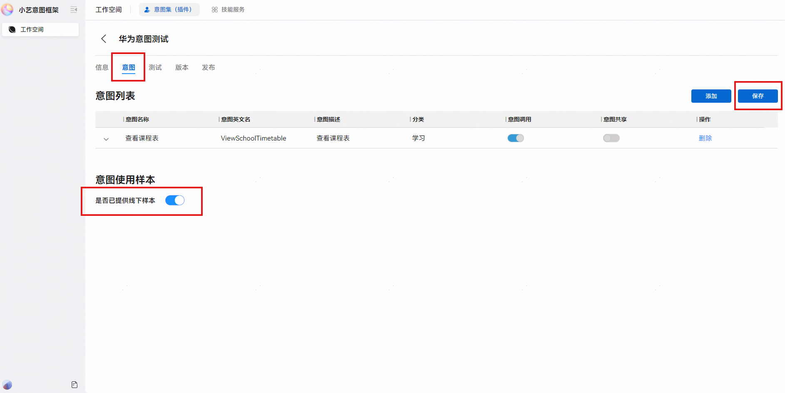
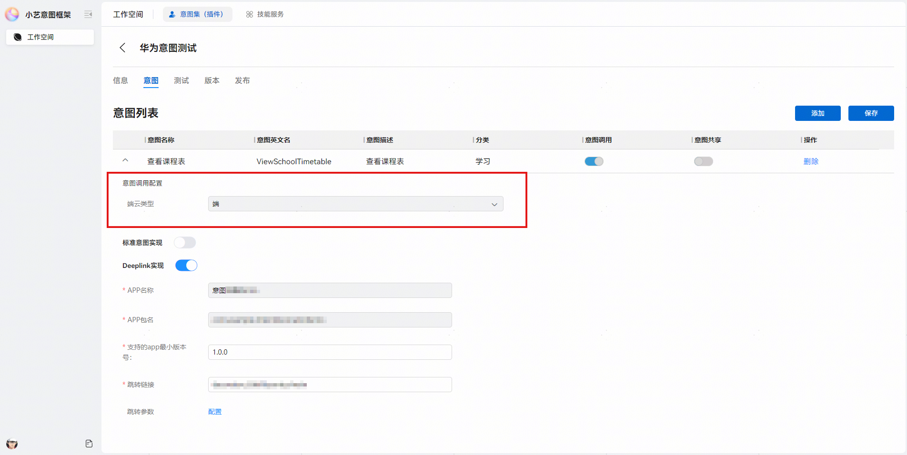

# 基于Link的装饰器方案

更新时间：2026-04-29 07:35:50

来源：https://developer.huawei.com/consumer/cn/doc/harmonyos-guides/intents-skill-all-rec-decorator-link

开发者使用@InsightIntentLink装饰器进行基于Link的意图声明，可快速将已实现的Link跳转功能接入意图框架，以购买电影票意图为例，详细说明如下：

插入前：

插入后：

装饰器的使用约束和说明：

- Link装饰器包含通过Link接入意图的所有配置，因此对装饰器所在Class、变量、成员没有要求，但是必须要在被依赖的ets文件中添加装饰器才可以被编译。
- 支持开发者设置wantParameter，执行Link时，会将该参数附带到want的parameter中。
- 装饰器方式仅支持参数名映射，不做参数加工，包括取值转换、合并等情况。
