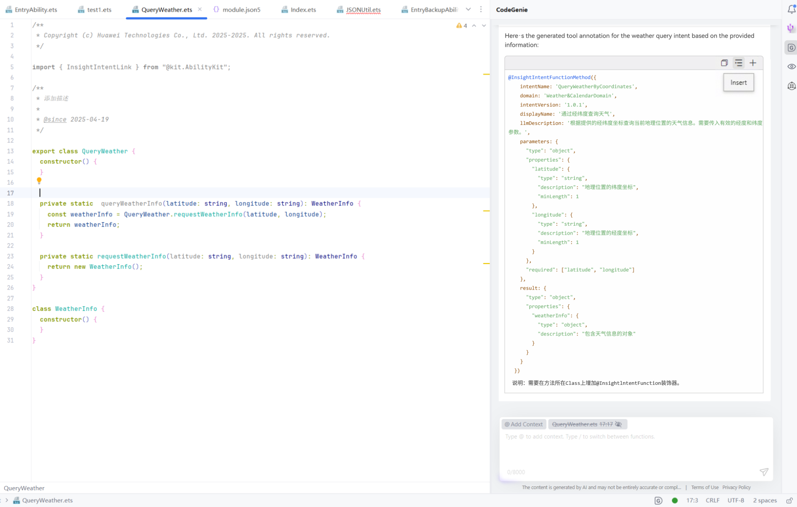
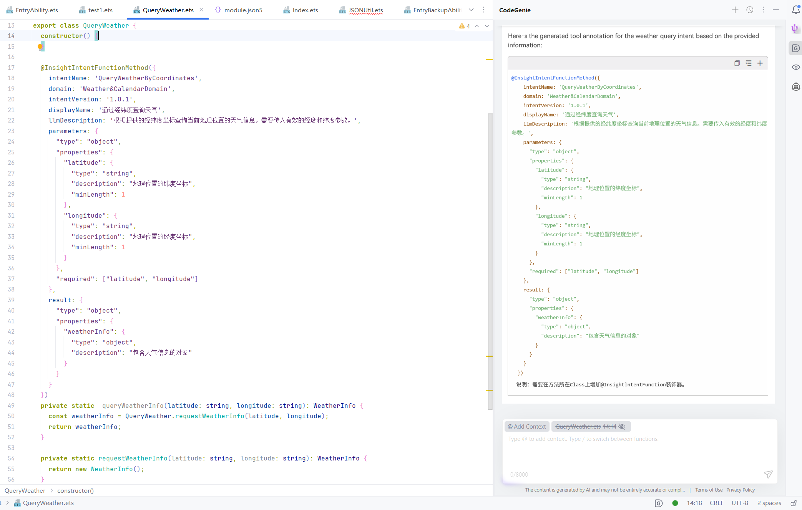

# 基于函数的装饰器方案

更新时间：2026-05-26 06:48:54

来源：https://developer.huawei.com/consumer/cn/doc/harmonyos-guides/intents-skill-all-rec-decorator-function

##### 概述

在目标执行函数上添加@InsightIntentFunctionMethod装饰器，以及在目标执行函数所属Class上添加@InsightIntentFunction进行意图声明，实现目标函数的执行。
 
  

##### 约束说明

- 仅限无其他依赖，可以直接拉起调用的全局函数。
- 支持将函数参数作为意图参数进行声明，参数类型支持基本类型。
- 装饰器所在函数不应该参与混淆，否则无法调用。
- 仅支持在export的类上添加该装饰器。

 
  

##### 开发示例

以购买电影票的意图为例，详细说明如下：
 1. 装饰器添加位置：在目标执行函数上添加@InsightIntentFunctionMethod装饰器，以及在目标执行函数所属Class上添加@InsightIntentFunction进行意图声明，且仅支持在静态方法上使用。

  
```text
import { insightIntent, InsightIntentFunction, InsightIntentFunctionMethod } from '@kit.AbilityKit';

@InsightIntentFunction()
export class PurchaseMovie {

  @InsightIntentFunctionMethod({
    intentName: 'PurchaseMovieTickets',
    domain: 'PurchaseTickets',
    intentVersion: '1.0.1',
    displayName: '购买电影票',
    llmDescription: '用于在线购买电影票，允许用户选择指定影院、电影和场次时间进行购票。在用户明确表达购票需求，且已提供所有必要信息（cinema, film, time）时使用。如果信息不全或者用户只是查询电影信息、放映时间或票价，不应调用此工具。',
    parameters: {
      'type': 'object',
      'properties': {
        'cinema': {
          'type': 'string',
          'description': '目标影院名称，仅支持平台合作的影院'
        },
        'film': {
          'type': 'string',
          'description': '目标电影名称，需为当前上映或即将上映且在影院排片列表中的电影'
        },
        'time': {
          'type': 'string',
          'description': '放映时间，必须为未来的场次，且需为影院当天有效排片时间；时间格式应为\'YYYY-MM-DD HH:MM\'（例如\'2025-07-01 19:30\'）'
        }
      },
      'required': ['cinema', 'film', 'time']
    }
  })
  static executePurchaseMovieIntent(cinema: string, film: string, time: string): insightIntent.ExecuteResult {
    const data: insightIntent.ExecuteResult = {
      code: 0, // 意图执行成功时code必须为0
      result: {
        orderNumber: 'XXXXXX',
        resultDesc: `电影票${film}购买成功`
      }
    }
    return data;
  }
}
```
  函数返回结果必须为insightIntent.ExecuteResult结构，且该结构result对象中需增加resultDesc字段对结果进行描述，模型依据此描述生成该意图执行结果的小艺回复话术。请参考上述示例代码。
2. 装饰器的字段说明以及示例：@InsightIntentFunction不涉及参数，@InsightIntentFunctionMethod字段以及具体说明如下。

| 字段名称 | 类型 | 必选 | 说明 |

| --- | --- | --- | --- |

| intentName | string | 是 | 意图名称，最大长度：64。 |

| domain | string | 是 | 意图所属的功能垂域。 |

| intentVersion | string | 是 | 意图的版本号，用于兼容性管理。 |

| displayName | string | 是 | 意图的展示名称，用于界面显示，最大长度：64。 |

| llmDescription | string | 否 | 意图的描述，详细描述该意图可实现的能力，便于大模型理解并调用。 |

| parameters | Record<string, object> | 否 | 意图参数定义，描述参数类型以及含义。 |

  为便于大模型理解和调用，相关参数定义需要遵照[自定义意图相关信息定义规范](https://developer.huawei.com/consumer/cn/doc/harmonyos-guides/intents-skill-all-rec-specification)进行设定。
3. 装饰器的添加方式：装饰器可以直接手动添加，同时也支持一键生成装饰器，建议使用后者，此方式需要安装相应插件，详细步骤如下。

  
- 打开CodeGenie插件：在DevEco Studio右侧边栏点击CodeGenie或输入快捷键Alt/Option+U，可以进入DevEco CodeGenie。若使用非最新版本的DevEco Studio，可通过[下载中心](https://developer.huawei.com/consumer/cn/download/deveco-codegenie)获取并使用相关功能，具体请参考[插件获取及安装](https://developer.huawei.com/consumer/cn/doc/harmonyos-guides/ide-codegenie#section18337533718)。

  



4. 框选想要接入意图框架功能的代码。

  



5. 在选中的代码块上右键CodeGenie > Insight Intent，选择适合的装饰器。

  


6. 在DevEco CodeGenie对话框中对意图定义，功能，参数等进行描述。

  


7. 回车或者点击发送按钮，即可生成对应的装饰器内容。

  


8. 将光标放置于要插入装饰器的位置，点击插入图标，即可在对应位置插入装饰器。

  插入前：

  


  插入后：

  

