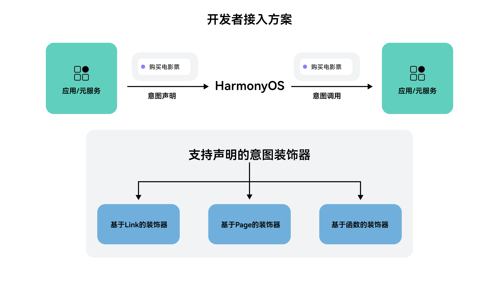

# 方案概述

更新时间：2026-04-29 07:35:50

来源：https://developer.huawei.com/consumer/cn/doc/harmonyos-guides/intents-skill-all-rec-decorator-overview

从6.0.0(20)开始，支持通过装饰器开发意图，支持将现有功能通过装饰器快速集成至系统入口。开发者可自定义意图，通过添加装饰器方式实现意图快速接入，支持Link跳转、Page和函数等意图装饰器，方便开发者快速开放应用内功能。

 

 开发者可根据想要暴露的应用功能，选择不同类型的装饰器进行意图声明：
