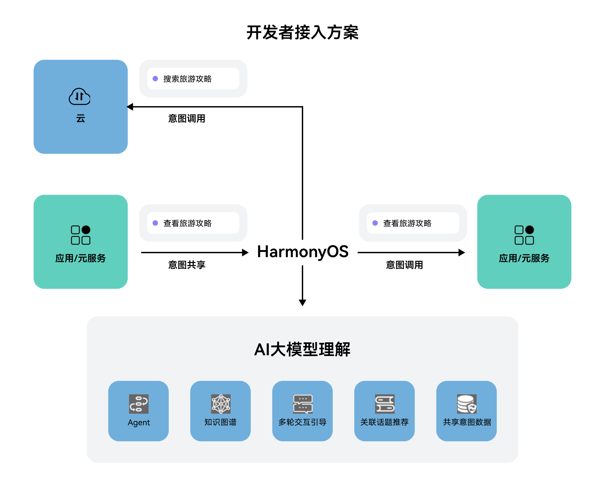

# 任务执行类场景方案（配置文件接入方式）

更新时间：2026-05-18 03:44:20

来源：https://developer.huawei.com/consumer/cn/doc/harmonyos-guides/intents-skill-all-rec-configuration

##### 方案概述

开发者需要按照意图定义，进行意图注册并实现意图调用；用户通过对小艺对话进行自然语言输入，小艺理解语义转换成意图调用（含意图参数），执行意图调用实现对应交互体验。
 



 
  

##### 意图声明

以“搜索旅游攻略”特性为例，开发者首先要注册“查看旅游攻略”（viewTravelGuides），其他意图见[各垂域意图Schema](https://developer.huawei.com/consumer/cn/doc/service/intents-schema-0000001901962713)。
 
开发者需要编辑对应的意图配置insight_intent.json文件实现意图注册。insight_intent.json文件需要放置在module下面的指定目录：src/main/resources/base/profile/insight_intent.json，并且整个工程中只能存在一个insight_intent.json文件。
 
```ArkTS
{
  // 应用支持的意图列表
  // 必须声明应用支持插件包含的必选意图，应用上架时会进行校验
  "insightIntents": [
    {
      // 意图名称
      // 名称应当遵循意图框架规范，当前仅支持预置垂域意图，不允许自定义
      // 应用内意图名称唯一，不允许出现相同的名称定义
      "intentName": "ViewTravelGuides",
      // 意图所属的垂域
      "domain": "TravelDomain",
      // 意图版本号
      // 插件引用意图时会校验该版本号，只有和插件定义的版本号一致才能正常调用
      "intentVersion": "1.0.1",
      // 意图调用逻辑入口
      "srcEntry": "./ets/entryability/InsightIntentExecutorImpl.ets",
      "uiAbility": {
        // 意图所在ability
        "ability": "EntryAbility",
        // UIAbility支持前后台两种执行模式
        "executeMode": [
          "background",
          "foreground"
        ]
      },
      "uiExtension": {// 提供意图执行的窗口化界面时需要进行的声明配置
        "ability": "insightIntentUIExtensionAbility" // 意图调用API所在ability名称
      }
    }
  ]
}
```
 
  

##### 端侧前台意图调用

开发者需自己实现InsightIntentExecutor，并在对应回调实现打开落地页（点击推荐卡片跳转的界面，如旅游攻略详情页）的能力，ViewTravelGuides的意图调用字段定义见查看旅游攻略（ViewTravelGuides）。
 
步骤如下：
 1. 继承InsightIntentExecutor。
2. 重写对应方法，例如目标拉起前台页面，则可重写onExecuteInUIAbilityForegroundMode方法。
3. 通过意图名称，识别查看旅游攻略意图（ViewTravelGuides），在对应的方法中传递意图参数（param），并拉起对应落地页（点击推荐卡片跳转的界面，如旅游攻略页面）。
 
```text
import { insightIntent, InsightIntentExecutor } from '@kit.AbilityKit';
import { window } from '@kit.ArkUI';
import { BusinessError } from '@kit.BasicServicesKit';

/**
 * 意图调用样例
 */
export default class InsightIntentExecutorImpl extends InsightIntentExecutor {
  private static readonly VIEW_TRAVEL_GUIDES = 'ViewTravelGuides';

  /**
   * override 执行前台UIAbility意图
   *
   * @param name 意图名称
   * @param param 意图参数
   * @param pageLoader 窗口
   * @returns 意图调用结果
   */
  onExecuteInUIAbilityForegroundMode(name: string, param: Record<string, Object>, pageLoader: window.WindowStage):
    Promise<insightIntent.ExecuteResult> {
    // 根据意图名称分发处理逻辑。接入方可根据实际业务实现页面跳转
    switch (name) {
      case InsightIntentExecutorImpl.VIEW_TRAVEL_GUIDES:
        return this.viewTravelGuides(param, pageLoader);
      default:
        break;
    }
    const data: insightIntent.ExecuteResult = {
      code: -1,
      result: {
        message: 'unknown intent'
      }
    }
    return Promise.resolve(data);
  }

  /**
   * 实现调用查看旅游攻略功能
   *
   * @param param 意图参数
   * @param pageLoader 窗口
   */
  private viewTravelGuides(param: Record<string, Object>,
    pageLoader: window.WindowStage): Promise<insightIntent.ExecuteResult> {
    return new Promise((resolve, reject) => {
      pageLoader.loadContent('pages/TravelGuidePage')
        .then(() => {
          const entityId: string = (typeof param.entityId === 'string') ? param.entityId : '';
          console.info(`Intent param, entityId: ${entityId}`);
          const data: insightIntent.ExecuteResult = {
            code: 0,
            result: {
              message: 'Intent execute succeed'
            }
          }
          resolve(data);
        })
        .catch((err: BusinessError) => {
          console.error(`Intent execute failed, Code: ${err?.code}, message: ${err?.message}`);
          const data: insightIntent.ExecuteResult = {
            code: -1,
            result: {
              message: 'Intent execute failed'
            }
          }
          reject(data);
        });
    })
  }
}
```
 
  

##### 端侧前台窗口意图调用

开发者需自己实现InsightIntentExecutor，并在对应回调实现窗口页面内容加载的能力。
 
步骤如下：
 1. 继承InsightIntentExecutor。
2. 重写对应方法，例如目标拉起前台窗口化页面，则可重写onExecuteInUIExtensionAbility方法。
3. 通过意图名称，识别打开蓝牙意图（LoadBluetoothCard）调用扩展意图，在对应的方法中传递意图参数（param），并拉起对应窗口化页面（如打开蓝牙窗口化页面）。
 
```text
import { insightIntent, InsightIntentExecutor, UIExtensionContentSession } from '@kit.AbilityKit';

/**
 * 意图调用样例
 */
export default class IntentExecutorImpl extends InsightIntentExecutor {
  private static readonly TAG: string = 'IntentExecutorImpl';
  private static readonly LOAD_BLUETOOTH_CARD: string = 'LoadBluetoothCard';
  /**
   * override 执行前台UI扩展意图
   *
   * @param name 意图名称
   * @param param 意图参数
   * @param pageLoader 窗口
   * @returns 意图调用结果
   */
  async onExecuteInUIExtensionAbility(name: string, param: Record<string, Object>,
    pageLoader: UIExtensionContentSession): Promise<insightIntent.ExecuteResult> {
    console.info(IntentExecutorImpl.TAG, `onExecuteInUIExtensionAbility`);
    switch (name) {
      case IntentExecutorImpl.LOAD_BLUETOOTH_CARD:
        console.info(IntentExecutorImpl.TAG, `onExecuteInUIAbilityForegroundMode::ForegroundUiAbility intent`);
        return this.openLoadBluetoothCard(pageLoader);
      default:
        console.error(IntentExecutorImpl.TAG, `onExecuteInUIAbilityForegroundMode::invalid intent`);
        break;
    }
    let result: insightIntent.ExecuteResult = {
      code: -1,
      result: {
        message: 'onExecuteInUIExtensionAbility failed'
      }
    };
    return result;
  }
  /**
   * 打开加载蓝牙卡片意图
   *
   * @param pageLoader 意图内容Session对象
   * @returns 执行结果
   */
  private async openLoadBluetoothCard(pageLoader: UIExtensionContentSession): Promise<insightIntent.ExecuteResult> {
    return new Promise((resolve, reject) => {
      try {
        pageLoader.loadContent('pages/UiExtensionPage');
        const data: insightIntent.ExecuteResult = {
          code: 0,
          result: {
            message: 'Intent execute succeed'
          }
        };
        resolve(data);
      } catch (err) {
        console.error(`Intent execute failed, Code: ${err?.code}, message: ${err?.message}`);
        const data: insightIntent.ExecuteResult = {
          code: -1,
          result: {
            message: 'Intent execute failed'
          }
        };
        reject(data);
      }
    });
  }
}
```
