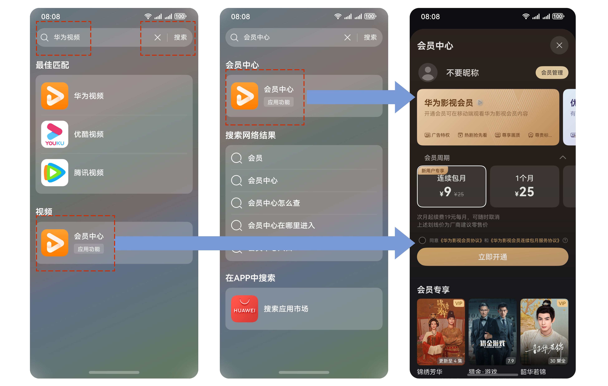
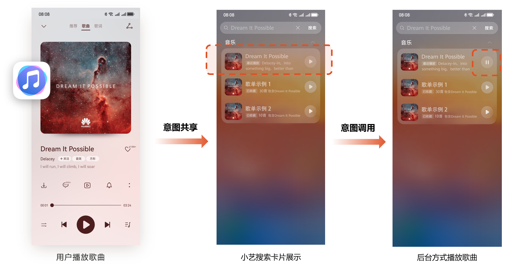
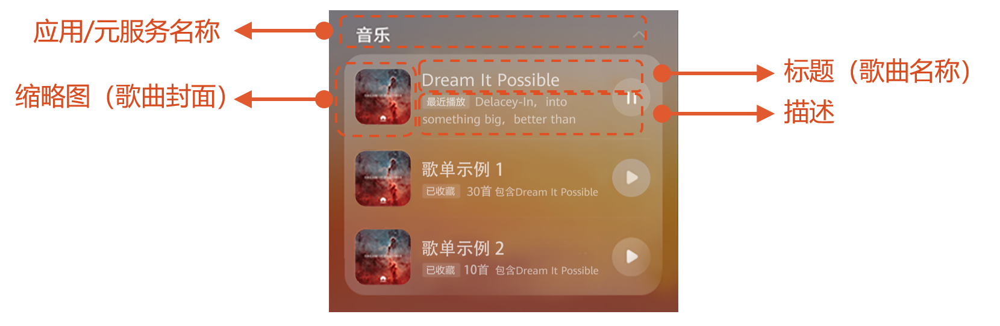

# 场景体验

更新时间：2026-04-20 06:34:33

来源：https://developer.huawei.com/consumer/cn/doc/harmonyos-guides/intents-search-rec-scene-experience

#### 典型场景

**功能搜索：** 开发者将应用内的功能接入Intents Kit后，在小艺搜索入口，搜索对应功能名或者应用名，可以将应用内功能直接搜出，比如视频应用接入“会员中心”功能后，用户可通过搜索应用名或功能名搜出具体功能，点击后直接拉起应用中的功能页面。
 

 
**内容搜索：** 以音乐为例，当用户在使用应用时，应用可以将音乐数据通过端侧API共享到意图框架，这里的音乐数据可以是用户收听过的歌曲，或是应用预测用户感兴趣的歌曲，那么后续用户在小艺搜索入口中搜索歌名时，系统将会在应用共享数据中检索对应内容，并使用模板卡片展示内容结果。当用户点击对应卡片热区时，可以跳转进具体音乐播放页或者后台执行播放。
 

 
  

#### 卡片展示效果

意图框架提供各垂域在小艺搜索展示使用的标准模板卡片，开发者无需开发展示卡片。
 
模板卡片包含应用/元服务和内容必要信息，比如歌曲名称、歌曲封面图、歌曲描述，这类参数需要开发者共享到系统。各垂域适用的风格卡片不同，以实际特性场景要求为准。以下为歌曲本地搜索的模板卡样式的示例：
 

