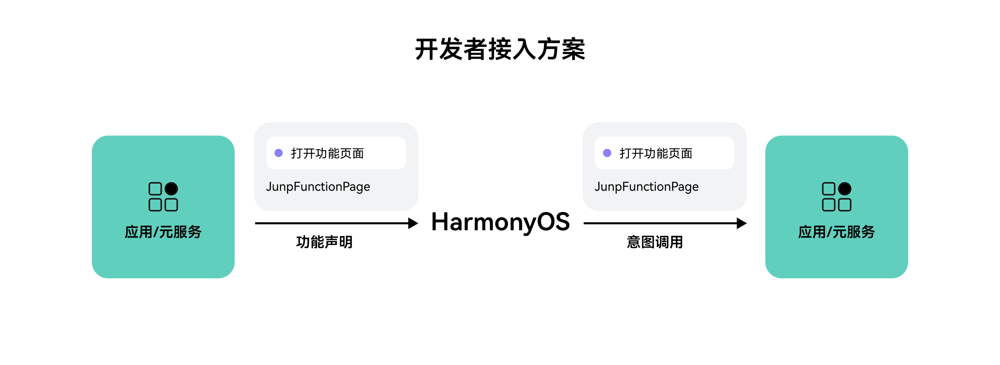

# 功能搜索方案

更新时间：2026-05-19 09:13:51

来源：https://developer.huawei.com/consumer/cn/doc/harmonyos-guides/intents-skill-all-rec-function-search

#### 方案概述
从5.1.0(18)开始，新增功能搜索接入方案，可通过该方案实现快速打开应用内功能页面。开发者将应用内的功能在意图声明文件中声明，并实现对应的意图调用，即可实现用户在小艺搜索入口直接搜索到应用内功能，点击后可直接拉起应用，直达功能页面。


**意图名称：跳转App功能页 JumpFunctionPage（端侧前台意图调用）**

| **参数类别** | **参数（中文）** | **参数（英文）** | 是否必选 | **描述** | 类型 | **数据样例** |
| --- | --- | --- | --- | --- | --- | --- |
| **Input** | 功能页面标识 | pageId | 是 | 具体功能的标识，开发者自定义。 | string | 1、2、3…。 |
| **Output** | 结果码 | code | 是 | 意图调用的结果码。 | number | 0：成功。 其他：失败（需提前与华为侧协商，不支持自定义）。 |
| **Output** | 结果体 | result | 是 | 意图调用返回的数据，如果无数据则返回空。 | Record<string, Object> | 详见意图调用示例代码。 |

#### 意图声明
开发者需要编辑对应的意图配置insight_intent.json文件实现意图注册。insight_intent.json文件需要放置在module下面的指定目录：src/main/resources/base/profile/insight_intent.json，并且整个工程中只能存在一个insight_intent.json文件。

```ts
{
    "insightIntents": [
       {
            "intentName": "JumpFunctionPage", // 功能搜意图
            "domain": "ToolsDomain",
            "intentVersion": "1.0.1", // 意图版本号
             // 意图调用逻辑入口
            "srcEntry": "./ets/entryability/InsightIntentExecutorImpl.ets",
            "uiAbility": {
            // 意图所在ability
            "ability": "EntryAbility",
            // UIAbility仅支持前台执行模式
            "executeMode": [
                "foreground"
            ]
            },
            "inputParams": [{ // 部分意图开放意图参数定义，格式整体参考JSON-Schema。
                "properties": { // 描述参数列表，后续可以同级别增加其他描述节点
                    "pageId": { // 具体功能的标识的key值
                        "type": "string", // 参数类型
                        "enum": [
                            {
                                "value": "1", // 具体功能的标识的value值
                                "displayName": "查找路线", // 功能名，小艺搜索展示
                                "keywords": [
                                    "查路线"
                                ], // 参数枚举值别名，可以用于索引、过滤，最多不超过5个
                                "displayDescription": "查找到达目的地的路线", // 功能描述，小艺搜索展示
                                "icon": "https://abc.xx" // 功能图标，小艺搜索展示
                            },
                            {
                                "value": "2", // 具体功能的标识的value值
                                "displayName": "扫一扫", // 功能名，小艺搜索展示
                                "keywords": [
                                    "扫码"
                                ], // 参数枚举值别名，可以用于索引、过滤
                                "displayDescription": "用于扫码", // 功能描述，小艺搜索展示
                                "icon": "https://abc.xx" // 功能图标，小艺搜索展示
                            }
                        ]
                    }
                }
            }]
        }
    ]
}
```

#### 端侧前台意图调用
开发者自行实现InsightIntentExecutor，并在对应回调实现打开落地页的能力。
步骤如下：
1. 继承InsightIntentExecutor。
2. 重写对应方法，例如目标拉起前台页面，则可重写onExecuteInUIAbilityForegroundMode方法。
3. 通过意图名称，识别跳转功能页面意图（JumpFunctionPage），在对应的方法中传递意图参数（param），并拉起对应落地页。

```ts
import { insightIntent, InsightIntentExecutor } from '@kit.AbilityKit';
import { window } from '@kit.ArkUI';
import { BusinessError } from '@kit.BasicServicesKit';

/**
 * 意图调用样例
 */
export default class InsightIntentExecutorImpl extends InsightIntentExecutor {
  private static readonly JUMP_FUNCTION_PAGE = 'JumpFunctionPage';

  /**
   * override 执行前台UIAbility意图
   *
   * @param name 意图名称
   * @param param 意图参数
   * @param pageLoader 窗口
   * @returns 意图调用结果
   */
  onExecuteInUIAbilityForegroundMode(name: string, param: Record<string, Object>, pageLoader: window.WindowStage):
    Promise<insightIntent.ExecuteResult> {
    // 根据意图名称分发处理逻辑。接入方可根据实际业务实现页面跳转
    switch (name) {
      case InsightIntentExecutorImpl.JUMP_FUNCTION_PAGE:
        return this.jumpFunctionPage(param, pageLoader);
      default:
        break;
    }
    const data: insightIntent.ExecuteResult = {
      code: -1,
      result: {
        message: 'unknown intent'
      }
    }
    return Promise.resolve(data);
  }

  /**
   * 实现跳转目标页面的功能
   *
   * @param param 意图参数
   * @param pageLoader 窗口
   */
  private jumpFunctionPage(param: Record<string, Object>,
    pageLoader: window.WindowStage): Promise<insightIntent.ExecuteResult> {
    return new Promise((resolve, reject) => {
      if (typeof param?.pageId !== 'string') {
        const data: insightIntent.ExecuteResult = {
          code: -1,
          result: {
            message: 'pageId type error'
          }
        }
        resolve(data);
      }
      let pageId: string = param?.pageId as string;
      pageLoader.loadContent('pages/' + pageId)
        .then(() => {
          const data: insightIntent.ExecuteResult = {
            code: 0,
            result: {
              message: 'Intent execute success'
            }
          }
          resolve(data);
        })
        .catch((err: BusinessError) => {
          // TODO 调用失败的情况
          console.error(`Intent execute failed, Code: ${err?.code}, message: ${err?.message}`);
          const data: insightIntent.ExecuteResult = {
            code: -2,
            result: {
              message: 'Intent execute failed'
            }
          }
          reject(data)
        });
    })
  }
}
```
