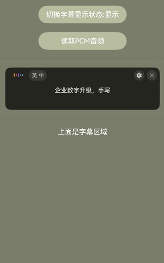

# AI字幕控件

更新时间：2026-05-12 09:31:20

来源：https://developer.huawei.com/consumer/cn/doc/harmonyos-guides/speech-aicaption-guide

#### 适用场景

AI字幕控件应用广泛，例如在用户不熟悉音频源语言或者静音的时候，为用户提供字幕服务。

本章节将向您介绍如何使用AI字幕组件[AICaptionComponent](https://developer.huawei.com/consumer/cn/doc/harmonyos-references/speech-aicaptioncomponent)和[AICaptionController](https://developer.huawei.com/consumer/cn/doc/harmonyos-references/speech-aicaptioncomponent#aicaptioncontroller)展示AI字幕，效果如下图所示。





#### 接口说明

AI字幕功能主要由[AICaptionComponent](https://developer.huawei.com/consumer/cn/doc/harmonyos-references/speech-aicaptioncomponent)提供，更多接口及使用方法请参见[API参考](https://developer.huawei.com/consumer/cn/doc/harmonyos-references/speech-aicaptioncomponent)。

| 接口 | 描述 |
| --- | --- |
| AICaptionComponent | AI字幕组件。 |
| AICaptionOptions | AI字幕初始化参数。 |
| AICaptionController | AI字幕组件的控制器，是AI字幕组件的主要功能入口类，用来操作AI字幕。它所承载的工作包括：写音频数据、获取音频流信息等。 |


#### 开发步骤
1. 从项目根目录进入/src/main/ets/pages/Index.ets文件，在使用AI字幕控件前，将实现AI字幕控件和其他相关的类添加至工程。

  
```text
import { AICaptionComponent, AICaptionController, AICaptionOptions,AICaptionFontSize } from '@kit.SpeechKit';
```

2. 简单配置页面的布局，加入AI字幕组件，并在aboutToAppear中设置AI字幕组件的传入参数。

  
```text
import { hilog } from '@kit.PerformanceAnalysisKit';

const TAG = 'AI_CAPTION_DEMO';

class Logger {
  static info(...msg: string[]) {
    hilog.info(0x0000, TAG, msg.join());
  }

  static error(...msg: string[]) {
    hilog.error(0x0000, TAG, msg.join());
  }
}

@Entry
@Component
struct Index {
  private captionOption ?: AICaptionOptions;
  private controller = new AICaptionController();
  @State isShown: boolean = false;

  aboutToAppear(): void {
    // AI字幕初始化参数，设置字幕的不透明度和回调函数
    this.captionOption = {
      initialOpacity: 1,
      onPrepared: () => {
        Logger.info('onPrepared')
      },
      onError: (error) => {
        Logger.error(`onError, code: ${error.code}, msg: ${error.message}`)
      },
      // 源语言
      sourceLanguage: 'zh',
      // 目标语言
      targetLanguage: 'zh',
      // 字体大小
      fontSize: AICaptionFontSize.NORMAL,
      // 字体颜色
      fontColor: Color.Black
    };
  }

  build() {
    Column({ space: 20 }) {
      // 调用AICaptionComponent组件初始化字幕
      AICaptionComponent({
        isShown: this.isShown,
        controller: this.controller,
        options: this.captionOption
      })
        .width('100%')
        .height(100)
      Divider()
      if (this.isShown) {
        Text('上面是字幕区域')
          .fontColor(Color.White)
      }
    }
    .width('100%')
    .height('100%')
    .padding(10)
    .backgroundColor('#7A7D6A')
  }
}
```

3. 在布局中加入两个按钮以及点击事件的回调函数。

  
第一个按钮的回调函数负责控制AI字幕组件的显示状态。
4. 第二个按钮的回调函数负责读取资源目录中的音频文件，将音频数据传给AI字幕组件。


#### 开发实例

Index.ets

```json
import { AICaptionComponent, AICaptionOptions, AICaptionController, AudioData,AICaptionFontSize } from '@kit.SpeechKit';
import { BusinessError } from '@kit.BasicServicesKit';
import { hilog } from '@kit.PerformanceAnalysisKit';

const TAG = 'AI_CAPTION_DEMO';

class Logger {
  static info(...msg: string[]) {
    hilog.info(0x0000, TAG, msg.join());
  }

  static error(...msg: string[]) {
    hilog.error(0x0000, TAG, msg.join());
  }
}

@Entry
@Component
struct Index {
  private captionOption?: AICaptionOptions;
  private controller: AICaptionController = new AICaptionController();
  @State isShown: boolean = false;
  isReading: boolean = false;

  aboutToAppear(): void {
    // AI字幕初始化参数，设置字幕的不透明度和回调函数
    this.captionOption = {
      initialOpacity: 1,
      onPrepared: () => {
        Logger.info('onPrepared')
      },
      onError: (error: BusinessError) => {
        Logger.error(`AICaption component error. Error code: ${error.code}, message: ${error.message}`);
      },
      // 源语言
      sourceLanguage: 'zh',
      // 目标语言
      targetLanguage: 'zh',
      // 字体大小
      fontSize: AICaptionFontSize.NORMAL,
      // 字体颜色
      fontColor: Color.Black
    };
  }

  async readPcmAudio() {
    this.isReading = true;
    // ChineseAudio.pcm文件放在entry\src\main\resources\base\media路径下
    let fileData: Uint8Array | undefined = undefined;
    try {
      fileData =
        await this.getUIContext()?.getHostContext()?.resourceManager.getMediaContent($r('app.media.ChineseAudio').id);
    } catch (e) {
      Logger.info(`get fileData fail , msg ${e} `);
    }
    if (fileData === undefined) {
      return;
    }
    const bufferSize = 640;
    const byteLength = fileData.byteLength;
    let offset = 0;
    Logger.info(`Pcm data total bytes: ${byteLength.toString()}`);
    let startTime = new Date().getTime();
    while (offset < byteLength) {
      // 模拟实际情况，读文件比录音机返回流快，所以要等待一段时间
      let nextOffset = offset + bufferSize;
      if (offset > byteLength) {
        this.isReading = false;
        return;
      }
      const arrayBuffer = fileData.buffer.slice(offset, nextOffset);
      let data = new Uint8Array(arrayBuffer);
      const audioData: AudioData = {
        data: data
      };

      if (this.controller) {
        try {
          this.controller.writeAudio(audioData);
        } catch (e) {
          Logger.error(`writeAudio exception`);
        }
      }
      offset = offset + bufferSize;
      const waitTime = bufferSize / 32;
      await this.sleep(waitTime);
    }
    let endTime = new Date().getTime();
    this.isReading = false;
    Logger.info(`Audio play time: ${JSON.stringify(endTime - startTime)}`);
  }

  async sleep(time: number): Promise<void> {
    return new Promise(resolve => setTimeout(resolve, time))
  }

  build() {
    Column({ space: 20 }) {
      Button('切换字幕显示状态：' + (this.isShown ? '显示' : '隐藏'))
        .backgroundColor('#B8BDA0')
        .width(200)
        .onClick(() => {
          this.isShown = !this.isShown;
        })
      Button('读取PCM音频')
        .backgroundColor('#B8BDA0')
        .width(200)
        .onClick(() => {
          if (!this.isReading) {
            void this.readPcmAudio();
          }
        })
      Divider()
      // 调用AICaptionComponent组件初始化字幕
      AICaptionComponent({
        isShown: this.isShown,
        controller: this.controller,
        options: this.captionOption
      })
        .width('100%')
        .height(100)
      Divider()
      if (this.isShown) {
        Text('上面是字幕区域')
          .fontColor(Color.White)
      }
    }
    .width('100%')
    .height('100%')
    .padding(10)
    .backgroundColor('#7A7D6A')
  }
}
```
