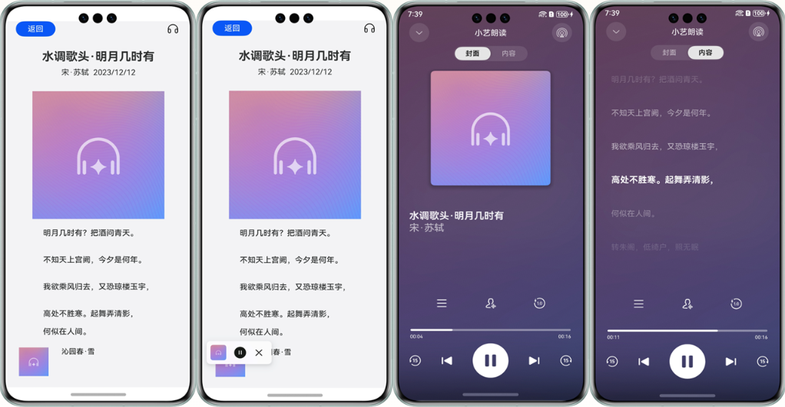

# 朗读控件

更新时间：2026-05-26 06:48:54

来源：https://developer.huawei.com/consumer/cn/doc/harmonyos-guides/speech-textreader-guide

#### 适用场景

朗读控件应用广泛，例如在用户不方便或者无法查看屏幕文字的时候，为用户朗读新闻，提供资讯。

本章节将向您介绍如何使用朗读组件，效果如下图所示。





#### 接口说明

以下仅列出demo中调用的部分主要接口，具体API说明详见[API参考](https://developer.huawei.com/consumer/cn/doc/harmonyos-references/speech-textreader-api)。

| 接口名 | 描述 |
| --- | --- |
| init(context: common.BaseContext, readParams: ReaderParam): Promise&lt;void&gt; | 初始化TextReader。 |
| start(readInfoList: ReadInfo[], articleId?: string): Promise&lt;void&gt; | 启动TextReader。 |
| on(type: string, callback: function): void | 注册所有事件回调，具体事件类型详见API参考。 |


#### 开发步骤
1. 首先从项目根目录进入/src/main/ets/entryability/EntryAbility.ets文件，将WindowManager添加至工程。

  
```text
import { WindowManager } from '@kit.SpeechKit';
import { ConfigurationConstant } from '@kit.AbilityKit';
```

2. （可选）在onWindowStageCreate(windowStage: window.WindowStage)生命周期方法中，添加setWindowStage方法设置窗口管理器。

  
```json
onWindowStageCreate(windowStage: window.WindowStage): void {
  console.info('Ability onWindowStageCreate');
  WindowManager.setWindowStage(windowStage);
  
  windowStage.loadContent('pages/Index', (err, data) => {
    if (err) {
      console.error(`Failed to load the content. Code: ${err.code}, message: ${err.message}`);
      return;
    }
    console.info(`Succeeded in loading the content. Data: ${JSON.stringify(data)}.` );
  });
}
```

3. 在onCreate()生命周期方法中，设置应用的颜色模式，使控件颜色模式跟应用的颜色模式保持一致。

  
如果应用想要跟随系统切换深浅色模式，请将颜色模式设置为COLOR_MODE_NOT_SET。
4. 如果应用想要主动配置颜色模式，请将颜色模式设置为COLOR_MODE_LIGHT（浅色）或者COLOR_MODE_DARK（深色）。
5. 从项目根目录进入/src/main/ets/pages/Index.ets文件，在使用朗读控件前，将实现朗读控件和其他相关的类添加至工程。

  
```text
import { TextReader, TextReaderIcon, ReadStateCode } from '@kit.SpeechKit';
```

6. 简单配置页面的布局，加入听筒图标，并且设置onClick点击事件。

  
```text
/**
 * 播放状态
 */
@State readState: ReadStateCode = ReadStateCode.WAITING;

build() {
    Column() {
      TextReaderIcon({ readState: this.readState })
        .margin({ right: 20 })
        .width(32)
        .height(32)
        .onClick(() => {
            // 设置点击事件
            // ...
        })
    }
}
```

7. 初始化朗读控件。

  
```text
// 用于显示当前页的按钮状态
@State isInit: boolean = false;
/**
 * 待加载的文章
 */
@State readInfoList: TextReader.ReadInfo[] = [];
@State selectedReadInfo: TextReader.ReadInfo = this.readInfoList[0];

async aboutToAppear() {
  // ...
  void this.init();
  /**
   * 加载数据
   */
  let readInfoList: TextReader.ReadInfo[] = [{
    id: '001',
    title: {
      text:'水调歌头.明月几时有',
      isClickable:true
    },
    author:{
      text:'宋.苏轼',
      isClickable:true
    },
    date: {
      text:'2024/01/01',
      isClickable:false
    },
    bodyInfo: '明月几时有？把酒问青天。'
  }];
  this.readInfoList = readInfoList;
  this.selectedReadInfo = this.readInfoList[0];
  // ...
}

/**
 * 初始化
 */
async init() {
  const readerParam: TextReader.ReaderParam = {
    isVoiceBrandVisible: true,
    businessBrandInfo: {
      panelName: '小艺朗读',
      panelIcon: $r('app.media.startIcon')
    }
  }
  try {
    let context: Context | undefined = this.getUIContext().getHostContext()
    if (context) {
      await TextReader.init(context, readerParam);
      this.isInit = true;
      this.setActionListener();
    }
  } catch (err) {
    console.error(`TextReader failed to init. Code: ${err.code}, message: ${err.message}`);
  }
}

onStateChanged = (state: TextReader.ReadState) => {
  if (this.selectedReadInfo?.id === state.id) {
    this.readState = state.state;
  } else {
    this.readState = ReadStateCode.WAITING;
  }
}

// 设置操作监听
setActionListener() {
  TextReader.on('stateChange', (state: TextReader.ReadState) => {
    this.onStateChanged(state);
  });
  // 在列表页无更多内容时，会显示加载失败，需要设置requestMore监听，调用loadMore函数以获得正确的显示信息。
  TextReader.on('requestMore', () => {
    TextReader.loadMore([], true);
  })
}

// 注销监听，根据业务情况在合适的时机调用
releaseActionListener() {
  TextReader.off('stateChange');
  TextReader.off('requestMore');
}
```

8. （可选）在setActionListener方法中设置更多监听，在用户与控件进行交互时触发回调通知开发者。注销监听，监听结束后进行释放。

  
```text
// 设置监听
setActionListener() {
  TextReader.on('setArticle', async (id: string) => { console.info(`setArticle ${id}`) });
  TextReader.on('clickArticle', (id: string) => {console.info(`onClickArticle ${id}`) });
  TextReader.on('clickAuthor', (id: string) => { console.info(`onClickAuthor ${id}`) });
  TextReader.on('clickNotification',  (id: string) => { console.info(`onClickNotification ${id}`) });
  TextReader.on('showPanel', () => { console.info(`onShowPanel`) });
  TextReader.on('hidePanel', () => { console.info(`onHidePanel`) });
  // ...
}
// 注销监听
releaseActionListener() {
  TextReader.off('setArticle');
  TextReader.off('clickArticle');
  TextReader.off('clickAuthor');
  TextReader.off('clickNotification');
  TextReader.off('showPanel');
  TextReader.off('hidePanel');
  // ...
}
```

9. 启动朗读控件。

  
```text
build() {
  Column() {
    TextReaderIcon({ readState: this.readState })
      // ...
      .onClick(() => {
        try {
          void TextReader.start(this.readInfoList, this.selectedReadInfo?.id);
        } catch (err) {
          console.error(`TextReader failed to start. Code: ${err.code}, message: ${err.message}`);
        }
      })
  }
}
```

10. （可选）若要配置长时任务，需要在[module.json5配置文件](https://developer.huawei.com/consumer/cn/doc/harmonyos-guides/module-configuration-file)中添加ohos.permission.KEEP_BACKGROUND_RUNNING权限，并且加入backgroundModes选项，然后在readerParam中将keepBackgroundRunning配置为true，确保朗读控件后台播报正常。

  
```ArkTS
// module.json5
{
  "module": {
    // ...
    "requestPermissions": [
      {
        "name": "ohos.permission.KEEP_BACKGROUND_RUNNING",
        "usedScene": {
          "abilities": [
            "FormAbility"
          ],
          "when": "inuse"
        }
      },
    ],
    "abilities": [
      {
        // ...
        "backgroundModes": [
          "audioPlayback"
        ],
        // ...
      }
    ]
  }
}

// Index.ets
async init() {
  const readerParam: TextReader.ReaderParam = {
    // ...
    keepBackgroundRunning: true
  }
}
```

11. （可选）若要在控件使用功能时切换音色，需要在[module.json5配置文件](https://developer.huawei.com/consumer/cn/doc/harmonyos-guides/module-configuration-file)中添加ohos.permission.INTERNET和ohos.permission.GET_NETWORK_INFO权限，确保朗读控件可以正常切换音色。

```json
{
  "module": {
    // ...
    "requestPermissions": [
      {
        "name": "ohos.permission.INTERNET",
        "reason": "$string:reason",
        "usedScene": {"abilities": []}
      },
      {
        "name": "ohos.permission.GET_NETWORK_INFO",
        "reason": "$string:reason",
        "usedScene": {"abilities": []}
      },
    ],
  }
}
```


#### 开发实例


#### EntryAbility.ets

```json
import { AbilityConstant, ConfigurationConstant, UIAbility, Want } from '@kit.AbilityKit';
import { window } from '@kit.ArkUI';
import { WindowManager } from '@kit.SpeechKit';
import { common } from '@kit.AbilityKit';
import { BusinessError } from '@kit.BasicServicesKit';

export default class EntryAbility extends UIAbility {
  onCreate(want: Want, launchParam: AbilityConstant.LaunchParam): void {
    try {
      this.context.getApplicationContext().setColorMode(ConfigurationConstant.ColorMode.COLOR_MODE_NOT_SET);
      let eventHub = this.context.eventHub;
      eventHub.on('onShowPanel', this.onShowPanel);
    } catch (err) {
      console.error(`error code: ${err.code}, message: ${err.message}.`);
    }
    console.info('Ability onCreate');
  }

  onDestroy(): void {
    console.info('Ability onDestroy');
  }

  onWindowStageCreate(windowStage: window.WindowStage): void {
    console.info('Ability onWindowStageCreate');
    WindowManager.setWindowStage(windowStage);

    windowStage.loadContent('pages/Index', (err, data) => {
      if (err.code) {
        console.error(`Failed to load the content. Code: ${err.code}, message: ${err.message}`);
        return;
      }
      console.info(`Succeeded in loading the content. Data: ${JSON.stringify(data)}.`);
    });
  }

  onWindowStageDestroy(): void {
    console.info('Ability onWindowStageDestroy');
  }

  onForeground(): void {
    console.info('Ability onForeground');
  }

  onBackground(): void {
    console.info('Ability onBackground');
  }

  onShowPanel = () => {
    let context: common.UIAbilityContext = this.context;
    let want: Want = {
      deviceId: '',
      bundleName: 'com.example.speechkit', // 需替换成实际应用包名
      abilityName: 'SubAbility',
      parameters: {
        info: 'From EntryAbility onShowPanel'
      }
    };
    context?.startAbility(want).then(() => {
      console.info('Succeeded in starting ability');
    }).catch((e: BusinessError) => {
      console.error(`Failed to start ability. Code is ${e.code}, message is ${e.message}`);
    })
  };
}
```


#### Index.ets

```text
import { TextReader, TextReaderIcon, ReadStateCode } from '@kit.SpeechKit';
import { deviceInfo } from '@kit.BasicServicesKit';

@Entry
@Component
struct Index {

  /**
   * 待加载的文章
   */
  @State readInfoList: TextReader.ReadInfo[] = [];
  @State selectedReadInfo: TextReader.ReadInfo = this.readInfoList[0];

  /**
   * 播放状态
   */
  @State readState: ReadStateCode = ReadStateCode.WAITING;

  /**
   * 用于显示当前页的按钮状态
   */
  @State isInit: boolean = false;

  async aboutToAppear() {
    /**
     * 加载数据
     */
    let readInfoList: TextReader.ReadInfo[] = [{
      id: '001',
      title: {
        text: '水调歌头.明月几时有',
        isClickable: true
      },
      author: {
        text: '宋.苏轼',
        isClickable: true
      },
      date: {
        text: '2024/01/01',
        isClickable: false
      },
      bodyInfo: '明月几时有？把酒问青天。'
    }];
    this.readInfoList = readInfoList;
    this.selectedReadInfo = this.readInfoList[0];
    void await this.init();
    AppStorage.setOrCreate('isReadyToStart', false);
  }

  /**
   * 初始化
   */
  async init() {
    const readerParam: TextReader.ReaderParam = {
      isVoiceBrandVisible: true,
      businessBrandInfo: {
        panelName: '小艺朗读',
        panelIcon: $r('app.media.startIcon')
      }
    };
    try {
      let context: Context | undefined = this.getUIContext().getHostContext();
      if (context) {
        await TextReader.init(context, readerParam);
        this.isInit = true;
        this.setActionListener();
      }
    } catch (err) {
      console.error(`TextReader failed to init. Code: ${err.code}, message: ${err.message}`);
    }
  }

  // 设置操作监听
  setActionListener() {
    TextReader.on('stateChange', (state: TextReader.ReadState) => {
      this.onStateChanged(state);
    });

    TextReader.on('requestMore', () => {
      TextReader.loadMore([], true);
    });
  }

  onStateChanged = (state: TextReader.ReadState) => {
    if (this.selectedReadInfo?.id === state.id) {
      this.readState = state.state;
    } else {
      this.readState = ReadStateCode.WAITING;
    }
  };

  build() {
    Column() {
      TextReaderIcon({ readState: this.readState })
        .margin({ right: 20 })
        .width(32)
        .height(32)
        .onClick(() => {
          try {
            if (deviceInfo.deviceType === '2in1') {
              let context = this.getUIContext().getHostContext();
              context?.eventHub.emit('onShowPanel');
            }
            void TextReader.start(this.readInfoList, this.selectedReadInfo?.id);
            TextReader.showPanel();
          } catch (err) {
            console.error(`TextReader failed to start. Code: ${err.code}, message: ${err.message}`);
          }
        })
    }
    .height('100%')
  }
}
```


#### SubAbility.ets

```text
import { TextReader, WindowManager } from '@kit.SpeechKit';
import { emitter } from '@kit.BasicServicesKit';
import { window } from '@kit.ArkUI';
import { AbilityConstant, UIAbility,Want } from '@kit.AbilityKit';


export default class SubAbility extends UIAbility {
  private link: SubscribedAbstractProperty<boolean> = AppStorage.link('isReadyToStart');

  onCreate(want: Want, launchParam: AbilityConstant.LaunchParam): void {
    let info = want?.parameters?.info;
  }

  onDestroy(): void {
    console.info('Ability onDestroy');
  }

  onWindowStageCreate(windowStage: window.WindowStage): void {
    // 主窗口正在被创建，为此窗口设置主页面
    console.info('SubAbility onWindowStageCreate');

    WindowManager.setWindowStage(windowStage);
    let eventData: emitter.EventData = {
      data: {
        'state': 'publish'
      }
    };
    emitter.emit("onLoadSubAbility", eventData);
    this.link.set(true);
    console.debug(`onWindowStageCreate::isReadyToStart: ${AppStorage.get<boolean>('isReadyToStart')}`)
  }

  async onWindowStageDestroy(): Promise<void> {
    // 主窗口正在被销毁，隐藏面板并停止播放
    console.info('Ability onWindowStageDestroy');
    TextReader.hidePanel();
    await TextReader.stop();
    this.link.set(false);
    console.debug(`onWindowStageDestroy::isReadyToStart: ${AppStorage.get<boolean>('isReadyToStart')}`)
  }

  onForeground(): void {

  }

  onBackground(): void {

  }
}
```


#### module.json5

```ArkTS
{
  "module": {
    "name": "entry",
    "type": "entry",
    "description": "$string:module_desc",
    "mainElement": "EntryAbility",
    "deviceTypes": [
      "phone",
      "tablet",
      "2in1"
    ],
    "deliveryWithInstall": true,
    "installationFree": false,
    "pages": "$profile:main_pages",
    "abilities": [
      {
        "name": "EntryAbility",
        "srcEntry": "./ets/entryability/EntryAbility.ets",
        "description": "$string:EntryAbility_desc",
        "icon": "$media:layered_image",
        "label": "$string:EntryAbility_label",
        "startWindowIcon": "$media:startIcon",
        "startWindowBackground": "$color:start_window_background",
        "exported": true,
        "skills": [
          {
            "entities": [
              "entity.system.home"
            ],
            "actions": [
              "ohos.want.action.home"
            ]
          }
        ]
      },
      {
        "name": "SubAbility", // UIAbility组件的名称
        "srcEntry": "./ets/entryability/SubAbility.ets", // UIAbility组件的代码路径
        "description": "$string:EntryAbility_desc", // UIAbility组件的描述信息
        "icon": "$media:layered_image", // UIAbility组件的图标
        "label": "$string:EntryAbility_label", // UIAbility组件的标签
        "startWindowIcon": "$media:startIcon", // UIAbility组件启动页面图标资源文件的索引
        "startWindowBackground": "$color:start_window_background", // UIAbility组件启动页面背景颜色资源文件的索引
        "supportWindowMode": ['floating'],
        "maxWindowWidth": 1158,
        "minWindowWidth": 750,
        "maxWindowHeight": 772,
        "minWindowHeight": 500,
      }
    ],
    "requestPermissions": [
      {
           "name": "ohos.permission.KEEP_BACKGROUND_RUNNING",
           "usedScene": {
             "abilities": []}
      },
      {
        "name": "ohos.permission.INTERNET",
        "reason": "$string:reason",
        "usedScene": {"abilities": []}
      },
      {
        "name": "ohos.permission.GET_NETWORK_INFO",
        "reason": "$string:reason",
        "usedScene": {"abilities": []}
      },
    ]
  }
}
```


#### 2in1适配步骤

2in1设备除了适配[开发步骤](#开发步骤)，还需执行以下步骤。如果开发者按照上述开发步骤来适配2in1，将会出现无法拉起播放面板的情况。
1. 在/src/main/ets/entryability下新建一个ability，用来承载2in1主窗，导入相关依赖。

  
```text
import { TextReader, WindowManager } from '@kit.SpeechKit';
import { commonEventManager } from '@kit.BasicServicesKit';
```

2. 在新ability中声明一个应用全局的状态变量isReadyToStart，并且通过AppStorage管理此状态变量。

  
```text
private link: SubscribedAbstractProperty<boolean>= AppStorage.link('isReadyToStart');
```

3. 在Index.ets的aboutToAppear生命周期方法中，创建全局的状态变量isReadyToStart。

  
```text
aboutToAppear() {
  AppStorage.setOrCreate('isReadyToStart', false);
  // ...其他配置
}
```

4. 配置WindowStage。对于5.1.1(19)及之前版本，使用getContext(this)接口实现。对于6.0.0(20)及以后版本，开始使用以下逻辑实现。

  
在新ability的onWindowStageCreate生命周期方法中，发送onLoadSubAbility事件。
5. 通过WindowManager.setWindowStage(windowStage)来设置新ability的windowStage。
6. 在onWindowStageCreate中将isReadyToStart设为true。
7. 在新ability的onWindowStageDestroy生命周期方法中，将isReadyToStart设为false，同时隐藏面板并停止播放。

  
```text
async onWindowStageDestroy(): Promise<void> {
  try {
    TextReader.hidePanel();
    await TextReader.stop();
    this.link.set(false);
  }catch (e) {
    console.error(`onWindowStageDestroy fail , msg: ${e}`)
  }
}
```

8. 在entryability中，onCreate方法需要用eventHub设置'onShowPanel'回调，用来创造新的ability；onShowPanel回调中，首先构造want，然后通过context.startAbility接口创建新的ability。

  
```text
import { AbilityConstant, Want } from '@kit.AbilityKit';
import { common } from "@kit.AbilityKit";
import { BusinessError } from "@kit.BasicServicesKit";


onCreate(want: Want, launchParam: AbilityConstant.LaunchParam): void {
  // ...其他配置
  let eventHub = this.context.eventHub;
  eventHub.on('onShowPanel', this.onShowPanel);
}

onShowPanel = () => {
  let context: common.UIAbilityContext = this.context;
  let want: Want = {
    deviceId: '',
    bundleName: 'com.example.speechkit', // 需替换成实际应用包名
    abilityName: 'SubAbility',
    parameters: {
      info: 'From EntryAbility onShowPanel'
    }
  };
  context?.startAbility(want).then(() => {
    console.info('Succeeded in starting ability');
  }).catch((e: BusinessError) => {
    console.error(`Failed to start ability. Code is ${e.code}, message is ${e.message}`);
  })
};
```

9. 在调用start之前根据设备类型进行判断，如果是2in1需要首先发送'onShowPanel'事件构造ability。

  
```text
import { deviceInfo } from '@kit.BasicServicesKit';

if (deviceInfo.deviceType === '2in1') {
  let context = this.getUIContext().getHostContext();
  context?.eventHub.emit('onShowPanel');
}
try {
  TextReader.showPanel();
} catch (err) {
  console.error(`error code: ${err.code}, message: ${err.message}.`)
}
```

10. 在module.json5中添加ability配置项，max和min的值需要保持一致，固定窗口的大小。

  
```ArkTS
{
  "name": "SubAbility", // UIAbility组件的名称
  "srcEntry": "./ets/entryability/SubAbility.ets", // UIAbility组件的代码路径
  "description": "$string:SubAbility_desc", // UIAbility组件的描述信息
  "icon": "$media:icon", // UIAbility组件的图标
  "label": "$string:EntryAbility_label", // UIAbility组件的标签
  "startWindowIcon": "$media:icon", // UIAbility组件启动页面图标资源文件的索引
  "startWindowBackground": "$color:start_window_background", // UIAbility组件启动页面背景颜色资源文件的索引
  "supportWindowMode": ['floating'], // 窗口支持悬浮窗显示
  "maxWindowWidth": 1158, // 最大窗口宽度
  "minWindowWidth": 1158, // 最小窗口宽度
  "maxWindowHeight": 772, // 最大窗口高度
  "minWindowHeight": 772, // 最小窗口高度
 }
```
