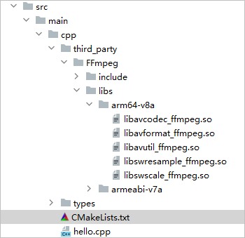
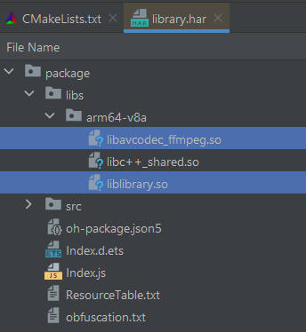

# 在NDK工程中使用预构建库

更新时间：2026-03-09 02:50:43

来源：https://developer.huawei.com/consumer/cn/doc/harmonyos-guides/build-with-ndk-prebuilts

在NDK工程中，可以通过CMake语法规则引入并使用预构建库。在引用预构建库时，模块libs目录中的预构建库，以及在CMakeLists.txt编译脚本中声明的预构建库都会被打包。
  

#### 预构建库使用约束

1.确保引入的SO动态库是通过[HarmonyOS NDK 编译工具链](https://developer.huawei.com/consumer/cn/doc/harmonyos-guides/build-with-ndk-overview)编译生成，如何通过[HarmonyOS NDK 编译工具链](https://developer.huawei.com/consumer/cn/doc/harmonyos-guides/build-with-ndk-overview)编译预构建库，请参考[CMake构建三方库适配流程](https://developer.huawei.com/consumer/cn/doc/best-practices/bpta-cmake-adapts-to-harmonyos#section1826019653918)。
 
2.确保引入的SO动态库的依赖库也导入到工程中且通过[HarmonyOS NDK 编译工具链](https://developer.huawei.com/consumer/cn/doc/harmonyos-guides/build-with-ndk-overview)编译生成。
 
  

#### 直接引入预构建库

可以通过直接将预构建的库文件复制到项目文件中, 来使用预构建库。例如在项目中需要使用预构建库libavcodec_ffmpeg.so，其开发态存放路径如下图所示：
 



 
在模块的CMakeLists.txt编译脚本中通过add_library添加所需的预构建库，并声明预构建库路径等信息后，可以在target_link_libraries中声明链接该预构建库，脚本示例如下所示：
 
```cpp
add_library(library SHARED hello.cpp)

add_library(avcodec_ffmpeg SHARED IMPORTED)
set_target_properties(avcodec_ffmpeg
    PROPERTIES
    IMPORTED_LOCATION ${CMAKE_CURRENT_SOURCE_DIR}/third_party/FFmpeg/libs/${OHOS_ARCH}/libavcodec_ffmpeg.so)

target_link_libraries(library PUBLIC libace_napi.z.so avcodec_ffmpeg)
```
 
在模块的CMakeLists.txt编译脚本中添加include_directories：
 
```text
include_directories(
    # ...
    ${CMAKE_CURRENT_SOURCE_DIR}/third_party/FFmpeg/include
)
```
 
当在HAR中使用预构建库时，当前编译的库和链接所需预构建库会打包到HAR中的libs目录下，如下图所示：
 



 
  

#### 预构建库的SONAME问题

请确保引入的预构建动态库（so）正确设置了SONAME。
 
如果预构建so没有SONAME，链接器将会将so的绝对路径插入到依赖这个so的二进制文件的dynamic section中。当这些二进制文件随hap包发布运行时，动态加载器（dynamic loader）可能最终无法找到这个so而导致错误。
 
可以使用llvm-readelf工具查看so文件是否设置了SONAME。llvm-readelf工具路径为：${DevEco Studio安装目录}/sdk/default/openharmony/native/llvm/bin或者${command-line-tools安装目录}/sdk/default/openharmony/native/llvm/bin/llvm-readelf。
 
示例如下：
 
```bash
> ${YOUR_PATH}/command-line-tools/sdk/default/openharmony/native/llvm/bin/llvm-readelf -d libavcodec_ffmpeg.so | grep SONAME
0x000000000000000e (SONAME)             Library soname: [libavcodec_ffmpeg.so]
```
 
若预构建so使用cmake进行构建，则所有的so默认会设置SONAME（只要目标平台支持）。
 
若预构建so使用其他构建工具，可以通过配置ldflags来设置。
 
```bash
${...}/clang++ ${...} -Wl,-soname,libavcodec_ffmpeg.so
```
 
  

#### 使用远程依赖HAR中集成的预构建库

当使用远程依赖HAR中集成的预构建库时，CMakeLists.txt文件中引用脚本如下所示：
 
```cpp
set(DEPENDENCY_PATH ${CMAKE_CURRENT_SOURCE_DIR}/../../../oh_modules)
add_library(library SHARED IMPORTED)
set_target_properties(library
    PROPERTIES
    IMPORTED_LOCATION ${DEPENDENCY_PATH}/library/libs/${OHOS_ARCH}/liblibrary.so)
add_library(entry SHARED hello.cpp)
target_link_libraries(entry PUBLIC libace_napi.z.so library)
```
 
  

#### 使用本地HAR中集成的预构建库

当使用本地HAR中集成的预构建库时，CMakeLists.txt文件中引用脚本如下所示：
 
```cpp
set(LIBRARY_DIR "${NATIVERENDER_ROOT_PATH}/../../../../library/build/default/intermediates/libs/default/${OHOS_ARCH}/")
add_library(library SHARED IMPORTED)
set_target_properties(library
    PROPERTIES
    IMPORTED_LOCATION ${LIBRARY_DIR}/liblibrary.so)
add_library(entry SHARED hello.cpp)
target_link_libraries(entry PUBLIC libace_napi.z.so library)
```
