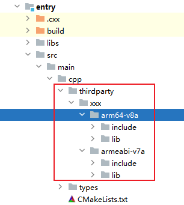
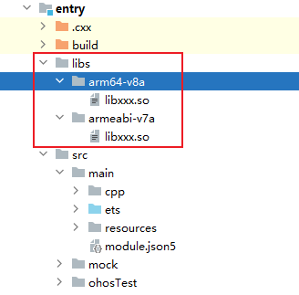
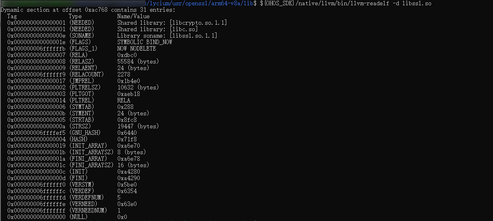
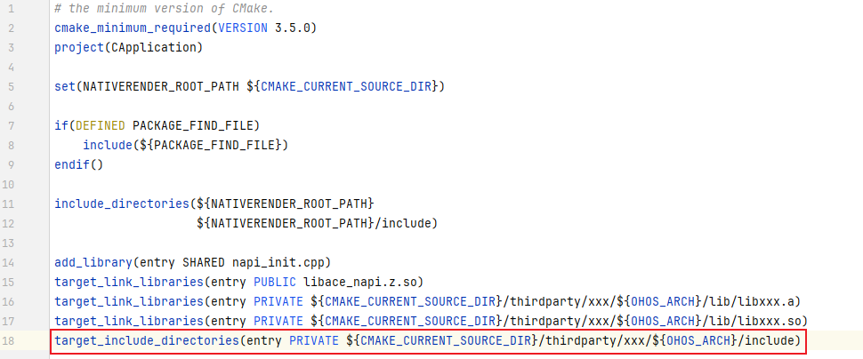

# 使用lycium交叉编译框架快速编译三方库

更新时间：2026-05-07 09:37:20

来源：https://developer.huawei.com/consumer/cn/doc/harmonyos-guides/toolchain-lycium-build-project

#### 概述

随着技术的不断发展，移动应用开发需求也越来越大，在传统移动应用开发过程中，开发者需要面对较为繁琐的配置和环境搭建，这使开发成本变得更高。为解决这类问题，通过使用[lycium](https://gitcode.com/openharmony-sig/tpc_c_cplusplus/tree/master/lycium)工具，可以帮助开发者实现快速开发，简化开发流程，减少开发耗时。
 
lycium是一款协助开发者通过shell语言实现C/C++三方库快速交叉编译，并在HarmonyOS上快速验证的编译框架工具。
 
开发者只需要设置对应C/C++三方库的编译方式以及编译参数，通过lycium就能快速的构建出能在HarmonyOS上运行的二进制文件。
 
本文将以openssl为例，介绍如何通过lycium工具快速编译三方库。
 
  

#### 通过lycium工具快速编译三方库

本小节介绍如何在Linux环境下，使用lycium工具通过ohos sdk快速编译openssl三方库源码。
 
  

#### 编译环境准备
1. Linux编译环境搭建及HarmonyOS SDK下载，请参考：[环境准备](https://developer.huawei.com/consumer/cn/doc/harmonyos-guides/toolchain-cmake-build-project#环境准备)。
2. 下载完SDK后，将SDK工具链配置到环境变量中。
- lycium支持的是C/C++三方库的交叉编译，SDK工具链只涉及到native目录下的工具，故OHOS_SDK的路径需配置成native工具的父目录，Linux环境中配置SDK环境变量方法如下：

  
```bash
owner@ubuntu:/mnt/e$ export OHOS_SDK=/xxx/ohos-sdk/linux # 此处SDK的路径需要开发者配置成自己的sdk解压目录
```


3. 拷贝编译工具。

  为简化开发中命令的配置，针对arm架构以及aarch64架构集成了几个编译命令，存放在lycium/Buildtools目录下。在使用lycium工具前，需要将这些编译命令拷贝到SDK对应的目录下，具体操作如下：

  
```bash
owner@ubuntu:/mnt/e/tpc_c_cplusplus-master$ cd lycium/Buildtools # 进入到工具包目录
owner@ubuntu:/mnt/e/tpc_c_cplusplus-master/lycium/Buildtools$ sha512sum -c SHA512SUM # 可校验工具包是否正常, 若输出"toolchain.tar.gz: OK"则说明工具包正常，否则说明工具包异常，需重新下载
owner@ubuntu:/mnt/e/tpc_c_cplusplus-master/lycium/Buildtools$ tar -zxvf toolchain.tar.gz # 解压拷贝编译工具
owner@ubuntu:/mnt/e/tpc_c_cplusplus-master/lycium/Buildtools$ cp toolchain/* ${OHOS_SDK}/native/llvm/bin # 将命令拷贝到工具链的native/llvm/bin目录下
```


4. 若SDK中cmake版本较低（cmake推荐使用3.26及以上版本），升级SDK即可。

 
  

#### 编译三方库
1. 修改三方库的编译方式以及编译参数。

  lycium框架提供了HPKBUILD文件供开发者对相应的C/C++三方库的编译配置。

  
- 在thirdparty目录下新建文件夹，用于存放三方库文件和HPKBUILD文件。

  
```bash
owner@ubuntu:/mnt/e/tpc_c_cplusplus-master/thirdparty$ mkdir openssl
```


2. 将HPKBUILD模板文件拷贝到新建三方库目录下。

  
```bash
owner@ubuntu:/mnt/e/tpc_c_cplusplus-master/thirdparty$ cp /xxx/tpc_c_cplusplus-master/lycium/template/HPKBUILD openssl
```


3. 根据三方库实际情况修改HPKBUILD文件配置项。

  
```bash
pkgname=NAME # 库名(必填)
pkgver=VERSION # 库版本(必填)
source="https://downloads.sourceforge.net/$pkgname/$pkgname-$pkgver.tar.gz" # 库源码下载链接(必填)
buildtools= # 编译方法, 暂时支持cmake, configure, make等, 根据三方库的编译构建方式填写.(必填)
builddir= # 源码压缩包解压后目录名(必填)
# 省略部分配置项
# 编译前准备工作，如设置环境变量，创建编译目录等
prepare() {
}

# 执行编译构建的命令
build() {
}

# 安装打包
package() {
}

# 测试
check() {
}

# 清理环境
cleanbuild() {
}
```
  每个编译脚本都需要按照该规则定义相应的变量以及对应的5个函数，其中变量标明必填的，需要根据库信息正确填写，否则会导致编译失败。

  填写示例参考如下：

  openssl的编译构建方式是configure编译构建，configure交叉编译是需要配置host类型，且需要配置对应的环境变量，框架中集成了环境变量设置的接口，封装在envset.sh中，因此除了基本信息外，还需要定义一个host变量以及导入envset.sh文件，基本变量配置参考如下：

  
```bash
pkgname=openssl # 库名
pkgver=OpenSSL_1_1_1u # 库的版本号
source="https://github.com/openssl/$pkgname/archive/refs/tags/$pkgver.zip" # 库的源码包路径
archs=("armeabi-v7a" "arm64-v8a") # 架构信息
buildtools="configure" # 编译方式为configure
builddir=$pkgname-${pkgver} # openssl 源码包解压后的文件夹名
packagename=$builddir.zip # 包名
source envset.sh # 导入envset.sh，envset.sh为环境设置脚本文件，通常包含构建所需的变量和函数，存放于tpc_c_cplusplus/lycium/script目录下
host= # 定义host变量
```
  在prepare()函数中创建编译目录，配置对应架构的环境变量：

  
```bash
prepare() {
   mkdir -p $builddir/$ARCH-build
   if [ $ARCH == ${archs[0]} ] # $ARCH：环境变量，表示目标架构，用于区分不同的CPU架构
   then
     setarm32ENV
     host=linux-generic32
   elif [ $ARCH == ${archs[1]} ]
   then
     setarm64ENV
     host=linux-aarch64
   else
     echo "${ARCH} not support"
     return -1
   fi
}
```
  build()函数使用configure命令生成Makefile并执行make指令：

  
```bash
build() {
   cd $builddir/$ARCH-build
   ../Configure $* $host > `pwd`/build.log 2>&1
   make -j4 >> `pwd`/build.log 2>&1
   ret=$?
   cd $OLDPWD
   return $ret
}
```
  openssl测试时需要单独通过编译目标depend生成测试用例，因此需要修改对应的check()函数。在check函数中执行make depend，并在执行完后清理对应的环境变量，以及在该函数后面通过注释说明该库在设备上的测试方法。

  
```bash
check() {
   cd $builddir/$ARCH-build
   make depend >> `pwd`/build.log 2>&1
   cd $OLDPWD
   if [ $ARCH == ${archs[0]} ]
   then
     unsetarm32ENV
   fi
   if [ $ARCH == ${archs[1]} ]
   then
     unsetarm64ENV
   fi
     unset host
   echo "Test must be on HarmonyOS device!"
   # real test CMD
   # 将编译目录加到 LD_LIBRARY_PATH 环境变量
   # make test
}
```
  package()和cleanbuild()函数，使用模板默认的即可。
- 快速编译三方库。

  配置完三方库的编译方式参数后，在lycium目录执行./build.sh openssl（openssl即为创建的目录名称），进行自动编译三方库，并打包安装到当前目录的usr/pkgname/ARCH目录（pkgname为三方库名称，ARCH为架构名称）。

  
```bash
owner@ubuntu:/mnt/e/tpc_c_cplusplus-master/lycium$ ./build.sh openssl # 默认编译thirdparty目录下的库
Build OS linux
OHOS_SDK=/mnt/e/ohos-sdk/linux
CLANG_VERSION=15.0.4
Build openssl OpenSSL_1_1_1u start!
  % Total % Received % Xferd Average Speed     Time    Time     Time Current
                             Dload  Upload    Total    Spent     Left Speed
100   222 0      222 0     0   457       0 --:--:-- --:--:-- --:--:--   456
100 11.3M 0    11.3M 0     0  958k       0 --:--:-- 0:00:12  --:--:-- 1802k
Compile HarmonyOS armeabi-v7a openssl OpenSSL_1_1_1u libs...
# 省略部分编译信息
ALL JOBS DONE!!!
```
  当未报错且日志打印ALL JOBS DONE!!!时，表示三方库编译成功。
- 查看编译后的三方库文件。

  编译成功后进入lycium/usr目录下，可查看编译生成的文件。

 
  

#### 应用中集成使用三方库
1. 将三方库生成的二进制文件拷贝到应用工程目录。

  为更好管理应用集成的三方库，需要在应用工程的cpp目录新建一个thirdparty目录，将生成的二进制文件以及头文件拷贝到该目录下。

  如下图所示，xxx代表三方库名称，xxx文件夹下包含了aarch64架构以及arm架构两种方式生成的二进制文件，每种架构目录下包含了该库的头文件目录include以及二进制文件目录lib。

  



  如果三方库二进制文件为so文件，还需要将so文件拷贝到工程目录的entry/libs/${OHOS_ARCH}/目录下，如下图：

  



  动态库引用注意事项：

  
- 应用在引用动态库的时候是通过soname来查找的，所以开发者需要将名字为soname的库文件拷贝到entry/libs/${OHOS_ARCH}/目录下（soname查看方法：${OHOS_SDK}/native/llvm/bin/llvm-readelf -d libxxx.so）。

  



2. 正确拷贝so文件。

  拷贝方法：不通过压缩直接将so文件拷贝到windows，或将so文件压缩成.zip格式拷贝到windows，正确拷贝so文件后，so文件大小应该与原库实体文件大小一致。

  
> [!NOTE]
> 如果将so文件以tar、gz、7z、bzip2等压缩方式拷贝到windows后在解压，其文件是实体库的软连接，大小和实体库大小不一致，文件也不能正常使用。

- 配置对应链接。

  配置链接只需要在cpp目录的CMakeLists.txt文件中添加对应target_link_libraries即可（动态库链接和静态库链接，只需填写一个）。

  
配置静态库链接。

  
```text
target_link_libraries(entry PRIVATE ${CMAKE_CURRENT_SOURCE_DIR}/thirdparty/xxx/${OHOS_ARCH}/lib/libxxx.a)
```

- 配置动态库链接。

  
```text
target_link_libraries(entry PRIVATE ${CMAKE_CURRENT_SOURCE_DIR}/thirdparty/xxx/${OHOS_ARCH}/lib/libxxx.so)
```


  



  - 配置头文件路径。

  在cpp目录的CMakeLists.txt文件中添加对应target_include_directories即可：

  
```text
target_include_directories(entry PRIVATE ${CMAKE_CURRENT_SOURCE_DIR}/thirdparty/xxx/${OHOS_ARCH}/include)
```
  


- 配置完三方库的链接和头文件路径后，开发者即可根据自身业务逻辑，在应用中调用三方库接口，详细请参考：[三方动态链接库（.so）集成开发实践](https://developer.huawei.com/consumer/cn/doc/best-practices/bpta-dynamic-link-library)。
