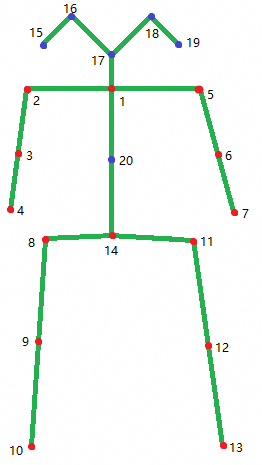

# 人体骨骼点识别与跟踪介绍

更新时间：2026-04-24 08:10:21

来源：https://developer.huawei.com/consumer/cn/doc/harmonyos-guides/arengine-body-conversion

AR Engine提供骨骼关键点识别的能力，检测场景中是否存在人体，识别之后输出人体20个骨骼关键点坐标。
 
通过人体跟踪与骨骼关键点识别功能，可以实现对终端设备的相机视野范围内的人体的跟踪和动作的识别。支持单人检测和双人检测。
 
**图1** 人体骨骼点示意图
 

 
> [!NOTE]
> 本功能仅提供能力，接入该功能不构成对产品的质量保证或任何承诺，详见 AR Engine人体跟踪与骨骼关键点识别功能技术局限性及免责声明 。
