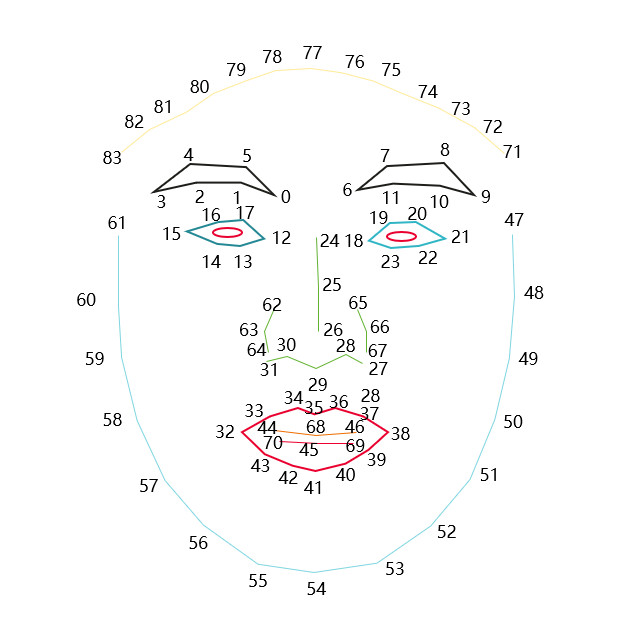

# 人脸识别与跟踪介绍

更新时间：2026-04-24 08:10:21

来源：https://developer.huawei.com/consumer/cn/doc/harmonyos-guides/arengine-face-conversion

AR Engine提供人脸表情跟踪的能力，跟踪获取人脸图像信息，实时将其理解成人脸表情内容，并转化成各种表情参数。

 AR Engine提供了64种包含眼睛、眉毛、眼球、嘴巴、舌头等主要脸部器官的表情动作以及84个人脸拓扑点。

 **图1** 人脸拓扑点示意图

 

> [!NOTE]
> 本功能仅提供能力，接入该功能不构成对产品的质量保证或任何承诺，详见AR Engine人脸跟踪功能技术局限性及免责声明。
