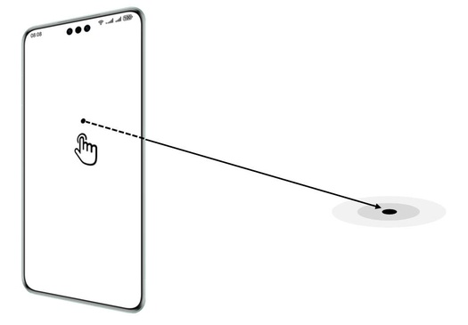

# 命中检测介绍

更新时间：2026-04-24 08:10:21

来源：https://developer.huawei.com/consumer/cn/doc/harmonyos-guides/arengine-arworld-conversion

AR Engine通过命中检测（Hit Testing）技术，将终端设备屏幕上的兴趣点映射为现实环境中的兴趣点。命中检测以现实环境中的兴趣点为源，发出一条射线连接到摄像头所在位置，返回射线与平面、稀疏点云、Mesh的交点。
 
用户可以在平面上放置虚拟物体，实现虚拟和现实的融合。
 
通过命中检测能力，用户可以点击终端设备屏幕，在虚拟世界中放置虚拟物体，用于虚拟家具试用等，实现虚拟与现实世界融合。
 
**图1** 命中检测示意图
 

