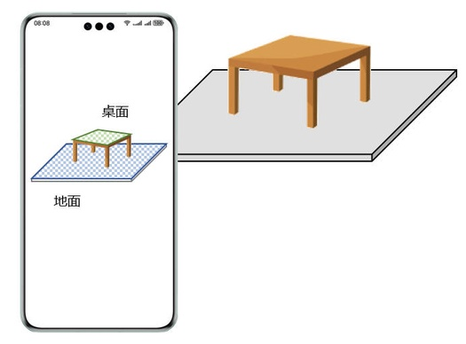

# 平面语义介绍

更新时间：2026-04-24 08:10:21

来源：https://developer.huawei.com/consumer/cn/doc/harmonyos-guides/arengine-get-semantics-conversion

AR Engine可以检测并识别不同的平面类型。当前支持的平面类型共11种，分别为：墙面、地面、座椅面、桌面、天花板、门面、窗面、床面、平面空间、立方体体积、立方体空间容积（平面空间、立方体体积和立方体空间容积仅在高精几何重建模式下支持）。

 **图1** 平面语义示意图（蓝色表示地面，绿色表示桌面）

 
