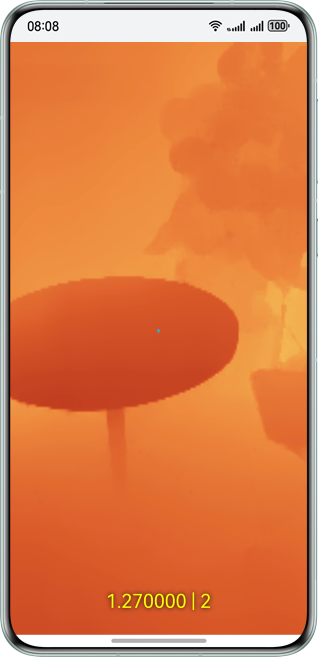

# 深度估计介绍

更新时间：2026-04-24 08:10:21

来源：https://developer.huawei.com/consumer/cn/doc/harmonyos-guides/arengine-get-depth-conversion

AR Engine支持持续输出周围环境相对终端设备的深度信息，利用这些深度信息，可以实现更加自然、无缝的虚实体验。

 本功能提供的深度信息是指从终端设备摄像头到显示场景中各点的深度值，每个像素点都有深度值、置信度信息，开发者可自行根据应用需求根据置信度选择更稠密或者更精确的深度信息。

 该技术可应用于例如测量、体积估算、场景重建等获取空间物体深度信息场景，基于此信息完成一些空间计算任务，比如计算物体体积等。

 **图1** 深度渲染示意图

 
