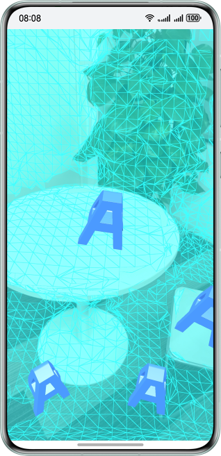

# 环境Mesh识别介绍

更新时间：2026-04-24 08:10:21

来源：https://developer.huawei.com/consumer/cn/doc/harmonyos-guides/arengine-get-mesh-conversion

AR Engine可以实时计算并输出当前画面中的环境网格数据，可用于处理虚实遮挡等应用场景。
 
通过环境网格能力，可将虚拟物体放置在任意可重建的曲面上，而不再受限于水平面和垂直面。同时可利用重建的环境网格实现虚实遮挡和碰撞检测，使得虚拟角色能够准确的知道当前所在的周围三维空间情况，实现更好的沉浸式AR体验。
 
**图1** 环境网格扫描示意图
 

