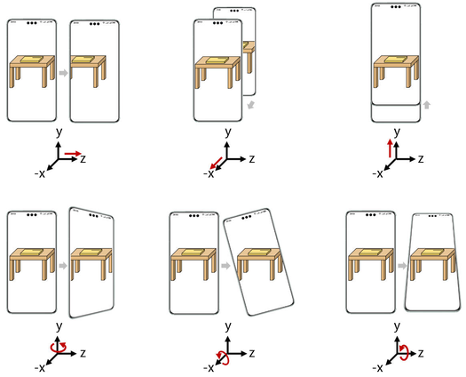
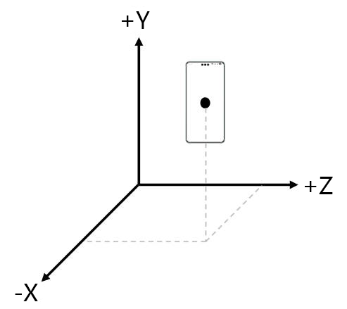
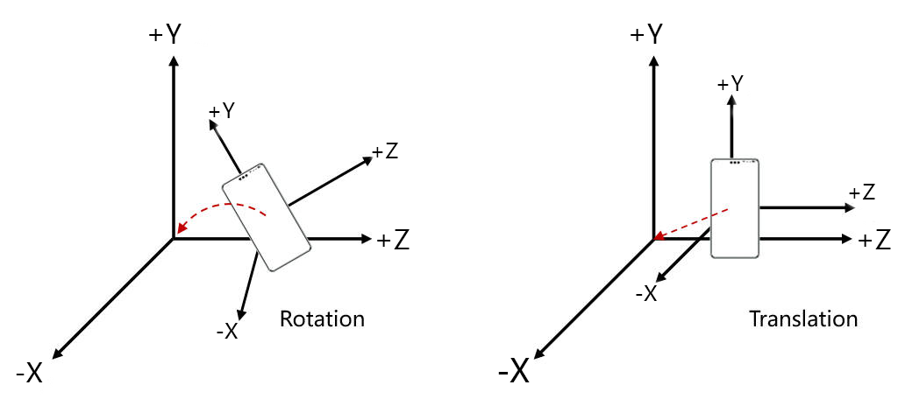

# 运动跟踪介绍

更新时间：2026-04-24 08:10:21

来源：https://developer.huawei.com/consumer/cn/doc/harmonyos-guides/arengine-get-pose-conversion

AR Engine通过获取终端设备摄像头数据，结合图像特征和惯性传感器（IMU），计算设备位置（沿x、y、z轴方向位移）和姿态（绕x、y、z轴旋转），实现6自由度（6DoF）运动跟踪能力。

 设备位姿描述了物体在真实世界中的位置和朝向。通过AR Engine，开发者可以实时获取设备在空间中任意时刻的位姿。

 **图1** 6DoF运动跟踪能力示意图（红色线代表设备运动方向）

 

## 世界坐标系与位姿示意

设备位姿一般在世界坐标系下进行表示。世界坐标系描述了真实物理空间中物体的绝对位置，其正方向如图2所示。 **图2** 世界坐标系示意图

AR Engine会自动完成世界坐标系初始化。 在AR Engine中，设备位姿由一个7维向量描述，包括旋转量

和位移量

。其中旋转量

是一组四元数，描述了设备相对于坐标原点的旋转状态；位移量

是一组三维向量，描述了设备相对于坐标原点的平移状态，如下图所示。 **图3** 设备位姿的旋转和平移变化示意图

通过旋转分量和平移分量，可以描述设备在空间中任意时刻的位姿状态。
